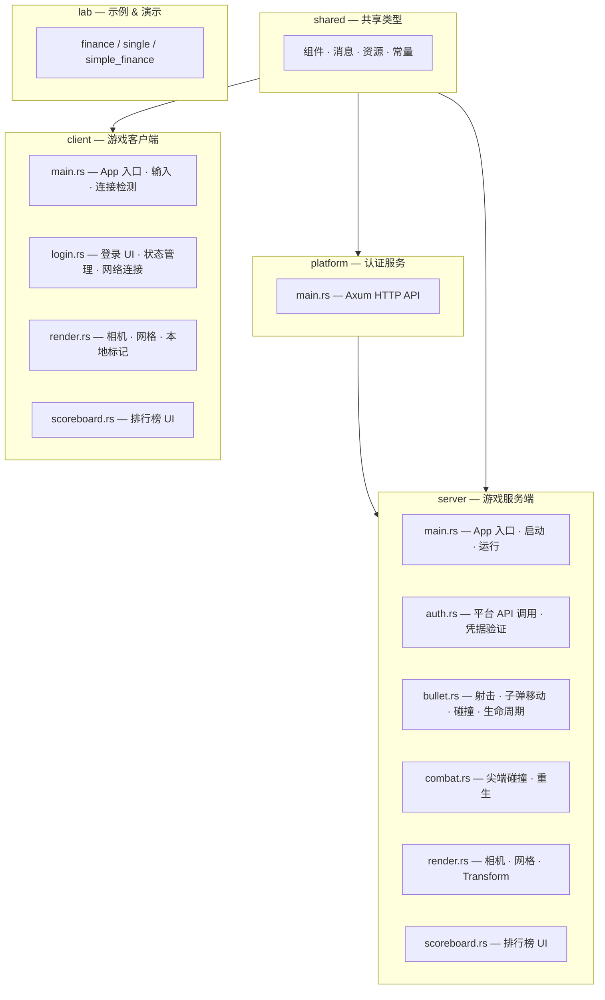
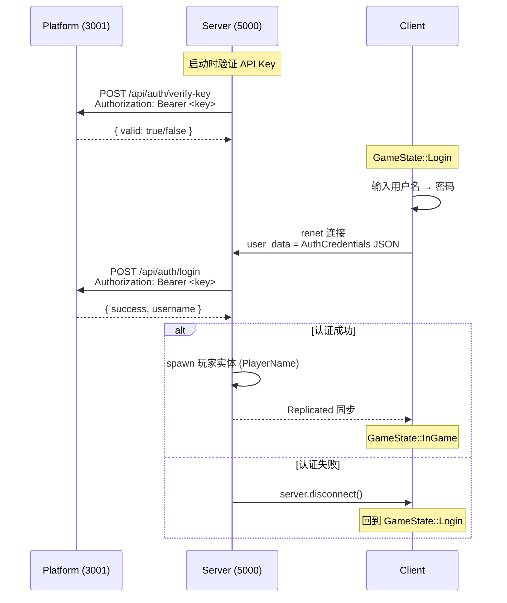
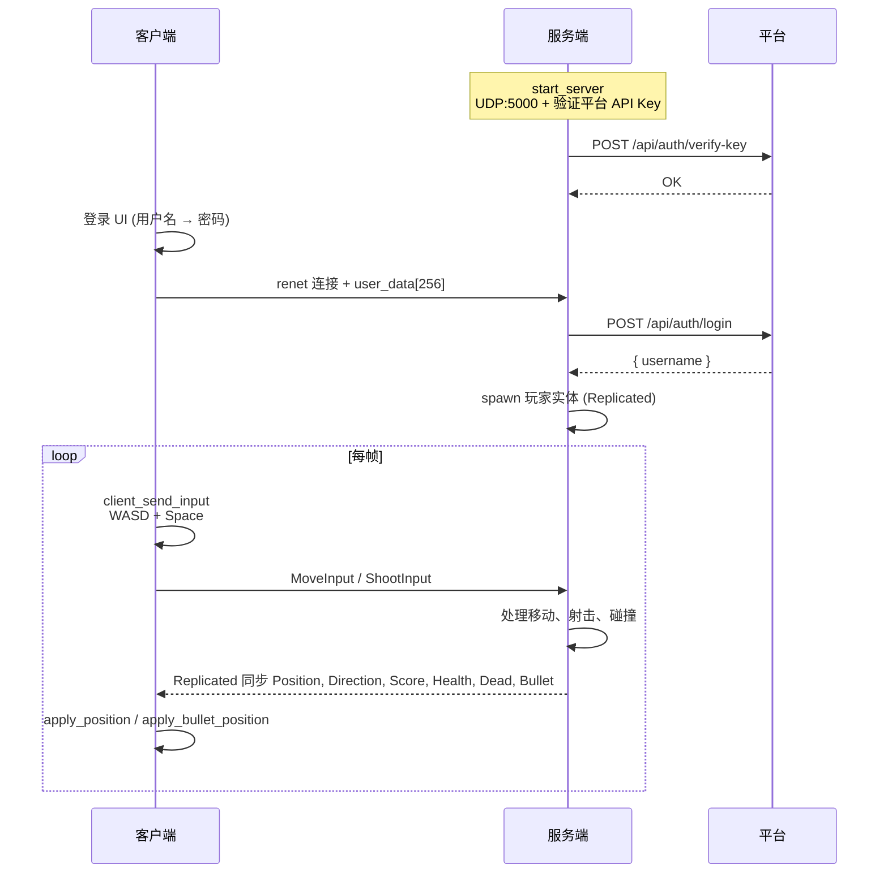

# simple — 设计文档

## 项目概述

基于 Bevy 引擎 + bevy_replicon 的多人联机对战游戏，使用 Cargo workspace 管理 5 个 crate。服务端权威架构——所有输入、碰撞检测、战斗、计分在服务端处理，通过 Replicated 组件同步到客户端。玩家控制三角形移动和射击，用尖端击杀或子弹击中其他玩家得分，死亡后 3 秒自动重生。

## 工作区结构



## 认证流程



## 共享类型 (shared/src/lib.rs)

### 组件

| 组件 | 属性 | 网络方向 | 说明 |
|------|------|---------|------|
| `Position` | x, y: f32 | S→C (Replicated) | 玩家位置，服务端权威 |
| `Direction` | angle: f32 | S→C (Replicated) | 玩家朝向，服务端权威 |
| `PlayerId` | u64 | S→C (Replicated) | 玩家唯一标识 |
| `PlayerName` | String | S→C (Replicated) | 玩家名称（来自平台认证） |
| `PlayerColor` | r, g, b: f32 | S→C (Replicated) | 玩家颜色 |
| `Score` | u32 | S→C (Replicated) | 玩家得分 |
| `Health` | u8 | S→C (Replicated) | 生命值（默认 MAX_HP=3） |
| `Dead` | — | S→C (Replicated) | 标记组件，存在即死亡 |
| `Bullet` | owner, x, y, angle, speed, r, g, b | S→C (Replicated) | 子弹实体数据 |

### 消息（客户端→服务端）

| 消息 | 属性 | 说明 |
|------|------|------|
| `MoveInput` | dx, dy: f32 | 归一化移动方向向量 |
| `ShootInput` | u8 | 射击请求（Space 键） |

### 序列化类型（客户端↔平台）

| 类型 | 属性 | 说明 |
|------|------|------|
| `AuthCredentials` | username, password | 登录凭据，序列化到 user_data[256] |
| `AuthResponse` | success, username, message | 平台认证响应 |
| `LoginRequest` | username, password | 平台 HTTP 请求体 |
| `LoginResponse` | success, username, message | 平台 HTTP 响应体 |

### 资源

| 资源 | 定义位置 | 说明 |
|------|---------|------|
| `PlayerCount` | shared | 已连接玩家数，服务端用于金色角度颜色生成 |
| `ApiKey` | server/auth | 服务端持有的平台 API Key |
| `PlatformConnected` | server/auth | 平台是否可用（启动验证后设置） |
| `RepliconChannels` | bevy_replicon | 网络通道配置 |
| `RenetServer` / `RenetClient` | server / client | 网络实例 |
| `NetcodeServerTransport` / `NetcodeClientTransport` | server / client | 传输层实例 |

### 客户端专属资源

| 资源 | 说明 |
|------|------|
| `ConnectTimer` | 连接超时计时器（5 秒） |
| `ConnectionState` | 连接状态标记 |
| `LocalClientId` | 本地客户端 ID |
| `LoginData` | 登录界面数据（用户名、密码、步骤、状态） |
| `GameState` | 客户端状态枚举（`Login`, `InGame`） |

### 常量

| 常量 | 值 | 说明 |
|------|-----|------|
| `PORT` | 5000 | 游戏服务器 UDP 端口 |
| `PROTOCOL_ID` | 123456 | Netcode 协议标识 |
| `PLATFORM_PORT` | 3001 | 平台 HTTP 端口 |
| `PLATFORM_API_KEY` | — | 默认 API Key |
| `MOVE_SPEED` | 300.0 | 玩家移动速度（像素/秒） |
| `MAX_HP` | 3 | 最大生命值 |
| `MAX_BULLETS_PER_PLAYER` | 5 | 每位玩家最多子弹数 |
| `SHOOT_COOLDOWN_SECS` | 0.3 | 射击冷却时间（秒） |
| `BULLET_SPEED` | 500.0 | 子弹飞行速度（像素/秒） |
| `BULLET_LIFETIME_SECS` | 2.0 | 子弹存活时间（秒） |
| `KILL_SCORE` | 10 | 击杀得分 |
| `RESPAWN_DELAY_SECS` | 3.0 | 死亡重生延迟 |
| `VISIBLE_HALF_WIDTH` | 640.0 | 可视区域半宽 |
| `VISIBLE_HALF_HEIGHT` | 360.0 | 可视区域半高 |
| `BOUNDARY_MARGIN` | 25.0 | 边界缓冲 |
| `SAFE_SPAWN_DISTANCE` | 200.0 | 重生点离最近玩家最小距离 |
| `MAX_SPAWN_ATTEMPTS` | 50 | 重生点搜索最大尝试次数 |

## 服务端模块

### server/src/main.rs — 入口

`run(api_key: &str)` 设置 Bevy App：注册插件、复制类型、消息类型、Observer、系统 schedule。`main()` 从环境变量或 `.env` 文件读取 `PLATFORM_API_KEY`。

**Plugin 注册**：
- `DefaultPlugins`（窗口标题 "Bevy 多人游戏 - 服务端"）
- `AssetPlugin`（`UnapprovedPathMode::Allow`，允许加载外部字体）
- `RepliconPlugins` + `RepliconRenetPlugins`

**Replicated 类型**：Position, Direction, PlayerId, PlayerColor, Score, Dead, PlayerName, Health, Bullet

**Client Message 类型**：MoveInput, ShootInput (Channel::Ordered)

**系统调度（Update，严格 `.chain()`）**：
```
spawn_render → tick_cooldowns → server_handle_input → server_handle_shoot
  → spawn_bullet_render → move_bullets → clamp_positions
  → bullet_player_collision → combat_detection → bullet_lifetime
  → respawn_dead_players → apply_position → apply_bullet_position
  → update_visibility → update_scoreboard
```

### server/src/auth.rs — 平台认证

- `verify_api_key_with_retry(api_key, max_retries)` — 启动时验证 Platform API Key，失败则重试（间隔 1 秒）
- `validate_credentials(api_key, creds)` — 调用 `POST /api/auth/login` 验证玩家凭据
- `ApiKey` 资源 — 存储 API Key
- `PlatformConnected` 资源 — 标记平台是否可用，若不可用则拒绝所有玩家认证

### server/src/bullet.rs — 子弹系统

**系统**：

| 系统 | 说明 |
|------|------|
| `tick_cooldowns` | 每帧更新所有玩家的 `ShootCooldown` 计时器 |
| `server_handle_shoot` | 读取 `ShootInput` 消息，检查冷却、子弹数量上限，从三角形尖端生成 Bullet 实体 |
| `move_bullets` | 每帧按 `BULLET_SPEED` 移动所有子弹，超出边界则 despawn |
| `bullet_player_collision` | 检查子弹是否命中其他玩家的三角形身体，命中按子弹方向确定击杀者 |
| `bullet_lifetime` | 每帧 tick `BulletLifetime` 计时器，超时 despawn |

**组件**：
- `ShootCooldown(Timer)` — 玩家射击冷却计时器（`Deref` 为 `Timer`）
- `BulletLifetime(Timer)` — 子弹存活时间计时器

**子弹碰撞**：子弹击中其他玩家三角形 → 引发 despawn 子弹、HP-1。HP 归零 → 插入 `Dead` + `RespawnTimer`，击杀者得分 +10。

### server/src/combat.rs — 近战战斗

- `tip_world(pos, dir)` — 计算三角形尖端的世界坐标
- `triangle_vertices(pos, dir)` — 计算三角形三个顶点的世界坐标
- `point_in_triangle(p, a, b, c)` — 重心坐标法检测点是否在三角形内
- `combat_detection` — 两两配对检测尖端碰撞：尖端在对方三角形内 = 击杀
- `respawn_dead_players` — tick 重生计时器，到时在安全位置移除 Dead 组件、恢复满 HP
- `find_safe_spawn` — 随机寻找离所有活玩家 ≥200px 的安全重生点（最多 50 次尝试）

`combat_detection` 内部分发四种情况：
- 双方互刺 → 同归于尽（都不加分）
- 单方刺中 → 击杀者得分 +10
- 使用 `HashSet<Entity>` 防止同一帧内重复击杀

### server/src/render.rs — 渲染

| 系统 | 说明 |
|------|------|
| `setup_camera` | 创建 Camera2d |
| `spawn_render` | 为新玩家创建 Triangle2d 网格（高 40px、底宽 30px） |
| `spawn_bullet_render` | 为新子弹创建小三角形网格（高 12px、底宽 8px） |
| `apply_position` | Position + Direction → Transform（translation + rotation） |
| `apply_bullet_position` | Bullet 位置 → Transform |

标记组件 `SpriteReady` 防止重复创建网格。

### server/src/scoreboard.rs — 排行榜

- `setup_scoreboard` — 创建居中 flexbox 容器，`GlobalZIndex(10)` 确保在最上层
- `update_scoreboard` — 每帧重建 UI：排序玩家 → 显示排名（🥇🥈🥉 / #N）、玩家名、分数

## 客户端模块

### client/src/main.rs — 入口

`run()` 设置 Bevy App。**State-based 系统门控**：

- `GameState::Login`：运行 `handle_login_input`, `render_login_text`, `handle_connect`
- `GameState::InGame`：运行 `client_send_input`, `check_connection`, `spawn_render`, `spawn_bullet_render`, `apply_position`, `apply_bullet_position`, `update_visibility`, `update_scoreboard`（`.chain()`）

`check_connection`：5 秒超时或服务器断开 → 清理网络资源 → 回到 `GameState::Login` 显示错误信息。

### client/src/login.rs — 登录界面

**两步骤状态机**：
1. `LoginStep::Username` — 输入用户名，回车进入下一步
2. `LoginStep::Password` — 输入密码，回车触发连接

**状态资源** `LoginData`：username, password, step, status（错误信息）, connect_requested（触发连接）

**系统**：

| 系统 | 说明 |
|------|------|
| `setup_login_screen` | 创建居中登录面板 UI（标题、用户名行、提示、输入框、状态） |
| `render_login_text` | 根据 LoginData 渲染当前步骤的文字（密码显示为 `*`） |
| `handle_login_input` | 处理键盘输入（字符/Backspace/Enter），管理两步状态转换 |
| `handle_connect` | LoginData.connect_requested 时，创建 renet 连接（credentials → user_data[256]），插入网络资源，切换到 InGame |
| `cleanup_login` | OnExit(Login) 时 despawn 登录 UI 实体 |

**认证数据流**：`AuthCredentials` → JSON 序列化 → `user_data[256]` → `NetcodeClientTransport` → 服务端提取验证

### client/src/render.rs — 客户端渲染

- `spawn_render` — 为所有新玩家创建 Triangle2d 网格，通过比较 `PlayerId` 和 `LocalClientId` 标记 `LocalPlayer`
- `spawn_bullet_render` — 为新子弹创建渲染
- `apply_position` / `apply_bullet_position` — 同步 Position/Bullet → Transform
- `update_visibility` — Dead 玩家隐藏，活玩家恢复可见

标记组件：
- `LocalSprite` — 已创建网格
- `LocalPlayer` — 本地玩家（`client_send_input` 只控制此实体）

### client/src/scoreboard.rs — 排行榜

右上角定位（`top: 10px, right: 15px`），使用 `TextSpan` 拼接所有玩家排名文本。显示玩家名和分数。

## 网络架构



## 战斗系统

两种击杀方式：

1. **近战碰撞**（`combat_detection`）：三角形的尖端戳中其他玩家三角形身体 → 直接击杀 → 击杀者 +10 分
2. **子弹射击**（`bullet_player_collision`）：子弹命中其他玩家三角形 → HP -1，HP 降为 0 时死亡 → 子弹所有者 +10 分

**射击限制**：冷却 0.3 秒 + 最多 5 颗子弹同时在场 + 子弹 2 秒自动消失。

**死亡状态**：插入 `Dead` + `RespawnTimer(3s)` → 隐藏渲染（`Visibility::Hidden`）→ 不可移动、不可被选中 → 3 秒后移除 `Dead` 和计时器 → 安全位置满 HP 重生。

## 渲染说明

- 玩家实体使用 `Triangle2d` 网格渲染（顶点朝上，高 40px，底宽 30px）
- 子弹实体使用小 `Triangle2d` 网格（高 12px，底宽 8px）
- `apply_position` 同步 Position（translation）+ Direction（绕 Z 轴旋转），三角形尖端朝向移动方向
- 方向角计算：`atan2(dy, dx) - π/2`，使三角形尖端指向移动方向
- 客户端本地 Direction 在 `client_send_input` 中即时更新（不等服务器回复，保证手感）
- `GlobalZIndex(10)` 确保排行榜 UI 始终在最上层
