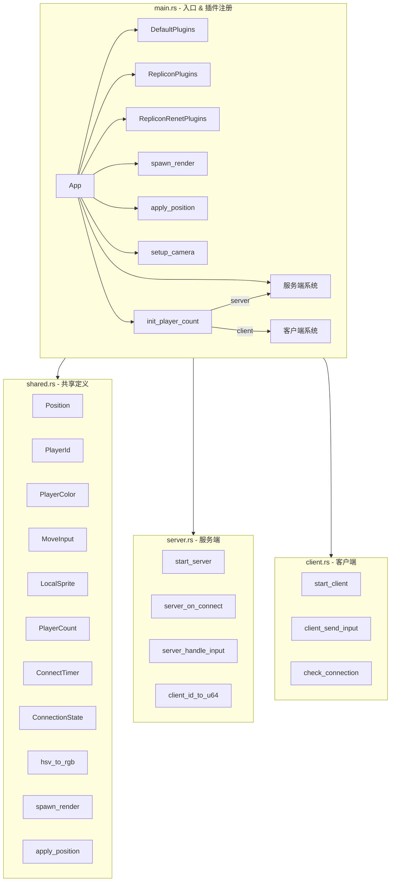
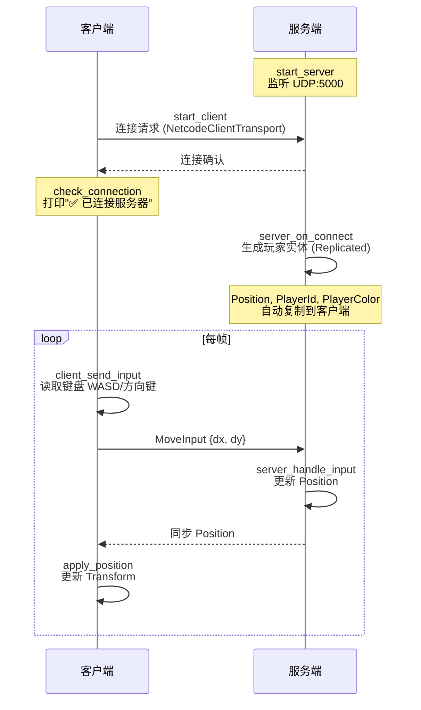
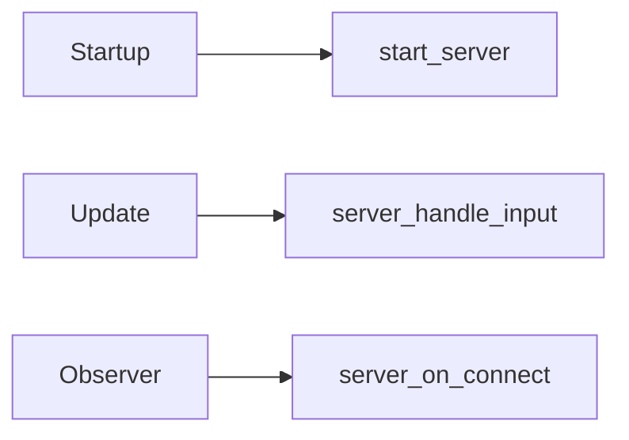
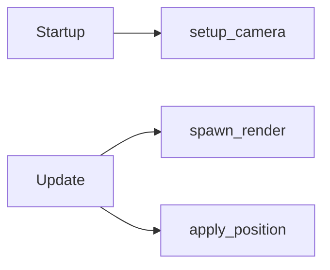
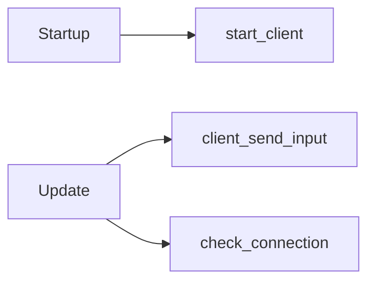
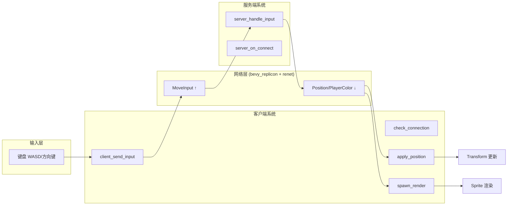

# Bevy 多人游戏设计文档

## 项目概述

基于 Bevy 引擎 + bevy_replicon 的多人联机游戏原型，支持服务端/客户端同一份代码运行。玩家通过键盘方向键或 WASD 控制方块移动，每个玩家拥有随机颜色。

## 技术栈

| 组件 | 说明 |
|------|------|
| Bevy | 游戏引擎 |
| bevy_replicon | 网络复制框架 |
| bevy_replicon_renet | renet 传输层 |
| serde | 序列化 |

## 模块结构



## 网络架构



## 组件定义

| 组件 | 属性 | 说明 |
|------|------|------|
| Position | x, y: f32 | 玩家位置，服务端权威 |
| PlayerId | u64 | 玩家唯一标识 |
| PlayerColor | r, g, b: f32 | 玩家颜色 |
| MoveInput | dx, dy: f32 | 移动输入向量（归一化）|
| LocalSprite | - | 标记已生成渲染精灵 |

## 资源定义

| 资源 | 说明 |
|------|------|
| PlayerCount | 已连接玩家数，用于生成颜色 |
| ConnectTimer | 客户端连接超时计时器（5秒）|
| ConnectionState | 连接状态标记（printed_connected）|
| RepliconChannels | 网络通道配置 |
| RenetClient / RenetServer | 网络客户端/服务端实例 |
| NetcodeClientTransport / NetcodeServerTransport | 传输层实例 |

## 常量定义

| 常量 | 值 | 说明 |
|------|-----|------|
| PORT | 5000 | 服务器监听端口 |
| MOVE_SPEED | 300.0 | 玩家移动速度（像素/秒）|
| PROTOCOL_ID | 123456 | 网络协议标识 |

## 系统调度

### 服务端



### 通用系统（服务端+客户端）



### 客户端



## 数据流



## 启动方式

```bash
# 启动服务端
cargo run -- server

# 启动客户端（可多开）
cargo run -- client
```
