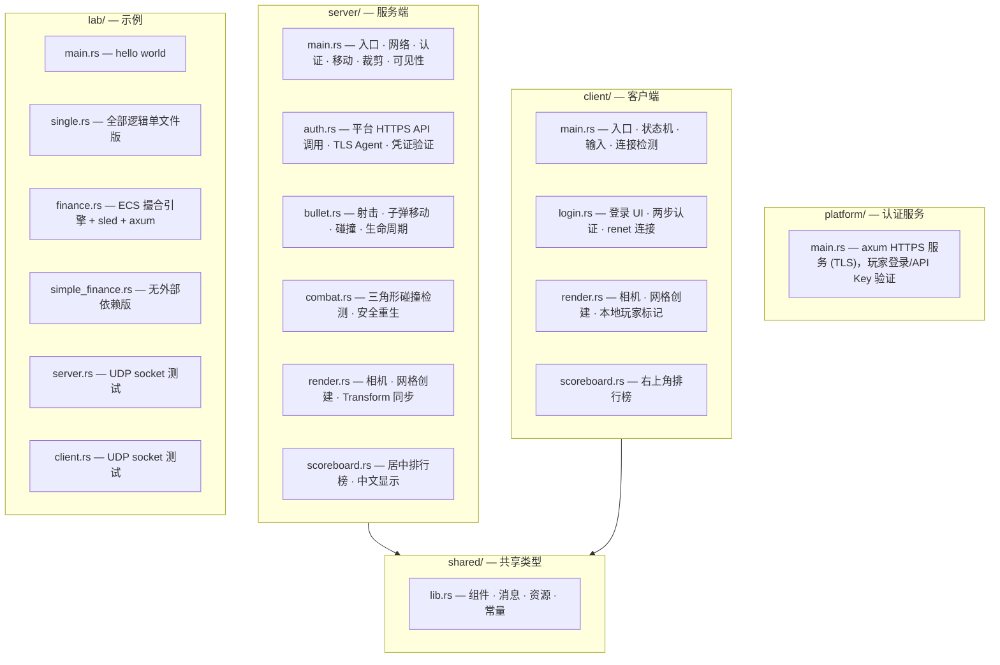
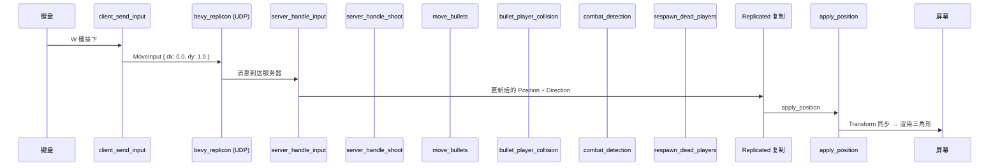
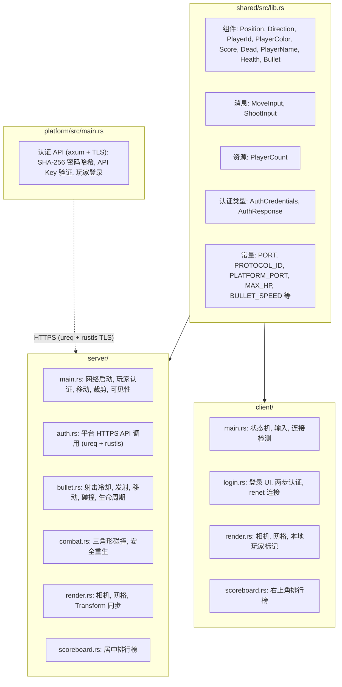
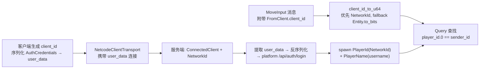

# LEARN.md — 学习路线

本教程逐文件分析全部代码，先列出所有知识点，再详细讲解代码逻辑，在用到知识点的地方给出提醒。

## 项目地图



| 文件 | 行数 | 角色 |
|------|------|------|
| `shared/src/lib.rs` | 96 | 全部共享类型定义（组件、资源、消息、常量） |
| `platform/src/main.rs` | 345 | 认证服务：axum HTTPS (TLS)，SHA-256 密码，API Key 验证，Session 管理 |
| `server/src/main.rs` | 423 | 服务端入口：网络启动、玩家认证、移动、裁剪、可见性、Session 续约 |
| `server/src/auth.rs` | 168 | 平台 HTTPS API 调用：Key 验证、凭证验证、Session 续约 (ureq + rustls TLS) |
| `server/src/bullet.rs` | 182 | 射击系统：冷却、发射、移动、碰撞、生命周期 |
| `server/src/combat.rs` | 177 | 战斗检测（三角形碰撞）、安全重生点计算 |
| `server/src/render.rs` | 75 | 服务端渲染：相机、网格、子弹渲染、Transform 同步 |
| `server/src/scoreboard.rs` | 171 | 服务端排行榜（居中、中文、奖牌 emoji、按钮交互） |
| `client/src/main.rs` | 161 | 客户端入口：状态机、输入、连接检测、相机、按钮交互 |
| `client/src/login.rs` | 427 | 登录 UI：两步认证（用户名→密码）、网络连接发起、按钮交互 |
| `client/src/render.rs` | 98 | 客户端渲染：本地玩家标记、子弹渲染、Transform、可见性 |
| `client/src/scoreboard.rs` | 82 | 客户端排行榜（右上角、玩家名显示、按钮交互） |
| `lab/examples/single.rs` | 311 | 单文件版多人游戏（无模块拆分） |
| `lab/examples/finance.rs` | 668 | 完整 ECS 撮合引擎（sled 持久化 + axum REST API） |
| `lab/examples/simple_finance.rs` | 265 | 简化 ECS 撮合引擎（无网络/持久化） |
| `lab/examples/server.rs` | 13 | UDP socket 服务器测试 |
| `lab/examples/client.rs` | 10 | UDP socket 客户端测试 |

---

## 第 1 级：先把游戏跑起来

```bash
# 0. 首次需要安装 mkcert 并生成 TLS 证书
winget install FiloSottile.mkcert    # Windows
# brew install mkcert                 # macOS
# apt install mkcert                  # Linux
mkcert -install
cd platform/certs && mkcert localhost 127.0.0.1 ::1 && cd ../..

# 终端 1 — 启动认证服务 (HTTPS://127.0.0.1:3001)
cargo run -p platform

# 终端 2 — 启动服务端（带窗口）
cargo run -p server

# 终端 3 — 启动客户端（可多开几个）
cargo run -p client
```

登录时输入用户名和密码（默认用户: kindy, ananda, martin, amy，密码同用户名）。进入游戏后用 WASD 或方向键移动，空格键射击。三角形尖端戳到其他玩家身体即可击杀得分，子弹命中也可造成伤害。HP 为 0 或尖端碰撞导致死亡，3 秒后自动重生。

---

## 第 2 级：完整知识点列表

在深入代码之前，先列出本项目涉及的全部技术知识点。

### 2.1 Rust 语言与工具链

| 知识点 | 在项目中的使用 |
|--------|---------------|
| Cargo Workspace | 5 个 crate 共享依赖版本（根 `Cargo.toml` 的 `[workspace.dependencies]`） |
| 模块系统 (`mod`, `use`, `pub`) | 每个 crate 的模块组织 |
| `derive` 宏 | 所有组件/消息派生 `Component`, `Serialize`, `Deserialize`, `Clone`, `Copy` 等 |
| 元组结构体 | `PlayerId(pub u64)`, `Score(pub u32)`, `ApiKey(pub String)` |
| `Deref` / `DerefMut` trait | `RespawnTimer`, `ShootCooldown`, `BulletLifetime` 透明代理 `Timer` |
| 类型别名 (`type`) | `type Point2 = (f32, f32)` |
| `Option<T>` | `Option<Handle<Font>>` 延迟加载字体 |
| `Result<T, E>` | 网络连接、平台 API 调用的错误处理 |
| `String` / `&str` | 玩家名、凭据序列化 |
| `Vec<T>` / `HashSet<T>` | 排行数据排序、击杀实体去重 |
| 闭包 (`|args| { body }`) | `.sort_unstable_by(|a, b| ...)` `get_or_insert_with(|| ...)` |
| `match` 模式匹配 | 客户端 ID 映射、方向键解析、战斗分支 |
| `if let` / `while let` | `client_id_to_u64` 中的 `ClientId::Client(entity)` 解构 |
| 常量 (`const`) | `MOVE_SPEED`, `PORT`, `PROTOCOL_ID` 等 |
| 属性 (`#[...]`) | `#[derive(...)]`, `#[allow(unreachable_patterns)]` |
| Edition 2024 | `Cargo.toml` 中 `edition = "2024"` |
| `env!("CARGO_MANIFEST_DIR")` | 编译时获取 crate 路径 |

### 2.2 Bevy ECS 核心

| 知识点 | 在项目中的使用 |
|--------|---------------|
| Entity（实体） | 每个玩家、子弹、UI 元素都是一个 Entity |
| Component（组件） | `Position`, `Direction`, `PlayerId`, `Dead` 等 |
| Resource（资源） | `PlayerCount`, `ConnectTimer`, `LocalClientId` 等 |
| System（系统） | 每帧执行的 Rust 函数 |
| SystemParam | `Query<T>`, `Res<T>`, `ResMut<T>`, `Commands`, `Local<T>` |
| Query 过滤 | `With<T>`, `Without<T>` |
| `Commands` 延迟执行 | `spawn()`, `insert()`, `remove()`, `despawn()` |
| Observer (`On<Add, T>`) | `server_on_connect` 响应客户端连接事件 |
| Schedule（调度） | `Startup`（一次）, `Update`（每帧） |
| State（状态） | `GameState::Login` / `GameState::InGame` 门控系统 |
| `.chain()` | 强制系统顺序执行 |
| `run_if(in_state(...))` | 只在特定状态运行系统 |
| `OnEnter` / `OnExit` | 进入/退出状态时的回调 |

### 2.3 Bevy 渲染系统

| 知识点 | 在项目中的使用 |
|--------|---------------|
| `Camera2d` | 2D 正交相机 |
| `Mesh2d` + `Assets<Mesh>` | 三角形网格（玩家 + 子弹） |
| `ColorMaterial` + `MeshMaterial2d` + `Assets<ColorMaterial>` | 颜色材质 |
| `Color::srgb(r, g, b)` | sRGB 颜色空间 |
| `Transform` | 位置（translation）+ 旋转（rotation）+ 缩放 |
| `GlobalTransform` | 全局变换（Bevy 0.18 spawn 必须带） |
| `Quat::from_rotation_z(angle)` | 绕 Z 轴旋转 |
| `Visibility` / `InheritedVisibility` | 可见性控制 |

### 2.4 Bevy UI 系统

| 知识点 | 在项目中的使用 |
|--------|---------------|
| `Node` | flexbox 容器配置 |
| `Text` / `TextSpan` | 文本内容（两种使用模式） |
| `TextFont` | 字体配置 |
| `TextColor` | 文字颜色 |
| `TextLayout` | 文本对齐方式 |
| `BackgroundColor` | 背景颜色 |
| `GlobalZIndex` | UI 层级 |
| `set_parent_in_place` | 建立 UI 父子关系 |
| `with_children` | 构建 UI 层级树 |
| flexbox 布局属性 | `flex_direction`, `align_items`, `justify_content`, `row_gap`, `padding` |
| `PositionType::Absolute` | 绝对定位 |
| `Val::Percent` / `Val::Px` | 尺寸单位 |

### 2.5 bevy_replicon 网络框架

| 知识点 | 在项目中的使用 |
|--------|---------------|
| `Replicated` 标记组件 | 服务端标记实体需同步到客户端 |
| `app.replicate::<T>()` | 注册可复制的组件类型 |
| `#[derive(Message)]` | 标记为网络消息（非组件） |
| `app.add_client_message::<T>(Channel)` | 注册客户端→服务端消息类型 |
| `MessageReader<FromClient<T>>` | 服务端读取客户端消息 |
| `MessageWriter<T>` | 客户端发送消息 |
| `FromClient<T>` | 消息包装（含 client_id） |
| `ClientId` 枚举 | `ClientId::Server` / `ClientId::Client(entity)` |
| `ConnectedClient` | renet 层在客户端连入时添加的组件 |
| `NetworkId` | bevy_replicon 的客户端标识（稳定 ID） |
| `Channel` | 消息通道类型 |
| `RepliconChannels` | 通道配置资源 |
| `RenetServer` / `RenetClient` | renet 服务器/客户端实例 |
| `NetcodeServerTransport` / `NetcodeClientTransport` | netcode 传输层 |
| `ServerAuthentication::Unsecure` | 不安全认证模式 |
| `ClientAuthentication::Unsecure` | 客户端认证（携带 user_data） |
| `server.disconnect(client_id)` | 服务端主动断开客户端 |

### 2.6 Platform 认证服务

| 知识点 | 在项目中的使用 |
|--------|---------------|
| axum HTTP 框架 | `Router`, `State`, `Json`, `HeaderMap`, `StatusCode` |
| axum-server (HTTPS) | `axum_server::bind_rustls` + `RustlsConfig`（mkcert TLS 证书） |
| tokio 异步运行时 | `#[tokio::main]` |
| SHA-256 密码哈希 | `sha2::Sha256` + `hex::encode` |
| `serde_json` | JSON 序列化/反序列化 |
| `Arc<Mutex<T>>` | 线程安全的共享状态 |
| rustls (TLS) | 自定义 `ClientConfig` + 根证书存储（服务端→平台 HTTPS 调用） |
| `OnceLock<T>` | 全局单例 TLS Agent 延迟初始化 |
| RESTful API 设计 | `POST /api/auth/verify-key`, `POST /api/auth/login`, `GET /api/health` |

### 2.7 游戏编程概念

| 知识点 | 在项目中的使用 |
|--------|---------------|
| 服务器权威模型 | Position/Direction/Score/Dead/Health 仅服务端修改 |
| 客户端预测 | 客户端本地更新 Direction 提升手感 |
| 帧率无关移动 | `delta_secs` 乘速度 |
| 输入归一化 | 斜向移动不超速 |
| 三角形碰撞检测 | 重心坐标法判断尖端是否在三角形内 |
| 安全重生点 | 随机位置重试 + 距离检查 |
| 金色角度配色 | `hue = (count * 137.508) % 360` |
| HSV→RGB 转换 | 6 段色相环 |
| Timer 计时器 | `TimerMode::Once` 冷却/重生/超时 |

### 2.8 其他 Crate

| 知识点 | 在项目中的使用 |
|--------|---------------|
| `serde` + `bincode` | bevy_replicon 内部二进制序列化 |
| `rand 0.10` | `rand::rng()`, `rng.random_range(min..max)` |
| `sled` | 嵌入式数据库（finance 示例） |
| `tokio::sync::mpsc` | 跨线程消息通道（finance 示例） |
| `Arc<AtomicU64>` | 原子计数器（finance 示例） |

---

## 第 3 级：Cargo Workspace 项目结构

> 📚 知识点：Cargo Workspace, `[workspace.dependencies]`, `resolver = "2"`

### 3.1 根 Cargo.toml

```toml
[workspace]
members = ["platform", "shared", "server", "client", "lab"]
resolver = "2"

[workspace.dependencies]
bevy = "0.18.1"
bevy_renet = "4.0.1"
bevy_replicon = "0.39.4"
bevy_replicon_renet = "0.15.0"
rand = "0.10.1"
serde = { version = "1", features = ["derive"] }
serde_json = "1"
```

`[workspace.dependencies]` 集中管理共享依赖的版本。子 crate 只需写 `bevy = { workspace = true }`，确保整个项目使用相同版本。`resolver = "2"` 启用 Rust 2021 edition 的依赖解析器。

### 3.2 crate 依赖关系

```
platform ──────────────────────────┐
                                   │
shared ◄── server ──(shared)───────┤
   ▲                               │
   ├──── client ──(shared)─────────┘
   │
   └──── lab ──(bevy, replicon, etc.)
```

- `shared` 只依赖 bevy + bevy_replicon + serde（最薄）
- `server` 和 `client` 各自依赖 `shared`（路径依赖 `path = "../shared"`）
- `platform` 独立发布——不依赖其他 crate，其他 crate 也不依赖它
- `lab` 独立——不依赖其他 crate，也不被任何 crate 依赖

### 3.3 为什么分这么多 crate

- **platform**：独立的 HTTP 服务，可单独部署
- **shared**：服务端和客户端的类型契约，避免重复定义
- **server**：游戏服务端，包含全部游戏逻辑（认证、战斗、计分、重生）
- **client**：游戏客户端，只包含渲染和输入逻辑
- **lab**：示例和实验，不参与主游戏构建

---

## 第 4 级：技术栈详解

### 4.1 Bevy ECS — 游戏引擎核心

> 📚 知识点：Entity, Component, Resource, System, SystemParam, Query, Commands, Observer, Schedule, State

#### 4.1.1 Entity（实体）

Entity 是一个轻量的 64 位整数 ID，不包含任何数据。类比数据库的主键——只标识一行记录，数据存在别的列里。

每个玩家、每个子弹、每个 UI 元素都是一个 Entity。Entity 可以动态添加/移除 Component。

#### 4.1.2 Component（组件）

Component 是挂在 Entity 上的纯数据，用 `#[derive(Component)]` 标记。项目中的例子：

```rust
#[derive(Component, Clone, Copy, Debug, Serialize, Deserialize)]
pub struct Position { pub x: f32, pub y: f32; }

#[derive(Component, Clone, Copy, Serialize, Deserialize, PartialEq)]
pub struct PlayerId(pub u64);

#[derive(Component, Clone, Copy, Serialize, Deserialize)]
pub struct Dead; // 标记组件——无字段，存在即表示死亡

#[derive(Component, Clone, Serialize, Deserialize)]
pub struct PlayerName(pub String);

#[derive(Component, Clone, Copy, Serialize, Deserialize)]
pub struct Health(pub u8);
```

> 📚 知识点：元组结构体 — `PlayerId(pub u64)` 和 `Score(pub u32)` 是元组结构体，只有单个命名字段。访问用 `player_id.0`。

Bevy 内部使用**原型（Archetype）**来组织有相同 Component 组合的实体。Query 通过匹配 Archetype 来高效遍历实体。

#### 4.1.3 Resource（资源）

Resource 是全局单例数据，用 `#[derive(Resource)]` 标记。不属于任何 Entity，整个 World 只有一份。

```rust
#[derive(Resource, Default)]
pub struct PlayerCount(pub u32);

#[derive(Resource)]
pub struct ApiKey(pub String);

#[derive(Resource)]
pub struct PlatformConnected(pub bool);
```

#### 4.1.4 System（系统）

System 是每帧执行的普通 Rust 函数。Bevy 通过函数签名自动推断需要注入什么参数——这叫**系统参数（SystemParam）**。

> 📚 知识点：SystemParam 自动注入 — Bevy 根据函数签名的参数类型自动从 World 中获取数据。

可用的 SystemParam 类型：

| SystemParam | 访问权限 | 用途 |
|-------------|---------|------|
| `Query<&T, Filter>` | 只读查询 | 遍历匹配 Filter 的所有实体的 Component T |
| `Query<&mut T, Filter>` | 可变查询 | 遍历并修改匹配实体的 Component T |
| `Res<T>` | 只读资源 | 读取全局资源 T |
| `ResMut<T>` | 可变资源 | 读取并修改全局资源 T |
| `Commands<'_, '_>` | 延迟命令 | spawn/insert/remove/despawn 实体 |
| `Res<Time>` | 只读资源 | `time.delta_secs()` 获取帧间隔 |
| `Res<ButtonInput<KeyCode>>` | 只读资源 | `keyboard.pressed(KeyCode::KeyW)` 检测按键 |
| `MessageReader<FromClient<T>>` | 只读 | 读取客户端发来的消息 |
| `MessageWriter<T>` | 只写 | 向服务端发送消息 |
| `On<Add, T>` | Observer 触发器 | 当某实体的 T 组件被添加时触发回调 |
| `Res<Assets<Mesh>>` | 可变资源 | 网格资产存储 |
| `Res<Assets<ColorMaterial>>` | 可变资源 | 颜色材质资产存储 |
| `Res<AssetServer>` | 只读资源 | 资产加载器 |
| `Local<T>` | 本地状态 | 跨帧持久化的函数本地变量 |
| `Option<Res<T>>` | 可选只读资源 | 资源不存在时为 None（不 panic） |
| `NextState<T>` | 状态切换 | `.set(new_state)` 切换应用状态 |
| `Added<T>` | Query 过滤 | 只匹配本帧刚添加了 T 组件的实体 |

> 📚 知识点：`Option<Res<T>>` — 特殊的 SystemParam，如果资源 T 不存在，值为 `None` 而不是 panic。用于客户端的 `local_id: Option<Res<LocalClientId>>`。

> 📚 知识点：Commands 的延迟执行 — `Commands` 不是立即生效的。操作被推入队列，所有系统的 Commands 在当前阶段结束后批量执行。同一系统内 spawn 的实体，其他系统在同一帧内看不到。

**Query 的过滤机制**：Bevy 内部维护了每种 Component 组合的 Archetype 列表。Query 通过 `With<T>` 和 `Without<T>` 过滤 Archetype。这是 O(1) 的 Archetype 匹配，不是逐实体检查。

**`&mut` 的借用规则**：Bevy 允许同一个 Query 返回多个 `&mut T`——这在普通 Rust 中不可能。Bevy 在运行时保证同一个 Entity 不会被同一个 Query 返回两次。

#### 4.1.5 系统调度

> 📚 知识点：Schedule（Startup/Update）, `.chain()`, `run_if(in_state(...))`, `OnEnter`/`OnExit`

| Schedule | 运行时机 |
|----------|---------|
| `Startup` | 应用启动时，所有 Startup 系统运行**一次** |
| `Update` | **每帧**运行一次 |
| `OnEnter(State)` | 进入状态时运行一次 |
| `OnExit(State)` | 退出状态时运行一次 |

**`.chain()` 的语义**：`(A, B, C).chain()` 创建严格的执行顺序：A 完成后 B，B 完成后 C。服务端 15 个系统全部 chain 在一起：

```
spawn_render → tick_cooldowns → server_handle_input → server_handle_shoot
→ spawn_bullet_render → move_bullets → clamp_positions → bullet_player_collision
→ combat_detection → bullet_lifetime → respawn_dead_players
→ apply_position → apply_bullet_position → update_visibility → update_scoreboard
```

> 📚 知识点：State（状态）— 客户端使用 `GameState` 枚举（`Login` / `InGame`）配合 `run_if(in_state(...))` 门控系统，确保登录 UI 系统只在登录状态下运行，游戏系统只在游戏中运行。

#### 4.1.6 Observer 触发器

> 📚 知识点：`On<Add, T>` Observer — 当任何实体上添加了 T 组件时触发回调

```rust
app.add_observer(server_on_connect);
```

`server_on_connect` 的第一个参数是 `trigger: On<Add, ConnectedClient>`。当 `ConnectedClient` 组件被 renet 传输层添加到某个实体时，此函数自动执行。`trigger.event_target()` 返回被添加了组件的那个 Entity。

#### 4.1.7 渲染系统详解

> 📚 知识点：Camera2d, Mesh2d, ColorMaterial, Transform, GlobalTransform, Visibility, Quat::from_rotation_z

**Mesh（网格）**：本项目用 `Triangle2d` 定义几何形状：

```rust
// 玩家三角形：高 40px，底宽 30px，尖端朝上
let mesh = Triangle2d::new(
    Vec2::new(0.0, 20.0),       // 顶点（正上方）
    Vec2::new(-15.0, -20.0),    // 左下
    Vec2::new(15.0, -20.0),     // 右下
);

// 子弹三角形：高 12px，底宽 8px（更小）
let mesh = Triangle2d::new(
    Vec2::new(0.0, 6.0),
    Vec2::new(-4.0, -6.0),
    Vec2::new(4.0, -6.0),
);
```

**网格到实体的挂载链**：`Triangle2d → Mesh2d(meshes.add(mesh)) → 实体`

**Material（材质）**：`MeshMaterial2d(materials.add(Color::srgb(r, g, b)))`

**Transform（变换）**：`Transform { translation: Vec3, rotation: Quat, scale: Vec3 }`。2D 游戏中只关心 `translation` 的 x/y 和 Z 轴旋转。

**渲染实体所需的完整 Component 集合**：

```rust
commands.entity(entity).insert((
    SpriteReady,                    // 标记已渲染
    Mesh2d(meshes.add(mesh)),       // 网格
    MeshMaterial2d(materials.add(Color::srgb(r, g, b))),  // 材质
    Transform::default(),           // 局部变换
    GlobalTransform::default(),     // 全局变换（Bevy 0.18 必须）
    Visibility::default(),          // 可见性
    InheritedVisibility::VISIBLE,   // 继承可见性
));
```

> 📚 知识点：`GlobalTransform` 必须显式添加 — Bevy 0.18 要求 spawn 实体时必须携带 `GlobalTransform`，否则 panic。

**Camera（相机）**：没有相机，Bevy 不会渲染任何东西：

```rust
commands.spawn((Camera2d, Transform::default(), GlobalTransform::default()));
```

**Visibility（可见性）**：三个层级：`Visibility::Visible` / `Visibility::Hidden` / `Visibility::Inherited`（默认）。项目用 `Visibility::Hidden` 隐藏死亡玩家，`Visibility::Inherited` 恢复（因为可能有 UI 父实体层级）。

#### 4.1.8 UI 渲染系统详解

> 📚 知识点：Node flexbox, Text, TextSpan, TextFont, TextColor, TextLayout, set_parent_in_place, with_children

Bevy 的 UI 系统将每个 UI 元素也当作一个 Entity，使用 flexbox 布局引擎。

**`Text` vs `TextSpan`**：
- `Text::new(str)` — 创建包含一个默认 `TextSpan` 的单段文本
- `TextSpan::new(str)` — 创建一段 styled 文本，通常作为子实体

服务端和客户端分别使用了两种方式：
- **服务端**：用 `Text::new(str)`，每个条目是一个独立实体，通过 `set_parent_in_place` 挂到 root
- **客户端**：用 `TextSpan(text.into())`，全部文本拼在一个字符串里

**常用 flexbox 属性**：

| 属性 | 含义 |
|------|------|
| `width: Val::Percent(100.0)` | 填满父容器 |
| `position_type: PositionType::Absolute` | 绝对定位，不参与正常布局流 |
| `flex_direction: FlexDirection::Column` | 子元素垂直排列 |
| `align_items: AlignItems::Center` | 子元素在交叉轴上居中 |
| `justify_content: JustifyContent::Center` | 子元素在主轴上居中 |
| `row_gap: Val::Px(4.0)` | 子元素间距 |
| `top: Val::Px(10.0)` | 绝对定位距顶 |
| `right: Val::Px(15.0)` | 绝对定位距右 |

### 4.2 bevy_replicon — 网络复制框架

> 📚 知识点：Replicated, replicate, Message, add_client_message, MessageReader, MessageWriter, FromClient, NetworkId

bevy_replicon 将网络同步抽象为"某些 Component 标记为 Replicated，服务端 spawn 实体时带上此标记，组件自动同步到所有客户端"。

#### 4.2.1 数据通道

**服务端 → 客户端（Replicated 复制）**：

```rust
app.replicate::<Position>();
app.replicate::<Direction>();
app.replicate::<PlayerId>();
app.replicate::<PlayerColor>();
app.replicate::<Score>();
app.replicate::<Dead>();
app.replicate::<PlayerName>();
app.replicate::<Health>();
app.replicate::<Bullet>();
```

> 服务端和客户端必须注册完全相同的类型，否则反序列化失败。

**客户端 → 服务端（Client Message）**：

```rust
app.add_client_message::<MoveInput>(Channel::Ordered);
app.add_client_message::<ShootInput>(Channel::Ordered);
```

`MoveInput` 和 `ShootInput` 用 `#[derive(Message)]` 而非 `#[derive(Component)]`——它们不挂在实体上，作为网络消息直接发送。

#### 4.2.2 Replicated 的实体生命周期

服务端 spawn 带 `Replicated` 的实体时：
1. bevy_replicon 为实体分配网络 ID
2. 将实体数据序列化后发送给所有客户端
3. 客户端在本地 World 创建对应实体

服务端 despawn 实体时，客户端也会 despawn 对应的实体。

**组件变更追踪**：bevy_replicon 内部使用 Bevy 的变更检测机制。被 replicate 的 Component 发生变化时标记为"脏"，下一帧同步。

#### 4.2.3 NetworkId — 稳定的客户端标识

> 📚 知识点：`NetworkId` — bevy_replicon 0.39 提供的稳定客户端标识，与 Bevy Entity 不同，它基于 renet 的 `ClientId`

```rust
use bevy_replicon::shared::backend::connected_client::NetworkId;
```

`NetworkId` 通过 `Query<&NetworkId>` 获取，`.get()` 返回内部 u64 值。它比 `Entity::to_bits()` 更稳定——`Entity` 的 generation 可能变化，而 `NetworkId` 在整个连接生命周期内不变。

项目中的 `client_id_to_u64` 优先使用 `NetworkId`：

```rust
fn client_id_to_u64(id: ClientId, clients: &Query<&NetworkId>) -> u64 {
    match id {
        ClientId::Server => 0,
        ClientId::Client(entity) => clients
            .get(entity)
            .map(|id| id.get().into())
            .unwrap_or_else(|_| entity.to_bits()),
    }
}
```

### 4.3 bevy_renet + bevy_replicon_renet — 传输层

> 📚 知识点：RenetServer, RenetClient, NetcodeServerTransport, NetcodeClientTransport, ConnectionConfig, ServerAuthentication::Unsecure, ClientAuthentication::Unsecure, user_data

renet 是一个基于 UDP 的网络库。bevy_replicon_renet 是连接 bevy_replicon 和 renet 的适配层。

**renet 的通道模型**：

| 通道类型 | 保证 | 用途 |
|----------|------|------|
| `Channel::ReliableOrdered` | 可靠 + 有序 | 状态同步（Position、Score） |
| `Channel::ReliableUnordered` | 可靠 + 无序 | 非顺序敏感数据 |
| `Channel::Unreliable` | 不可靠 + 无序 | 高频低延迟数据 |

**启动阶段的特殊性**：`start_server` 和 `handle_connect` 使用 `&mut World` 参数（非 `Commands`），因为 Startup 阶段需要在 Schedule 执行之前直接往 World 插入 Resource。

### 4.4 Platform 认证服务

> 📚 知识点：axum, tokio, SHA-256 哈希, serde_json, Headers 认证, Arc<Mutex<>>, ureq HTTP 客户端

Platform 是一个独立的 axum HTTP 服务，运行在 `127.0.0.1:3001`。

**API 端点**：

| 方法 | 路径 | 用途 | 认证 |
|------|------|------|------|
| POST | `/api/auth/verify-key` | 验证 API Key | Bearer token |
| POST | `/api/auth/login` | 验证玩家凭据 | Bearer token |
| GET | `/api/health` | 健康检查 | 无 |

**认证流程**：
1. 服务端启动时从 `.env` 文件（或环境变量）读取 `PLATFORM_API_KEY`
2. 服务端用此 Key 通过 HTTPS 调用 `/api/auth/verify-key` 验证（带重试 3 次，使用自定义 rustls TLS Agent）
3. 玩家连接时，客户端将用户名和密码序列化为 JSON 放入 `user_data`（256 字节）
4. 服务端提取 `user_data` → 反序列化 → 通过 HTTPS 调用 `/api/auth/login` 验证
5. 认证成功 → spawn 玩家（带 `PlayerName`）；失败 → `server.disconnect(client_id)`

**密码存储**：SHA-256 哈希，存于 `players.json`。默认用户：kindy, ananda, martin, amy（密码同用户名）。

### 4.5 serde + bincode — 序列化

> 📚 知识点：Serialize, Deserialize, bincode vs JSON

bevy_replicon 使用 bincode（二进制编码）序列化组件数据。bincode 比 JSON 紧凑——`Position { x: 100.0, y: 200.0 }` 在 bincode 中只占 8 字节。

用户认证信息用 JSON（`serde_json`）序列化到 256 字节的 `user_data` 字段中。

### 4.6 游戏编程概念

#### 4.6.1 服务器权威模型

> 📚 知识点：服务器权威、客户端预测

```
客户端键盘输入 → MoveInput / ShootInput 消息 → 服务端处理
  → 服务端更新权威状态（Position, Direction, Score, Dead, Health, Bullet）
  → Replicated 复制回所有客户端 → 客户端渲染
```

- 客户端**不直接修改** `Position`、`Score`、`Dead`、`Health`
- 客户端发送输入消息（"我想移动/射击"），服务端决定实际结果
- 客户端本地更新 `Direction`（不等服务器回复）保持手感响应

#### 4.6.2 三角形碰撞检测

> 📚 知识点：重心坐标法、克莱姆法则

判断一个点是否在三角形内部，使用重心坐标法。解 2×2 线性方程组，用克莱姆法则：

```
v2 = u*v0 + v*v1  (v0=C-A, v1=B-A, v2=P-A)
点 P 在三角形内部 ⇔ u ≥ 0 ∧ v ≥ 0 ∧ (u+v) ≤ 1
```

#### 4.6.3 为什么减 π/2

三角形 mesh 的尖端在局部坐标 `(0, 20)`（Y 轴正方向，屏幕上方）。`atan2(dy, dx)` 返回的角度 0 指向 X 轴正方向（屏幕右方）。两者差 90° = π/2 弧度。所以 `dir.angle = atan2(dy, dx) - FRAC_PI_2`。

#### 4.6.4 HSV→RGB + 金色角度配色

> 📚 知识点：HSV 色彩空间、黄金比例 φ = 1.618

金色角度公式：`hue = (count * 137.508) % 360`。`137.508 = 360 × (1 − 1/φ)`。每个玩家在色相环上偏移 137.5°，永不重复且最大区分度。

HSV→RGB 将色相环分为 6 段（红→黄→绿→青→蓝→品红），每段 60°。

---

## 第 5 级：整体架构

### 5.1 一次按键的完整数据流

按下 `W` 键，从输入到屏幕上三角形移动的完整路径：



按下 `空格` 键的射击流：

```
空格键 → client_send_input → ShootInput(0) → server_handle_shoot
  → spawn Bullet (Replicated) → spawn_bullet_render → move_bullets (每帧)
  → bullet_player_collision (检查击中) → 减 HP / 击杀
  → bullet_lifetime → despawn (2秒后过期)
```

### 5.2 模块职责和依赖



---

## 第 6 级：共享类型层 (`shared/src/lib.rs`)

> 这是服务端和客户端之间的契约。84 行，零系统逻辑。

### 6.1 网络常量

```rust
pub const PORT: u16 = 5000;
pub const PROTOCOL_ID: u64 = 123456;
pub const PLATFORM_PORT: u16 = 3001;
pub const PLATFORM_API_KEY: &str = "super-secret-platform-api-key";
pub const PLATFORM_HOST: &str = "127.0.0.1";
```

`PROTOCOL_ID` 是 netcode 协议的版本标识——服务端和客户端必须一致，否则连接被拒绝。`PLATFORM_API_KEY` 是默认的 API Key（当没有 `.env` 文件时使用）。`PLATFORM_HOST` 是平台 HTTPS 服务地址，服务端用它与 `PLATFORM_PORT` 拼接完整的 HTTPS URL。

### 6.2 核心组件

| 类型 | derive | 用途 |
|------|--------|------|
| `Position { x, y }` | Component, Clone, Copy, Debug, Serialize, Deserialize | 玩家位置 |
| `PlayerId(pub u64)` | Component, Clone, Copy, Serialize, Deserialize, PartialEq | 玩家标识 |
| `PlayerColor { r, g, b }` | Component, Clone, Copy, Serialize, Deserialize | 玩家颜色 |
| `Direction { angle }` | Component, Clone, Copy, Serialize, Deserialize, Default | 朝向角 |
| `Score(pub u32)` | Component, Clone, Copy, Serialize, Deserialize, Default, Debug | 得分 |
| `Dead` | Component, Clone, Copy, Serialize, Deserialize, Debug | 死亡标记（标记组件） |
| `PlayerName(pub String)` | Component, Clone, Serialize, Deserialize | 玩家名字 |
| `Health(pub u8)` | Component, Clone, Copy, Serialize, Deserialize | 生命值 |
| `Bullet { owner, x, y, angle, speed, r, g, b }` | Component, Clone, Copy, Serialize, Deserialize, Debug | 子弹数据 |

### 6.3 消息类型

```rust
#[derive(Message, Clone, Serialize, Deserialize)]
pub struct MoveInput { pub dx: f32, pub dy: f32; }

#[derive(Message, Clone, Serialize, Deserialize)]
pub struct ShootInput(pub u8);
```

> 📚 知识点：`#[derive(Message)]` vs `#[derive(Component)]` — Message 不挂在实体上，作为网络消息直接发送。`ShootInput` 用元组结构体，字段 `0` 目前未使用，预留给未来扩展（如不同武器类型）。

### 6.4 认证类型

```rust
#[derive(Clone, Serialize, Deserialize, Debug)]
pub struct AuthCredentials { pub username: String, pub password: String; }

#[derive(Clone, Serialize, Deserialize, Debug)]
pub struct AuthResponse { pub success: bool, pub username: String, pub message: String, pub token: String; }

#[derive(Clone, Serialize, Deserialize, Debug)]
pub struct RenewRequest { pub token: String; }

#[derive(Clone, Serialize, Deserialize, Debug)]
pub struct RenewResponse { pub success: bool, pub message: String; }
```

这两个类型在客户端（序列化到 `user_data`）、服务端（提取并转发到平台）、platform（反序列化处理）三重使用。

### 6.5 游戏常量

```rust
pub const MAX_HP: u8 = 3;
pub const MAX_BULLETS_PER_PLAYER: usize = 5;
pub const SHOOT_COOLDOWN_SECS: f32 = 0.3;
pub const BULLET_SPEED: f32 = 500.0;
pub const BULLET_LIFETIME_SECS: f32 = 2.0;
```

`PlayerCount` 是共享资源定义，但只有服务端实际使用它。客户端也 `init_resource::<PlayerCount>()` 但值始终为 0。

> 📚 知识点：`ShootInput` 用元组结构体 `pub u8` — 字段 `0` 目前未使用，预留给未来扩展（如不同武器类型）。

---

## 第 7 级：Platform 认证服务 (`platform/src/main.rs`)

> 📚 知识点：axum Router/State/Json/HeaderMap, axum-server TLS, rustls, tokio, SHA-256 哈希, `Arc<Mutex<>>`

### 7.1 数据结构

```rust
struct Player { username: String, password_hash: String; }
struct PlayerDb { players: Vec<Player>; }
struct ApiKeyDb { keys: Vec<String>; }
struct AppState { players: Arc<Mutex<PlayerDb>>, api_keys: ApiKeyDb, sessions: Arc<Mutex<HashMap<String, Session>>>; }
struct Session { username: String, expires_at: Instant; }
```

> 📚 知识点：`Arc<Mutex<PlayerDb>>` — 多线程共享可变状态。axum 的 handler 在 tokio 工作线程上并发执行，Mutex 提供内部可变性，Arc 提供共享所有权。player 密码为空时自动填充（hash(username)）。
> 📚 知识点：Session 管理 — 平台维护 `HashMap<token, Session>`，登录时生成 32 位随机 token，60 秒过期。支持"顶号"（同一用户新登录会删除旧 session）。

### 7.2 密码哈希

```rust
fn hash_password(password: &str) -> String {
    let mut hasher = Sha256::new();
    hasher.update(password.as_bytes());
    hex::encode(hasher.finalize())
}
```

> 📚 知识点：SHA-256 — `sha2::Sha256::new()` 创建哈希器，`.update()` 输入数据，`.finalize()` 输出哈希，`hex::encode()` 转十六进制字符串。存储时存哈希而非明文。

### 7.3 API Key 提取和验证

```rust
fn extract_api_key(headers: &HeaderMap) -> Option<&str> {
    headers.get("Authorization")
        .and_then(|v| v.to_str().ok())
        .and_then(|v| v.strip_prefix("Bearer "))
}
```

从 HTTP `Authorization: Bearer <key>` 头中提取 token。使用 `Option` 链式调用，层层提取。

> 📚 知识点：`HeaderMap` — axum 的 HTTP 请求头类型。`.get()` 返回 `Option<&HeaderValue>`，`.to_str()` 返回 `Result<&str, ToStrError>`，`.strip_prefix()` 返回 `Option<&str>`。

### 7.4 API 端点

**`POST /api/auth/verify-key`** — 验证 API Key 是否有效。服务端启动时通过 HTTPS 调用。

**`POST /api/auth/login`** — 验证玩家凭据。接收 `LoginRequest { username, password }`，哈希密码后与数据库比对，返回 `AuthResponse { success, username, message, token }`。通过 HTTPS 调用。支持"顶号"——同一用户新登录会删除旧 session。

**`POST /api/session/renew`** — 续约 session。接收 `RenewRequest { token }`，刷新 session 过期时间。服务端每 30 秒调用一次。

**`GET /api/health`** — 健康检查，返回 `{"status": "ok"}`。

### 7.5 服务器启动

```rust
#[tokio::main]
async fn main() {
    let state = AppState { players: Arc::new(Mutex::new(players)), api_keys };
    let app = Router::new()
        .route("/api/auth/verify-key", post(verify_key_handler))
        .route("/api/auth/login", post(login_handler))
        .route("/api/health", get(health_handler))
        .with_state(state);

    // 加载 mkcert 生成的 TLS 证书
    let tls_config = RustlsConfig::from_pem_file(
        format!("{MANIFEST_DIR}/certs/localhost.pem"),
        format!("{MANIFEST_DIR}/certs/localhost-key.pem"),
    ).await.expect("Failed to load TLS certificates");

    let addr = "127.0.0.1:3001".parse().unwrap();
    println!("Platform listening on https://127.0.0.1:3001");

    axum_server::bind_rustls(addr, tls_config)
        .serve(app.into_make_service())
        .await
        .unwrap();
}
```

> 📚 知识点：`#[tokio::main]` — 将 `async fn main()` 转换为同步入口，内部创建 tokio 异步运行时。`axum_server::bind_rustls` 绑定带 TLS 的 HTTPS 服务器，使用 rustls 作为 TLS 后端。证书由 mkcert 生成（`mkcert localhost 127.0.0.1 ::1`），存储在 `platform/certs/` 目录。

---

## 第 8 级：服务端逐文件分析

### 8.1 `server/src/main.rs` — 入口和核心系统

#### 8.1.1 导入和子模块

```rust
use bevy_replicon::shared::backend::connected_client::NetworkId;
```

> 📚 知识点：`NetworkId` — bevy_replicon 0.39 的新 API，替代直接用 `Entity::to_bits()` 作为客户端标识。

子模块：`auth` (HTTPS 平台调用), `bullet`, `combat`, `render`, `scoreboard`。注意 `combat` 是 `pub(crate)` 的——因为 `bullet.rs` 需要引用其中的 `triangle_vertices` 和 `point_in_triangle` 函数。`auth` 模块使用 `rustls` + `ureq` 进行 HTTPS 通信。

#### 8.1.2 服务端专属常量

| 常量 | 值 | 含义 |
|------|-----|------|
| `MOVE_SPEED` | 300.0 | 60fps 下每帧约 5px |
| `VISIBLE_HALF_WIDTH` | 640.0 | Bevy 默认窗口 1280×720 |
| `VISIBLE_HALF_HEIGHT` | 360.0 | 半高 |
| `BOUNDARY_MARGIN` | 25.0 | 三角形高 40px 的边界余量 |
| `KILL_SCORE` | 10 | 每次击杀得分 |
| `RESPAWN_DELAY_SECS` | 3.0 | 重生等待时间 |
| `SAFE_SPAWN_DISTANCE` | 200.0 | 安全重生最小距离 |
| `MAX_SPAWN_ATTEMPTS` | 50 | 找安全点最大重试次数 |

这些常量被 `combat.rs` 和 `bullet.rs` 直接引用（`use crate::...`），不通过 `shared`——客户端永远不需要知道它们。

#### 8.1.3 start_server

```rust
pub fn start_server(world: &mut World) {
```

> 📚 知识点：`&mut World` 参数 — Startup 系统的一个特殊签名，允许直接操作 World。在 Schedule 开始执行之前需要往 World 插入 Resource（如 RenetServer, NetcodeServerTransport），Commands 延迟执行满足不了这个时序。

逐行分析：
1. 获取 `RepliconChannels` 资源
2. 创建 `RenetServer`，传入通道配置
3. 绑定 UDP socket 到 `0.0.0.0:5000`
4. 获取当前 UNIX 时间戳（netcode 协议需要）
5. 创建 `NetcodeServerTransport`：`max_clients: 8`, `protocol_id`, `authentication: ServerAuthentication::Unsecure`
6. 将 server 和 transport 作为 Resource 插入 World

#### 8.1.4 verify_platform_connection

```rust
fn verify_platform_connection(api_key: Res<ApiKey>, mut connected: ResMut<PlatformConnected>) {
    match verify_api_key_with_retry(&api_key.0, 3) {
        Ok(()) => { info!("平台连接验证成功"); connected.0 = true; }
        Err(msg) => { error!("平台不可用: {msg}"); connected.0 = false; }
    }
}
```

这是一个 Startup 系统，在服务端启动时验证平台 API 是否可用。如果平台不可用，设置 `PlatformConnected(false)`——后续玩家认证直接拒绝，避免卡在平台调用超时。

#### 8.1.5 server_on_connect（Observer）

> 📚 这个是服务端最重要的系统，体现了完整的认证流程

```rust
pub fn server_on_connect(
    trigger: On<Add, ConnectedClient>,
    mut commands: Commands,
    mut count: ResMut<PlayerCount>,
    transport: Res<NetcodeServerTransport>,
    api_key: Res<ApiKey>,
    platform: Res<PlatformConnected>,
    clients: Query<&NetworkId>,
    mut server: ResMut<RenetServer>,
    mut online_players: ResMut<OnlinePlayers>,
    alive_players: Query<&Position, Without<Dead>>,
)
```

认证流程（逐行分析）：

1. `client_entity = trigger.event_target()` — 获取被添加了 `ConnectedClient` 的连接实体
2. `id_num = client_entity.to_bits()` — 默认 ID（无认证信息时使用）
3. `clients.get(client_entity)` — 获取 `NetworkId`
4. 如果有 NetworkId：`transport.user_data(client_id)` — 获取客户端在连接时传入的 `user_data`（256字节）
5. 从 `user_data` 中查找 `\0` 字节确定有效长度，截取 JSON
6. `serde_json::from_slice::<AuthCredentials>(...)` — 反序列化认证凭据
7. 如果 `!platform.0` — 平台不可用，直接 disconnect
8. `auth::validate_credentials(&api_key.0, &creds)` — 调用平台 API 验证凭据，返回 `(username, token)`
9. **重复登录检测**：检查 `online_players.by_name.contains_key(username)`，若已在线则 disconnect
10. 成功 → 存储 token 到 `online_players.tokens`，记录 `by_name` 和 `by_client` 映射
11. 无认证信息 → 使用 `Player_{id_num}` 作为默认名
12. 金色角度计算 hue → `hsv_to_rgb()` → `find_safe_spawn(&alive_positions)` 寻找安全重生点 → spawn 玩家实体

> 📚 知识点：`server.disconnect(client_id)` — renet 服务端的主动断开连接方法。用于认证失败时拒绝客户端。

**spawn 的组件**：`Replicated`, `PlayerId`, `PlayerName`, `Position`（安全重生点）, `Direction`, `PlayerColor`, `Score`, `Health(MAX_HP)`, `ShootCooldown`（初始已冷却完成）

> 📚 知识点：`ShootCooldown` 的初始值 — `Timer::from_seconds(SHOOT_COOLDOWN_SECS, TimerMode::Once)` 然后立即 `.tick(duration)` 使冷却立即完成，这样玩家连接后可以立刻射击。

#### 8.1.6 server_handle_input

```rust
pub fn server_handle_input(
    mut move_msgs: MessageReader<FromClient<MoveInput>>,
    mut players: Query<(&PlayerId, &mut Position, &mut Direction), Without<Dead>>,
    clients: Query<&NetworkId>,
    time: Res<Time>,
)
```

- `move_msgs.read()` 消费此帧所有 `MoveInput` 消息
- `client_id_to_u64(*client_id, &clients)` 将 `ClientId` 转 u64
- 遍历所有 `Without<Dead>` 的玩家，匹配 `player_id.0 == sender_id`
- `pos += message * MOVE_SPEED * time.delta_secs()` — 帧率无关移动
- 仅当 `dx != 0 || dy != 0` 时更新 Direction（静止保留最后朝向）

#### 8.1.7 client_id_to_u64

```rust
fn client_id_to_u64(id: ClientId, clients: &Query<&NetworkId>) -> u64 {
    match id {
        ClientId::Server => 0,
        ClientId::Client(entity) => clients.get(entity)
            .map(|id| id.get().into())
            .unwrap_or_else(|_| entity.to_bits()),
    }
}
```

> 📚 知识点：优先使用 `NetworkId::get()` 作为客户端标识（稳定），`Entity::to_bits()` 作为 fallback。

#### 8.1.8 clamp_positions

```rust
pub fn clamp_positions(mut players: Query<&mut Position, (With<PlayerId>, Without<Dead>)>) {
    let min_x = -VISIBLE_HALF_WIDTH + BOUNDARY_MARGIN;  // -615
    let max_x =  VISIBLE_HALF_WIDTH - BOUNDARY_MARGIN;  //  615
    let min_y = -VISIBLE_HALF_HEIGHT + BOUNDARY_MARGIN; // -335
    let max_y =  VISIBLE_HALF_HEIGHT - BOUNDARY_MARGIN; //  335
    for mut pos in players.iter_mut() {
        pos.x = pos.x.clamp(min_x, max_x);
        pos.y = pos.y.clamp(min_y, max_y);
    }
}
```

> 📚 知识点：`f32::clamp(min, max)` — 如果 `self < min` 返回 `min`，`> max` 返回 `max`，否则返回 `self`。

#### 8.1.9 run()

```rust
pub fn run(api_key: &str) {
    let mut app = App::new();

    app.add_plugins(DefaultPlugins.set(WindowPlugin { ... })
        .set(AssetPlugin { unapproved_path_mode: UnapprovedPathMode::Allow, ..default() }));
    app.add_plugins((RepliconPlugins, bevy_replicon_renet::RepliconRenetPlugins));

    app.replicate::<Position>();
    // ... 9 个 replicate 注册
    app.add_client_message::<MoveInput>(Channel::Ordered);
    app.add_client_message::<ShootInput>(Channel::Ordered);
    app.init_resource::<PlayerCount>();
    app.insert_resource(ApiKey(api_key.to_string()));
    app.insert_resource(PlatformConnected(true));

    app.add_plugins(ButtonPlugin);
    app.init_resource::<OnlinePlayers>();
    app.add_observer(server_on_connect);
    app.add_observer(server_on_disconnect);
    app.insert_resource(SessionRenewalTimer(Timer::from_seconds(30.0, TimerMode::Repeating)));
    app.add_systems(Startup, (setup_camera, start_server, setup_scoreboard, verify_platform_connection));
    app.add_systems(Update, (
        spawn_render, tick_cooldowns, server_handle_input, server_handle_shoot,
        spawn_bullet_render, move_bullets, clamp_positions, bullet_player_collision,
        combat_detection, bullet_lifetime, respawn_dead_players,
        apply_position, apply_bullet_position, update_visibility, update_scoreboard,
        renew_sessions_system,
    ).chain());

    app.run();
}
```

> 📚 知识点：`app.insert_resource(ApiKey(...))` — 手动插入 Resource（不是 `init_resource`），因为 ApiKey 没有实现 Default，需要提供值。

**新增资源和 Observer**：
- `ButtonPlugin` — `bevy_ui_widgets` 插件，为排行榜提供按钮交互
- `OnlinePlayers` — 追踪已认证在线玩家：`by_name` (username→entity), `by_client` (client→username), `tokens` (username→token)
- `SessionRenewalTimer` — 30 秒重复计时器，驱动 `renew_sessions_system`
- `server_on_disconnect` — 客户端断开 Observer，清理 `OnlinePlayers` 并 despawn 玩家实体

**系统执行顺序的原因**：
- `tick_cooldowns` 必须早于 `server_handle_shoot`（要先减少冷却才能判断能否射击）
- `spawn_bullet_render` 必须在 `server_handle_shoot` 之后（因为 bullet 刚被 spawn）
- `move_bullets` 在 `clamp_positions` 之前（子弹移动后再玩家裁剪，两者独立）
- `bullet_player_collision` 在 `combat_detection` 之前（先处理子弹伤害，再处理尖端碰撞）
- `bullet_lifetime` 在 `combat_detection` 之后（过期子弹在碰撞检测后清理）
- `apply_bullet_position` 在 `apply_position` 之后
- `renew_sessions_system` 在最后（不依赖其他游戏逻辑，独立运行）

#### 8.1.10 server_on_disconnect（Observer）

```rust
pub fn server_on_disconnect(
    trigger: On<Remove, ConnectedClient>,
    mut commands: Commands,
    mut online_players: ResMut<OnlinePlayers>,
)
```

客户端断开连接时触发：
1. `client_entity = trigger.event_target()` — 获取断开连接的实体
2. 从 `online_players.by_client` 查找 username
3. 从 `online_players.by_name` 获取 player_entity 并 `despawn`
4. 清理 `tokens` 中的对应 token

> 📚 知识点：`On<Remove, ConnectedClient>` — 当 `ConnectedClient` 组件被移除时触发（客户端断开）。

#### 8.1.11 renew_sessions_system

```rust
pub fn renew_sessions_system(
    online_players: ResMut<OnlinePlayers>,
    api_key: Res<ApiKey>,
    platform: Res<PlatformConnected>,
    mut timer: ResMut<SessionRenewalTimer>,
    clients: Query<&NetworkId>,
    mut server: ResMut<RenetServer>,
    time: Res<Time>,
)
```

每 30 秒执行一次 session 续约：
1. `timer.0.tick(time.delta()).just_finished()` — 检查计时器是否到期
2. 遍历 `online_players.tokens` 中所有已认证玩家的 token
3. 调用 `auth::renew_session(&api_key.0, &token)` 向平台发送续约请求
4. 成功 → `debug!` 日志；失败 → `warn!` 日志 → 查找对应 client_entity → `server.disconnect()`

> 📚 知识点：Session 续约 — 防止玩家 token 过期后仍留在游戏中。平台 session TTL 为 60 秒，服务端每 30 秒续约一次，确保 token 始终有效。

### 8.2 `server/src/auth.rs` — 平台 API 调用

> 📚 知识点：ureq HTTPS 客户端、rustls 自定义 TLS 配置、mkcert CA 证书加载、OnceLock 全局单例

```rust
pub fn verify_api_key_with_retry(api_key: &str, max_retries: u32) -> Result<(), String>
pub fn validate_credentials(api_key: &str, creds: &AuthCredentials) -> Result<(String, String), String>
pub fn renew_session(api_key: &str, token: &str) -> Result<(), String>

/// 构建信任 mkcert CA 的 ureq Agent（延迟初始化，全局复用）
fn tls_agent() -> &'static ureq::Agent
/// 跨平台查找 mkcert 根 CA 证书路径
fn mkcert_ca_path() -> Option<PathBuf>
```

**tls_agent**：全局复用的 ureq HTTPS Agent。使用 `OnceLock` 延迟初始化：

1. 加载系统原生根证书（`rustls_native_certs::load_native_certs()`）——信任 Let's Encrypt 等公共 CA
2. 加载 mkcert 本地 CA 证书（`mkcert_ca_path()` 跨平台查找 `rootCA.pem`）
3. 构建 rustls `ClientConfig`，配置到 `ureq::AgentBuilder`

> 📚 知识点：`OnceLock<ureq::Agent>` — 线程安全的延迟初始化容器。`get_or_init(|| ...)` 只在第一次调用时执行闭包，后续调用返回缓存的引用。适合全局复用 TLS 配置（避免每次请求重新握手）。

**mkcert_ca_path**：按优先级查找 mkcert 根 CA：
1. 环境变量 `MKCERT_CA`
2. Windows: `%LOCALAPPDATA%/mkcert/rootCA.pem`
3. Linux: `$HOME/.local/share/mkcert/rootCA.pem`
4. macOS: `$HOME/Library/Application Support/mkcert/rootCA.pem`

**verify_api_key_with_retry**：启动时调用，带重试（最多 3 次，间隔 1 秒）。平台未启动时这给了一些容忍度。

**validate_credentials**：每个玩家连接时调用。通过 `tls_agent()` 发 HTTPS POST 到 `/api/auth/login`，携带 JSON body 和 `Authorization: Bearer <key>` 头。成功返回 `(username, token)`。

**renew_session**：`renew_sessions_system` 调用。通过 `tls_agent()` 发 HTTPS POST 到 `/api/session/renew`，携带 `RenewRequest { token }`。成功返回 `Ok(())`，失败返回错误信息。

> 📚 知识点：`tls_agent().post(url).set(...).send_string(&body)` — 通过自定义 TLS Agent 的 HTTPS POST 请求。URL 从 `http://` 改为 `https://`。`send_string()` 而不是 `send_json()`，因为需要自定义 Content-Type 头。

### 8.3 `server/src/bullet.rs` — 射击系统

> 实现射击、子弹移动、碰撞和生命周期的完整模块。

#### 8.3.1 组件

```rust
#[derive(Component, Deref, DerefMut)]
pub struct ShootCooldown(pub Timer);

#[derive(Component, Deref, DerefMut)]
pub struct BulletLifetime(pub Timer);
```

> 📚 知识点：`Deref`/`DerefMut` — `ShootCooldown` 可以透明地当作 `Timer` 使用：`cooldown.tick(time.delta())` 等价于 `cooldown.0.tick(time.delta())`。

#### 8.3.2 tick_cooldowns

每帧对所有玩家的 `ShootCooldown` 调用 `.tick(delta)`，倒计时减少。

#### 8.3.3 server_handle_shoot

射击条件检查（三重门控）：
1. `cooldown.remaining_secs() > 0.0` — 冷却中不能射击（`ShootCooldown` 尚未归零）
2. `bullet_count >= MAX_BULLETS_PER_PLAYER` — 场上子弹超过 5 个不能射击（防止滥射）
3. 射击通过 → `cooldown.reset()` 重置冷却

子弹从三角形尖端发射：`tip_x = pos.x - 20.0 * sin_a`, `tip_y = pos.y + 20.0 * cos_a`

spawn 的 Bullet 实体带 `Replicated` 标记 + `BulletLifetime`（2 秒后自动消失）。

#### 8.3.4 move_bullets

每帧更新所有子弹位置：
```rust
bullet.x += -sin_a * bullet.speed * dt;
bullet.y += cos_a * bullet.speed * dt;
```

> 📚 知识点：子弹移动使用 `-sin_a` 和 `cos_a`（与尖端方向一致），因为子弹朝三角形的尖端方向飞行。

如果子弹超出边界 → 直接 despawn（出界清理）。

#### 8.3.5 bullet_lifetime

每帧 tick `BulletLifetime`，2 秒到期后 `just_finished()` → despawn。

> 📚 知识点：`TimerMode::Once` — `.just_finished()` 只在累计时间首次达到 duration 时返回 true，之后返回 false。确保 despawn 只执行一次。

#### 8.3.6 bullet_player_collision

子弹-玩家碰撞检测：
1. 遍历所有子弹 × 玩家（双重循环）
2. 跳过子弹拥有者（`player_id.0 == bullet.owner`）— 不打自己人
3. 用 `triangle_vertices()` 获取玩家三角形，`point_in_triangle()` 判断子弹点是否在三角形内
4. 命中：despawn 子弹，减 HP
5. HP 降至 0 → 插入 `(Dead, RespawnTimer)` + 攻击者得分

> 📚 知识点：`point_in_triangle` 复用自 `combat.rs`（`pub(crate)` 可见性），子弹作为一个点检测是否在三角形内部。

### 8.4 `server/src/combat.rs` — 战斗系统

> 📚 知识点：重心坐标法、三角旋转矩阵、安全重生、O(N²) 配对

#### 8.4.1 几何函数

**tip_world** — 计算三角形尖端的世界坐标：
```rust
fn tip_world(pos: &Position, dir: &Direction) -> Point2 {
    let (sin_a, cos_a) = dir.angle.sin_cos();
    (pos.x - 20.0 * sin_a, pos.y + 20.0 * cos_a)
}
```

**triangle_vertices** — 计算三角形三个顶点的世界坐标（尖端 + 左下 + 右下），用旋转矩阵 `[[cos, -sin], [sin, cos]]` 应用旋转。

> 这两个函数从 `bullet.rs` 中被引用（`use crate::combat::{point_in_triangle, triangle_vertices}`），子弹碰撞需要复用相同的几何计算。

**point_in_triangle** — 重心坐标法，用克莱姆法则解 2×2 线性方程组。退化三角形（`denom ≈ 0`）直接返回 false。

#### 8.4.2 combat_detection

两两配对遍历所有玩家，O(N²)：
- 每对 (A, B) 互相检查尖端是否在对方三角形内
- `(true, true)` → 同归于尽（都不加分）
- `(true, false)` → A 击杀 B（A 得分）
- `(false, true)` → B 击杀 A（B 得分）
- `killed: HashSet<Entity>` 防止同一帧内重复击杀

击杀后：
- 插入 `(Dead, RespawnTimer(Timer::from_seconds(3.0, TimerMode::Once)))`
- 得分延后到循环结束后统一处理（避免借用冲突）

> 📚 知识点：`HashSet<Entity>` — 用于去重，防止同一帧内多个玩家击杀了同一个目标导致重复插入 Dead。

#### 8.4.3 respawn_dead_players

1. 遍历所有 `With<Dead>` 的玩家
2. `.tick(delta)` 累加帧时间
3. `.just_finished()` 为 true → 重生
4. `find_safe_spawn()` 找位置 → 移除 `Dead` 和 `RespawnTimer` → 插入新 `Position` + `Health(MAX_HP)`

**find_safe_spawn**：最多尝试 50 次，每次随机生成边界内坐标，检查离所有存活玩家距离 ≥ 200px。50 次后直接硬塞（不检查距离）。

### 8.5 `server/src/render.rs` — 服务端渲染

- `SpriteReady` 标记组件 — 避免重复创建渲染
- `setup_camera` — 创建 2D 相机
- `spawn_render` — 为 `Without<SpriteReady>` 的玩家创建网格
- `spawn_bullet_render` — 为 `Without<SpriteReady>` 的子弹创建网格（子弹三角形更小：12×8px）
- `apply_position` — 同步 `Position` + `Direction` → `Transform`（玩家）
- `apply_bullet_position` — 同步 `Bullet` 数据 → `Transform`（子弹）

> 📚 知识点：子弹和玩家使用相同的 `SpriteReady` 标记组件，通过 `With<Bullet>` / `With<PlayerId>` 在 Query 中区分。

### 8.6 `server/src/scoreboard.rs` — 服务端排行榜

- `setup_scoreboard` — 创建全屏居中的 flexbox 容器 + `GlobalZIndex(10)`
- `update_scoreboard` — 每帧清理旧实体 + 重建新实体

**显示内容**：标题 + 玩家列表（奖牌 emoji 🥇🥈🥉 + 玩家名 + 分数）

> 📚 知识点：`Local<Option<Handle<Font>>>` — 延迟加载字体。只在第一次调用时 `get_or_insert_with(|| asset_server.load(...))`，后续帧复用 Handle。避免了每帧重复加载资产。

字体路径为 `fonts/msyh.ttc`（项目本地字体文件），通过 `UnapprovedPathMode::Allow` 允许加载 assets 目录外的文件。

---

## 第 9 级：客户端逐文件分析

### 9.1 `client/src/main.rs` — 入口

#### 9.1.1 GameState 状态机

```rust
#[derive(States, Default, Debug, Clone, PartialEq, Eq, Hash)]
pub enum GameState {
    #[default]
    Login,
    InGame,
}
```

客户端使用状态机管理两个阶段：
- **Login**：显示登录 UI，收集用户名和密码
- **InGame**：游戏进行中，处理输入和渲染

#### 9.1.2 客户端专属资源

```rust
#[derive(Resource)] pub(crate) struct ConnectTimer(pub Timer);         // 5秒连接超时
#[derive(Resource, Default)] pub(crate) struct ConnectionState { ... }; // 防止重复打印
#[derive(Resource)] pub struct LocalClientId(pub u64);                 // 本地玩家 ID
```

#### 9.1.3 client_send_input

> 📚 知识点：输入归一化、客户端预测

1. WASD + 方向键双支持，组合方向（多键同时按不冲突）
2. 空格键射击：`ShootInput(0)` 发送（字段 0 预留）
3. 输入归一化：`(dx, dy) / sqrt(dx² + dy²)`
4. 本地 Direction 更新：`angle = atan2(ndy, ndx) - FRAC_PI_2`
5. `move_writer.write(MoveInput { dx: ndx, dy: ndy })` — 只发送非零输入

> 📚 知识点：客户端 Direction 本地更新 — 不等服务器回复，立即更新 Direction 使转向即时响应。但 Direction 也是 Replicated 的，下一帧服务端权威值会覆盖。在局域网低延迟下（<10ms RTT），这个覆盖几乎不可见。

#### 9.1.4 check_connection

```rust
let should_disconnect = (timer.0.is_finished() && !client.is_connected())
    || (state.printed_connected && !client.is_connected());
```

两个断开条件：
1. **连接超时**：5 秒内未连接（`is_finished()` && `!is_connected()`）
2. **认证失败/服务器关闭**：已连接后断开（`printed_connected` && `!is_connected()`）

断开时清理所有网络相关 Resource 并切回 `GameState::Login`。

> 📚 知识点：`commands.remove_resource::<T>()` — 从 World 中移除 Resource。这里清理了 RenetClient, NetcodeClientTransport, ConnectionState, ConnectTimer, LocalClientId 五个资源，为下次连接做准备。

#### 9.1.5 run()

```rust
app.init_state::<GameState>();
app.init_resource::<LoginData>();
app.add_plugins(ButtonPlugin);
app.add_observer(on_login_button_activate);

app.add_systems(OnEnter(GameState::Login), setup_login_screen);
app.add_systems(OnExit(GameState::Login), cleanup_login);
app.add_systems(Update, (handle_login_input, render_login_text, handle_connect)
    .run_if(in_state(GameState::Login)));
app.add_systems(Update, (client_send_input, check_connection, spawn_render, spawn_bullet_render,
    apply_position, apply_bullet_position, update_visibility, update_scoreboard)
    .chain()
    .run_if(in_state(GameState::InGame)));
```

> 📚 知识点：`run_if(in_state(...))` — 条件系统门控。登录 UI 系统只在 `Login` 状态运行，游戏系统只在 `InGame` 运行。这是 Bevy 状态机制的核心用法。`OnEnter(Login)` 在进入登录状态时创建 UI，`OnExit(Login)` 在离开时清理 UI。

游戏系统使用 `.chain()` 确保执行顺序：先处理输入和连接，再创建渲染，最后同步变换和 UI。

客户端注册了 `ButtonPlugin` 和 `on_login_button_activate` Observer，支持通过点击登录按钮提交。

### 9.2 `client/src/login.rs` — 登录 UI

> 客户端最大的模块（427 行），实现了完整的登录交互，支持键盘和按钮两种提交方式。

#### 9.2.1 状态和数据结构

```rust
pub enum GameState { Login, InGame }
pub struct LoginData { username, password, step, status, connect_requested }
pub enum LoginStep { Username, Password }
```

**两步登录流程**：
1. `Username` 阶段：用户输入用户名，回车或点击按钮确认
2. `Password` 阶段：用户输入密码（屏幕显示为 `*`），回车或点击按钮提交
3. 提交后 → `connect_requested = true` → `handle_connect` 发起网络连接

#### 9.2.2 setup_login_screen

> 📚 知识点：`with_children` — Bevy UI 的层级构建 API

用 `with_children` 构建 UI 层级树：
```
LoginRoot (全屏容器, 背景色)
  └── Panel (居中列布局)
       ├── "Login" (标题, 36px)
       ├── "用户: xxx" (用户名行, 14px)
       ├── "请输入用户名/密码" (提示, 18px)
       ├── "xxx_" (输入框, 28px)
       ├── "下一步"/"登录" (提交按钮, bevy_ui_widgets::Button)
       └── "" (状态/错误信息, 16px, 红色)
```

五个 `LoginText` 组件（同标记）挂在不同子实体上，在 `render_login_text` 中按顺序更新。提交按钮使用 `bevy_ui_widgets::Button`，点击时触发 `On<Activate>` Observer。

#### 9.2.3 advance_login

```rust
pub fn advance_login(login_data: &mut LoginData)
```

状态推进函数（键盘 Enter 或按钮点击都会调用）：
- `Username` 阶段：检查用户名非空 → 进入 `Password` 阶段
- `Password` 阶段：检查密码非空 → `connect_requested = true`

#### 9.2.4 handle_login_input

键盘输入处理：字符键（A-Z, 0-9, 空格）→ 追加到当前字段，Backspace → 删除末尾字符，Enter → 调用 `advance_login()`。

> 📚 知识点：`keys.just_pressed(code)` — Bevy 的"刚按下"检测，只在按下的第一帧返回 true。`keys.pressed(code)` 是"按住"检测，每帧都返回 true。

#### 9.2.5 render_login_text

根据 `LoginData` 实时更新 UI 文本：
- 用户名行：显示当前输入的用户名
- 提示文本："请输入用户名" 或 "请输入密码"
- 输入框：显示输入内容（密码用 `*` 掩码），带闪烁下划线
- 提交按钮：根据阶段显示 "下一步" 或 "登录"
- 状态文本：错误信息（红色）

连接请求期间，按钮插入 `InteractionDisabled` 组件防止重复提交。

#### 9.2.6 handle_connect

网络连接发起：

1. 序列化 `AuthCredentials { username, password }` → JSON
2. **JSON 放入 256 字节 `user_data`** 字段（超出截断）
3. 创建 `RenetClient` + `NetcodeClientTransport`
4. `client_id` = 纳秒时间戳（`subsec_nanos + secs * 10^9`）
5. 插入 5 个 Resource：client, transport, ConnectionState, ConnectTimer, LocalClientId
6. `next_state.set(GameState::InGame)` 切换到游戏状态

> 📚 知识点：`user_data` 的 256 字节限制 — 用 `\0` 填充。服务端通过查找第一个 `\0` 确定有效数据长度。JSON 超过 256 字节时截断（用户名+密码一般远小于 256）。

#### 9.2.7 cleanup_login

退出登录状态时清理所有带 `LoginRoot` 标记的 UI 实体。

### 9.3 `client/src/render.rs` — 客户端渲染

- `LocalSprite` — 标记已创建渲染（同服务端 `SpriteReady`）
- `LocalPlayer` — 标记本地玩家实体
- `spawn_render` — 创建网格 + 本地玩家识别（`player_id.0 == local_id.0` → 插入 `LocalPlayer`）

> 📚 知识点：`Option<Res<LocalClientId>>` — 如果资源不存在值为 None 而非 panic。客户端始终有 `LocalClientId`，所以走 Some 分支。

- `spawn_bullet_render` — 为 Replicated 子弹创建渲染
- `apply_position` / `apply_bullet_position` — Transform 同步
- `update_visibility` — 死亡玩家隐藏（`Visibility::Hidden`）

### 9.4 `client/src/scoreboard.rs` — 客户端排行榜

与服务端排行榜功能相同但风格更简洁：
- 固定右上角（`top: 10px, right: 15px`）
- `align_items: FlexEnd` — 右对齐
- 用 `TextSpan` 拼接所有文本（不每行一个实体）
- 显示玩家名（`name.0`）而非 ID
- 使用 `bevy_ui_widgets::Button` + `observe` 包裹排行榜文本，支持点击交互

---

## 第 10 级：Lab 示例分析

### 10.1 `single.rs` — 单文件版多人游戏

312 行单文件，把所有逻辑（共享类型、服务端、客户端）放在一起。与主项目的关键差异：

- 没有 `Direction` 组件（不旋转三角形）
- 没有认证（无 platform、无密码）
- 渲染用 `Sprite` 而非 `Triangle2d` + `ColorMaterial`
- `client_id_to_u64` 有 fallback 到 `DefaultHasher`（纯防御性代码）
- 没有模块拆分，没有国家分离

### 10.2 `finance.rs` — ECS 撮合引擎

> 📚 知识点：ECS 用于非游戏领域、sled 嵌入式数据库、axum REST API、tokio::sync::mpsc、Arc<AtomicU64>

669 行完整的订单撮合引擎：
- **数据结构**：`Order`（订单）、`Account`（账户）、`MarketData`（行情）、`Trade`（成交）
- **订单簿**：`OrderBook` 资源，维护买单（价格降序）和卖单（价格升序）
- **持久化**：sled 嵌入式 KV 数据库，4 个 Tree（orders, accounts, trades, market）
- **撮合逻辑**：真实对手盘撮合，支持部分成交（`PartialFilled`）
- **风控**：检查资金/持仓是否足够
- **Web API**：`POST /orders`, `GET /orders?status=pending`, `GET /trades`, `GET /accounts`
- **通道模式**：mpsc 跨线程通道（axum handler → Bevy system）

### 10.3 其他示例

- `simple_finance.rs` — 简化版撮合引擎（266 行），无持久化、无 API、纯 ECS
- `server.rs` — 最简 UDP socket 服务器（14 行）
- `client.rs` — 最简 UDP socket 客户端（11 行）

---

## 第 11 级：关键映射链和组件地图

### 11.1 client_id → PlayerId 映射（带认证版）



1. 客户端序列化 `{"username":"kindy","password":"kindy"}` → 放入 256 字节 `user_data`
2. 服务端 renet 创建 `ConnectedClient` Entity + `NetworkId` → 触发 Observer
3. `transport.user_data(client_id)` 提取 user_data → 反序列化 → 调用平台 API
4. 认证成功 → `PlayerId(NetworkId)` + `PlayerName(username)`；失败 → disconnect
5. 后续 `MoveInput` 消息到来时，`client_id_to_u64` 用 `NetworkId` 查找 → 匹配玩家

### 11.2 Position + Direction → Transform 桥接

Bevy 渲染管线读取 `Transform`。游戏逻辑在 `Position` + `Direction` 中。`apply_position` 是桥：

```rust
transform.translation = Vec3::new(pos.x, pos.y, 0.0);
transform.rotation = Quat::from_rotation_z(dir.angle);
```

**为什么不用 Transform 直接做权威数据**：
1. Transform 是 3D 通用结构，网络同步浪费带宽
2. Position 只有 8 字节，Direction 只有 4 字节
3. 逻辑层和渲染层分离——游戏逻辑只操作 Position/Direction

### 11.3 组件地图

| 类型 | 定义 | 服务端写 | 客户端写 | 网络方向 |
|------|------|---------|---------|---------|
| `Position` | shared | server_handle_input, clamp_positions, respawn_dead_players | — | S→C (Replicated) |
| `Direction` | shared | server_handle_input | client_send_input (本地) | S→C (Replicated) |
| `PlayerId` | shared | server_on_connect | — | S→C (Replicated) |
| `PlayerColor` | shared | server_on_connect | — | S→C (Replicated) |
| `Score` | shared | combat_detection, bullet_player_collision | — | S→C (Replicated) |
| `Dead` | shared | combat_detection, bullet_player_collision (insert), respawn_dead_players (remove) | — | S→C (Replicated) |
| `PlayerName` | shared | server_on_connect | — | S→C (Replicated) |
| `Health` | shared | bullet_player_collision, respawn_dead_players (reset) | — | S→C (Replicated) |
| `Bullet` | shared | server_handle_shoot (spawn), move_bullets (update) | — | S→C (Replicated) |
| `MoveInput` | shared | — | client_send_input | C→S (Message) |
| `ShootInput` | shared | — | client_send_input | C→S (Message) |
| `PlayerCount` | shared | server_on_connect (increment) | — | 不传输 |
| `RespawnTimer` | server/main | combat_detection (insert), respawn_dead_players (tick, remove) | — | 不传输 |
| `ShootCooldown` | server/bullet | server_on_connect (init), tick_cooldowns, server_handle_shoot (reset) | — | 不传输 |
| `BulletLifetime` | server/bullet | server_handle_shoot (init), bullet_lifetime (tick) | — | 不传输 |
| `SpriteReady` | server/render | spawn_render (insert) | — | 不传输 |
| `LocalSprite` | client/render | — | spawn_render (insert) | 不传输 |
| `LocalPlayer` | client/render | — | spawn_render (insert) | 不传输 |
| `LocalClientId` | client/main | — | handle_connect (insert) | 不传输 |
| `OnlinePlayers` | server/main | server_on_connect, server_on_disconnect, renew_sessions_system | — | 不传输 |
| `SessionRenewalTimer` | server/main | run() (init), renew_sessions_system (tick) | — | 不传输 |

### 11.4 Query 过滤模式汇总

| 过滤条件 | 使用系统 |
|----------|---------|
| `With<PlayerId>, Without<SpriteReady/LocalSprite>` | spawn_render (双方) |
| `With<PlayerId>, Without<Dead>` | server_handle_input, clamp_positions, combat_detection, respawn_dead (alive) |
| `With<Dead>` | respawn_dead_players (dead), update_visibility (dead) |
| `With<LocalPlayer>, Without<Dead>` | client_send_input |
| `With<Bullet>, Without<SpriteReady>` | spawn_bullet_render |
| `With<Bullet>` | move_bullets, bullet_player_collision |
| `With<BulletLifetime>, With<Bullet>` | bullet_lifetime |

---

## 依赖速查

| Crate | 用途 |
|-------|------|
| `bevy` 0.18 | ECS 引擎, 2D 渲染, 窗口管理, UI 系统, 输入, 时间 |
| `bevy_replicon` 0.39 | 网络复制框架（Replicated, Message, Observer） |
| `bevy_replicon_renet` 0.15 | renet 传输适配器 |
| `bevy_renet` 4.0 | UDP 网络库（renet channels） |
| `axum` 0.8 | HTTP 框架（platform + finance 示例） |
| `axum-server` 0.7 | HTTPS 服务器 + rustls TLS（platform） |
| `tokio` 1 | 异步运行时（platform + finance 示例） |
| `serde` + `serde_json` | 序列化/反序列化 |
| `sha2` + `hex` | SHA-256 密码哈希（platform） |
| `ureq` 2 | 同步 HTTPS 客户端（server→platform） |
| `rustls` 0.23 | TLS 协议实现（server→platform 客户端认证） |
| `sled` 0.34 | 嵌入式数据库（finance 示例） |
| `rand` 0.10 | 随机数（安全重生点、行情模拟） |
| `bincode` | 二进制序列化（finance 示例，bevy_replicon 内部也使用） |

---


