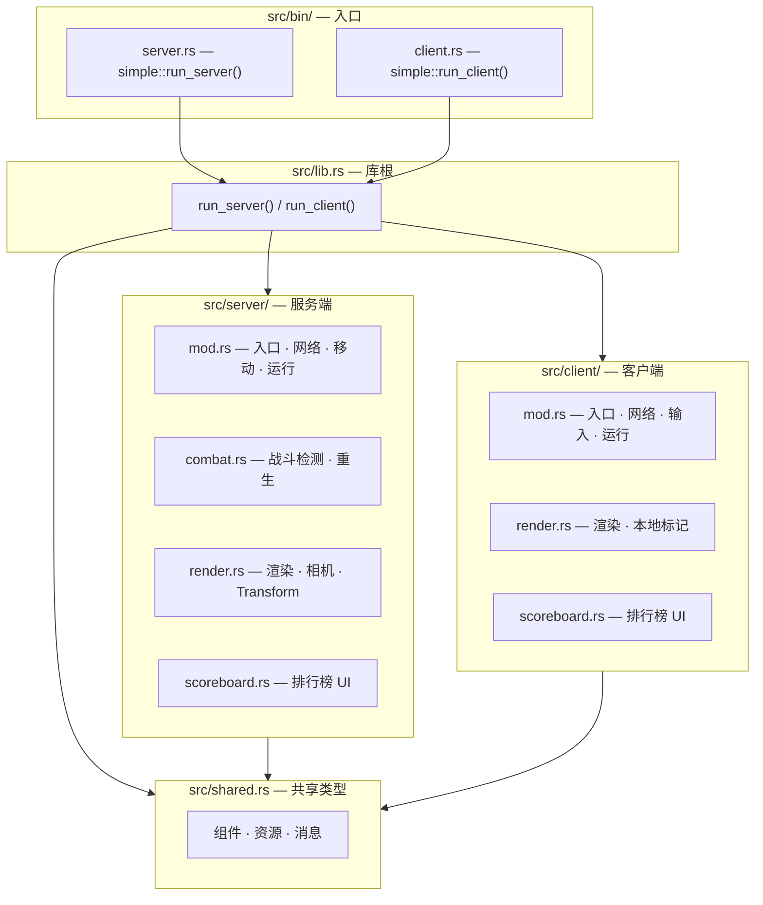
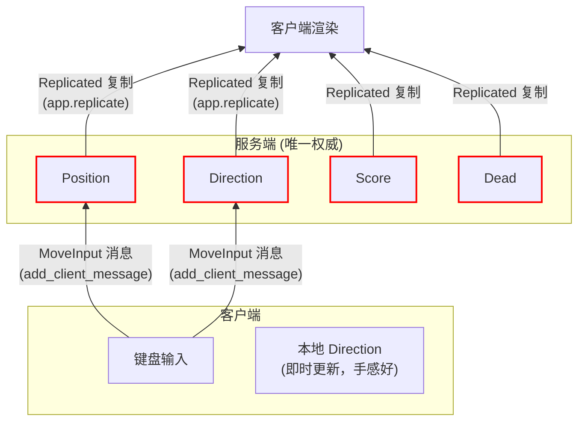
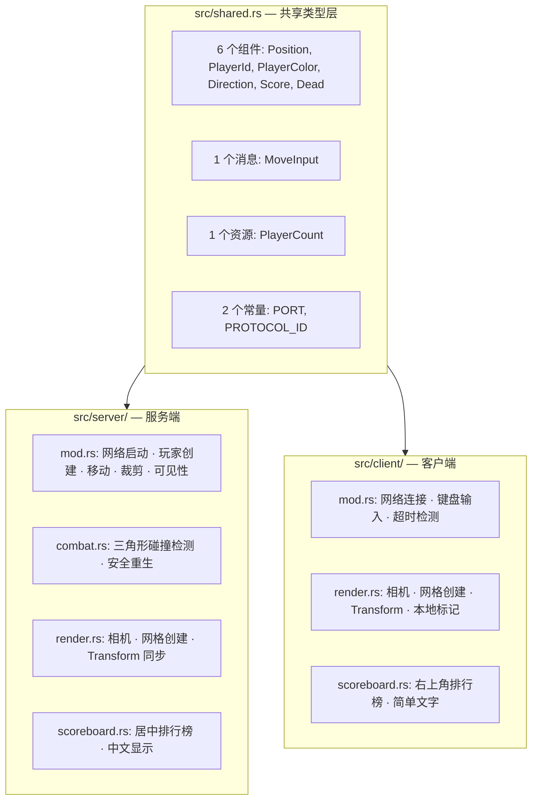
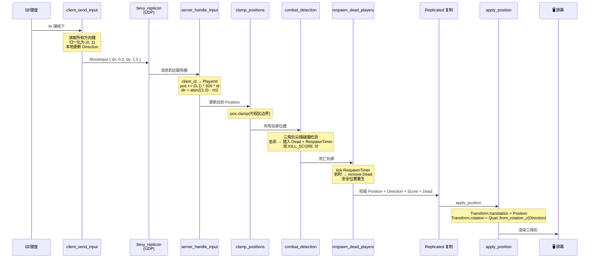
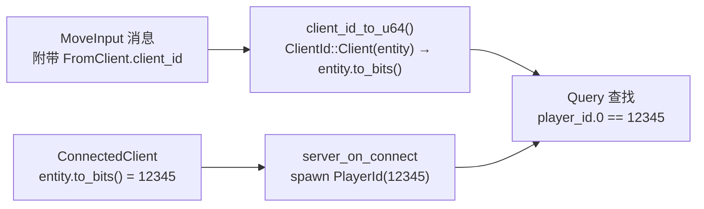

# LEARN.md — 学习路线

本教程逐行分析 `src/` 下的全部代码，先讲技术基础，再讲架构，最后拆解每个文件的每一行。

## 项目地图



| 文件 | 行数 | 角色 |
|------|------|------|
| `src/shared.rs` | 42 | 全部共享类型定义（组件、资源、消息） |
| `src/server/mod.rs` | 211 | 服务端入口：网络启动、玩家创建、移动处理、边界裁剪、可见性管理、run() |
| `src/server/combat.rs` | 178 | 战斗检测（三角形碰撞）、安全重生点计算 |
| `src/server/render.rs` | 43 | 服务端渲染：相机、网格创建、Transform 同步 |
| `src/server/scoreboard.rs` | 93 | 服务端排行榜 UI（居中中文显示） |
| `src/client/mod.rs` | 152 | 客户端入口：网络连接、键盘输入、超时检测、相机、run() |
| `src/client/render.rs` | 66 | 客户端渲染：本地玩家标记、Transform 同步、可见性 |
| `src/client/scoreboard.rs` | 64 | 客户端排行榜 UI（右上角简单文字） |
| `src/bin/server.rs` | 4 | 服务端二进制入口 |
| `src/bin/client.rs` | 4 | 客户端二进制入口 |
| `src/lib.rs` | 12 | 库根，暴露 `run_server()` / `run_client()` |

---

## 第 1 级：先把游戏跑起来

```bash
# 终端 1 — 启动服务端（带窗口）
cargo run --bin server

# 终端 2 — 启动客户端（可多开几个）
cargo run --bin client
```

你会看到三角形玩家，WASD 或方向键移动，三角形尖端指向移动方向。每个新玩家颜色不同。用三角形的尖端戳其他玩家的身体即可击杀得分。被击杀后 3 秒自动重生。

---

## 第 2 级：Cargo 项目结构

在深入代码之前，先理解 Rust 项目如何组织两个独立二进制文件。

### 2.1 Cargo.toml 的双二进制配置

```toml
[[bin]]
name = "server"
path = "src/bin/server.rs"

[[bin]]
name = "client"
path = "src/bin/client.rs"
```

Cargo 默认会编译 `src/main.rs` 作为二进制入口。但这里通过 `[[bin]]` 显式声明了两个二进制目标，各自有独立的入口文件。`cargo run --bin server` 只编译 `src/bin/server.rs` 及其依赖；`cargo run --bin client` 只编译 `src/bin/client.rs` 及其依赖。

两个入口都非常薄：

```rust
// src/bin/server.rs
fn main() {
    simple::run_server();
}

// src/bin/client.rs
fn main() {
    simple::run_client();
}
```

它们不包含任何游戏逻辑，只调用库根 `lib.rs` 暴露的函数。`simple` 是 Cargo.toml 中 `[package] name = "simple"` 定义的包名。

### 2.2 lib.rs — 库根

```rust
mod shared;
mod server;
mod client;

pub fn run_server() {
    server::run();
}

pub fn run_client() {
    client::run();
}
```

`mod shared;` 告诉 Rust 编译器在同级目录找 `shared.rs` 或 `shared/mod.rs`。这里 `shared.rs` 是单文件模块，而 `server/` 和 `client/` 是目录模块（各自有 `mod.rs` + 子模块）。

`run_server()` 和 `run_client()` 是库的公开 API，被 `src/bin/` 下的入口调用。调用链是：

```
src/bin/server.rs: main()
  → simple::run_server()         // lib.rs:5
    → server::run()              // server/mod.rs:161
      → App::new() → add_plugins → add_systems → run()
```

### 2.3 为什么服务端和客户端是分开的二进制

服务端包含战斗逻辑、计分、重生等游戏规则。如果这些代码编译进客户端，玩家可以通过逆向工程找出击杀判定、重生位置等漏洞。分开编译后，客户端二进制中不包含任何服务端模块（`mod server;` 虽在 lib.rs 声明，但客户端入口只调 `run_client()`，Rust 的链接器会包含服务端代码——不过在这个项目中服务端逻辑始终被编译，真正的隔离需要 feature gate。当前架构已将服务端常量/函数归类在 `server/` 模块下，为未来的 feature gate 做准备）。

---

## 第 3 级：技术栈详解

在读懂代码之前，先理解项目用了哪些框架和它们各自解决什么问题。

### 3.1 Bevy ECS — 游戏引擎核心

Bevy 是一个数据驱动的游戏引擎，核心是 **ECS（Entity-Component-System）** 架构。ECS 将传统 OOP 中耦合在一起的数据和行为分离到三个独立维度。

#### 3.1.1 Entity（实体）

Entity 是一个轻量的 64 位整数 ID，不包含任何数据本身。可以类比数据库的主键——它只标识一行记录，但所有数据存在别的列里。

```rust
// Bevy 内部，Entity 的结构大致是：
// id: u32  (generation: u32) 用于防止悬垂引用
```

在项目中，每个玩家对应一个 Entity。Entity 可以动态添加/移除 Component。

#### 3.1.2 Component（组件）

Component 是挂在 Entity 上的纯数据，用 `#[derive(Component)]` 标记。项目中的例子：

```rust
#[derive(Component, Clone, Copy, Debug, Serialize, Deserialize)]
pub struct Position {
    pub x: f32,
    pub y: f32,
}

#[derive(Component, Clone, Copy, Serialize, Deserialize, PartialEq)]
pub struct PlayerId(pub u64);

#[derive(Component, Clone, Copy, Serialize, Deserialize)]
pub struct PlayerColor {
    pub r: f32,
    pub g: f32,
    pub b: f32,
}

#[derive(Component, Clone, Copy, Serialize, Deserialize, Default)]
pub struct Direction {
    pub angle: f32,
}

#[derive(Component, Clone, Copy, Serialize, Deserialize, Default, Debug)]
pub struct Score(pub u32);

#[derive(Component, Clone, Copy, Serialize, Deserialize, Debug)]
pub struct Dead;
```

Bevy 内部使用**原型（Archetype）**来组织有相同 Component 组合的实体。所有 `(Position, Direction, PlayerId, PlayerColor, Score)` 组合的实体存在同一个 Archetype 中。Query 通过匹配 Archetype 来高效遍历实体——不需要逐实体检查，直接跳到包含目标组合的 Archetype。

#### 3.1.3 Resource（资源）

Resource 是全局单例数据，用 `#[derive(Resource)]` 标记。与 Component 不同，Resource 不属于任何 Entity，整个 World 只有一份。

```rust
// shared.rs — 共享资源
#[derive(Resource, Default)]
pub struct PlayerCount(pub u32);

// client/mod.rs — 客户端专属资源
#[derive(Resource)]
pub(crate) struct ConnectTimer(pub Timer);

#[derive(Resource, Default)]
pub(crate) struct ConnectionState {
    pub printed_connected: bool,
}

#[derive(Resource)]
pub struct LocalClientId(pub u64);
```

`PlayerCount` 是共享资源定义，但只有服务端实际使用它。`ConnectTimer`、`ConnectionState`、`LocalClientId` 只定义在客户端模块中，服务端完全不知道它们的存在。

#### 3.1.4 System（系统）

System 是每帧执行的普通 Rust 函数。Bevy 通过函数签名自动推断需要注入什么参数——这叫**系统参数（SystemParam）**。

可用的 SystemParam 类型：

| SystemParam | 访问权限 | 用途 |
|-------------|---------|------|
| `Query<&T, Filter>` | 只读查询 | 遍历匹配 Filter 的所有实体的 Component T |
| `Query<&mut T, Filter>` | 可变查询 | 遍历并修改匹配实体的 Component T |
| `Res<T>` | 只读资源 | 读取全局资源 T |
| `ResMut<T>` | 可变资源 | 读取并修改全局资源 T |
| `Commands<'_, '_>` | 延迟命令 | spawn/insert/remove/despawn 实体（不是立即执行） |
| `Res<Time>` | 只读资源 | `time.delta_secs()` 获取上一帧到当前帧的秒数 |
| `Res<ButtonInput<KeyCode>>` | 只读资源 | `keyboard.pressed(KeyCode::KeyW)` 检测按键 |
| `MessageReader<FromClient<T>>` | 只读 | 读取客户端发来的消息（[3.2](#32-bevy_replicon--网络复制框架)） |
| `MessageWriter<T>` | 只写 | 向服务端发送消息 |
| `On<Add, T>` | Observer 触发器 | 当某实体的 T 组件被添加时触发回调 |
| `Res<Assets<Mesh>>` | 可变资源 | 网格资产存储 |
| `Res<Assets<ColorMaterial>>` | 可变资源 | 颜色材质资产存储 |
| `Res<AssetServer>` | 只读资源 | 资产加载器（从文件系统加载字体等） |
| `Local<T>` | 本地状态 | 跨帧持久化的函数本地变量 |

**Commands 的延迟执行机制**：`Commands` 不是立即生效的。调用 `commands.spawn(...)` 或 `commands.entity(e).insert(...)` 时，操作被推入一个队列缓冲区。所有系统的 Commands 在当前阶段（如 Update）结束后批量执行。这意味着在同一个系统内 spawn 的实体，其他系统在同一帧内看不到——只有下一帧才能被 Query 查到。

**Query 的过滤机制**：Bevy 内部维护了每种 Component 组合的 Archetype 列表。Query 通过 `With<T>` 和 `Without<T>` 过滤 Archetype。例如 `Query<&Position, (With<PlayerId>, Without<Dead>)>` 只遍历同时有 `Position` 和 `PlayerId` 但没有 `Dead` 的实体。这是 O(1) 的 Archetype 匹配，不是逐实体检查。

**`&mut` 的借用规则**：Bevy 允许同一个 Query 返回多个 `&mut T`——这在普通 Rust 中不可能（不能同时有两个可变引用）。Bevy 在运行时保证：同一个 Entity 不会被同一个 Query 返回两次。

#### 3.1.5 系统调度：Startup、Update、Observer

Bevy 有多个**调度阶段（Schedule）**：

| Schedule | 运行时机 |
|----------|---------|
| `Startup` | 应用启动时，所有 Startup 系统运行**一次** |
| `Update` | **每帧**运行一次 |
| 其他 | `FixedUpdate`（固定时间步长）、`PostUpdate` 等，本项目未使用 |

```rust
// app.add_systems(Startup, ...) — 启动时运行一次
app.add_systems(Startup, (setup_camera, start_server, setup_scoreboard));

// app.add_systems(Update, ...) — 每帧运行
app.add_systems(Update, (
    spawn_render,
    server_handle_input,
    clamp_positions,
    combat_detection,
    respawn_dead_players,
    apply_position,
    update_visibility,
    update_scoreboard,
).chain());
```

**Observer** 是 Bevy 的事件驱动机制。`server_on_connect` 不用 `add_systems` 注册，而是用 `add_observer`：

```rust
app.add_observer(server_on_connect);
```

它的签名是：

```rust
pub fn server_on_connect(
    trigger: On<Add, ConnectedClient>,
    mut commands: Commands,
    mut count: ResMut<PlayerCount>,
)
```

`On<Add, ConnectedClient>` 表示：当任何实体上被添加了 `ConnectedClient` 组件时，触发此函数执行。`trigger.event_target()` 返回被添加了该组件的 Entity。

#### 3.1.6 `.chain()` 的语义

```rust
app.add_systems(Update, (A, B, C).chain());
```

等价于：

```rust
app.add_systems(Update, A);
app.add_systems(Update, B.after(A));
app.add_systems(Update, C.after(B));
```

`.chain()` 创建了严格的执行顺序：A 完全执行完毕后，B 才开始；B 完全执行完毕后，C 才开始。如果不用 `.chain()`，Bevy 可以并行执行它们（只要不违反借用规则）。

项目服务端中 8 个系统全部 chain 在一起，确保了每一帧的执行顺序是确定性的：

```
spawn_render → server_handle_input → clamp_positions → combat_detection
  → respawn_dead_players → apply_position → update_visibility → update_scoreboard
```

这个顺序是有原因的：
- `spawn_render` 必须先于 `apply_position`（否则新玩家没有 Transform 可写）
- `clamp_positions` 必须后于 `server_handle_input`（否则裁剪的是旧位置）
- `combat_detection` 必须后于 `clamp_positions`（否则碰撞检测位置不准）
- `respawn_dead_players` 必须后于 `combat_detection`（否则刚被杀的人立刻重生）
- `apply_position` 必须后于 `respawn_dead_players`（重生后新位置需同步到 Transform）

客户端没有使用 `.chain()`，各系统间没有硬性顺序依赖：

```rust
app.add_systems(Update, (
    client_send_input,     // 发送输入
    check_connection,      // 检查连接
    spawn_render,          // 创建渲染
    apply_position,        // 同步 Transform
    update_visibility,     // 更新可见性
    update_scoreboard,     // 更新榜单
));
```

#### 3.1.7 渲染系统详解

Bevy 的 2D 渲染管线需要几个关键组件协同工作：

**Mesh（网格）**：定义几何形状。本项目用 `Triangle2d`：

```rust
let mesh = Triangle2d::new(
    Vec2::new(0.0, 20.0),       // 顶点（正上方）
    Vec2::new(-15.0, -20.0),    // 左下
    Vec2::new(15.0, -20.0),     // 右下
);
```

三个顶点定义了高 40px、底宽 30px 的等腰三角形，尖端朝上。

**网格到实体的挂载链**：

```
Triangle2d → Mesh2d(meshes.add(mesh)) → 实体
```

`meshes.add(mesh)` 将网格数据上传到 GPU，返回 `Handle<Mesh>`。`Mesh2d` 是 Component，Bevy 渲染系统看到它就会渲染。

**Material（材质）**：定义颜色/纹理。本项目用 `ColorMaterial`：

```rust
MeshMaterial2d(materials.add(Color::srgb(color.r, color.g, color.b)))
```

`Color::srgb(r, g, b)` 接受 0-1 范围的线性 sRGB 值。项目中颜色值来自 `PlayerColor`，本身就是 0-1 范围。

**Transform（变换）**：定义实体在世界空间中的位置、旋转、缩放。这是一个 4×4 矩阵的 Bevy 封装：

```rust
Transform {
    translation: Vec3,  // 位置 (x, y, z)
    rotation: Quat,     // 旋转（四元数）
    scale: Vec3,        // 缩放
}
```

2D 游戏中只关心 `translation` 的 x/y 和 `rotation` 绕 Z 轴的旋转。`Quat::from_rotation_z(angle)` 生成一个绕 Z 轴旋转 `angle` 弧度的四元数。

**Transform 是 Bevy 渲染的"真相"**——GPU 读取 Transform 来决定三角形在屏幕上的位置和朝向。我们的逻辑数据 `Position` + `Direction` 只是应用层数据，`apply_position` 系统负责将逻辑数据同步到渲染数据。

**Camera（相机）**：没有相机，Bevy 不会渲染任何东西：

```rust
commands.spawn((Camera2d, Transform::default(), GlobalTransform::default()));
```

`Camera2d` 是 2D 正交相机的 Component。`Transform::default()` 放在原点 (0,0,0)。`GlobalTransform::default()` 必须显式添加——Bevy 0.18 要求 spawn 时带 `GlobalTransform`，否则 panic。

**Visibility（可见性）**：三个层级的可见性控制：

| Component | 含义 |
|-----------|------|
| `Visibility::Visible` | 本实体显式设置为可见 |
| `Visibility::Hidden` | 本实体显式设置为隐藏 |
| `Visibility::Inherited` | 继承父实体的可见性（默认） |

`InheritedVisibility` 是 Bevy 内部计算的——从父实体层层继承下来的可见性状态。最终渲染时，实体可见当且仅当自己的 Visibility 和 InheritedVisibility 都允许显示。

项目中的 `update_visibility` 系统把 `Dead` 玩家设为 `Visibility::Hidden`，活着时恢复为 `Visibility::Inherited`。注意：这里不是设为 `Visibility::Visible`，因为玩家实体可能有父实体（比如 UI 层级），设为 `Inherited` 更安全。

**GlobalTransform**：Bevy 在每帧渲染前自动从 `Transform` 计算 `GlobalTransform`（通过 Transform 传播系统）。`GlobalTransform = ParentGlobalTransform * LocalTransform`。对于没有父实体的实体，`GlobalTransform = Transform`。spawn 实体时必须带这个 Component。

#### 3.1.8 UI 渲染系统详解

Bevy 的 UI 系统将每个 UI 元素也当作一个 Entity（带有 UI 相关的 Component），使用 flexbox 布局引擎。

**UI 实体的核心组件**：

| Component | 含义 |
|-----------|------|
| `Node` | flexbox 容器配置 |
| `Text` / `TextSpan` | 文本内容 |
| `TextFont` | 字体配置（字体文件、字号） |
| `TextColor` | 文字颜色 |
| `TextLayout` | 文本对齐方式 |

**Bevy 0.18 的多段文本模型**：一段文本由父实体持有 `Text`（包含多个 `TextSpan`），子实体持有单个 `TextSpan`。`Text::new("hello")` 创建一个含一个 `TextSpan` 的 `Text`。

**`Text` vs `TextSpan`**：

- `Text::new(str)` — 创建包含一个默认 `TextSpan` 的单段文本，挂在父实体上
- `TextSpan::new(str)` — 创建一段 styled 文本，通常作为子实体

服务端和客户端排行榜分别使用了两种方式：
- 服务端 (`server/scoreboard.rs`)：用 `Text::new(str)`，每个条目是一个独立实体，通过 `set_parent_in_place` 挂到 root 下
- 客户端 (`client/scoreboard.rs`)：用 `TextSpan(str.into())`，全部文本拼在一个字符串里

**flexbox 布局**：`Node` 的布局属性基于 CSS flexbox 模型：

| 属性 | 含义 |
|------|------|
| `width` / `height` | 元素尺寸，`Val::Percent(100.0)` = 填满父容器 |
| `position_type: PositionType::Absolute` | 绝对定位，不参与正常布局流 |
| `flex_direction: FlexDirection::Column` | 子元素垂直排列 |
| `align_items: AlignItems::Center` | 子元素在交叉轴上居中 |
| `justify_content: JustifyContent::Center` | 子元素在主轴（列方向=垂直）上居中 |
| `row_gap: Val::Px(4.0)` | 子元素之间的间距 4px |
| `top` / `right` / `bottom` / `left` | 绝对定位时的边距 |

**UI 层级**：通过 `set_parent_in_place` 建立父子关系：

```rust
commands.entity(child_entity).set_parent_in_place(root_entity);
```

UI 实体形成一棵树，Bevy 的 UI 布局系统自顶向下计算每个节点的位置和大小。

### 3.2 bevy_replicon — 网络复制框架

bevy_replicon 是一个基于 ECS 的网络复制库。它将网络同步抽象为"某些 Component 被标记为 Replicated，服务端 spawn 实体时带上此标记，组件自动同步到所有客户端"。

#### 3.2.1 数据通道

bevy_replicon 区分两种数据流向：

**服务端 → 客户端（Replicated 复制）**：

```rust
app.replicate::<Position>();
app.replicate::<Direction>();
app.replicate::<PlayerId>();
app.replicate::<PlayerColor>();
app.replicate::<Score>();
app.replicate::<Dead>();
```

注册后，服务端 spawn 带 `Replicated` 标记 + 这些组件的实体时，bevy_replicon 自动将组件数据序列化并通过网络发送到所有连接的客户端。客户端收到后反序列化并在本地 World 中创建对应的实体和组件。

**更新时机**：每帧 Update 阶段结束后，bevy_replicon 的内部系统（`RepliconServerPlugin` 注册的系统）自动检测所有带 `Replicated` 的实体的变更，将变更的组件数据发送给客户端。

**客户端 → 服务端（Client Message）**：

```rust
app.add_client_message::<MoveInput>(Channel::Ordered);
```

`MoveInput` 不是 Component 而是 Message（`#[derive(Message)]`）。Message 不挂在实体上，而是直接作为网络消息发送：

- 客户端用 `MessageWriter<MoveInput>` 发送
- 服务端用 `MessageReader<FromClient<MoveInput>>` 接收

`FromClient<T>` 是一个包装，解包后得到：

```rust
struct FromClient<T> {
    pub client_id: ClientId,  // 发送者标识
    pub message: T,            // 消息体
}
```

`Channel::Ordered` 指定消息通过有序可靠通道发送（保证顺序和不丢包）。

#### 3.2.2 Replicated 的实体生命周期

服务端 spawn 一个带 `Replicated` 的实体时：

1. bevy_replicon 为这个实体分配一个网络 ID
2. 将实体数据（包括所有注册为 replicate 的组件）序列化
3. 通过可靠通道发送给所有客户端
4. 客户端在本地 World 创建对应的实体

服务端 despawn 实体时，bevy_replicon 通知客户端也 despawn 对应的实体。

**组件变更追踪**：bevy_replicon 内部使用 Bevy 的变更检测机制。任何被 replicate 的 Component 发生变化时（通过 `ResMut<T>` 或 `&mut T` in Query 修改），bevy_replicon 标记其为"脏"，下一帧同步周期将其发送给客户端。

#### 3.2.3 Observer 触发器

```rust
app.add_observer(server_on_connect);
```

`server_on_connect` 用 `On<Add, ConnectedClient>` 作为第一个参数。这是 bevy_replicon 提供的触发器——当 `ConnectedClient` 组件（来自 bevy_replicon_renet）被添加到某个实体时触发。这发生在 renet 传输层检测到新客户端连入时。

`trigger.event_target()` 返回被添加了 `ConnectedClient` 的那个 Entity。服务端用 `entity.to_bits()` 生成 `PlayerId`，保证每个玩家的 ID 唯一且可追溯。

### 3.3 bevy_renet + bevy_replicon_renet — 传输层

renet 是一个基于 UDP 的网络库，提供类似 TCP 的可靠性抽象。bevy_replicon_renet 是连接 bevy_replicon 和 renet 的适配层。

#### 3.3.1 renet 的通道模型

renet 将网络通信抽象为**通道（Channel）**，每个通道有独立的可靠性/顺序保证：

| 通道类型 | 保证 | 用途 |
|----------|------|------|
| `Channel::ReliableOrdered` | 可靠 + 有序 | 状态同步（Position、Score 等） |
| `Channel::ReliableUnordered` | 可靠 + 无序 | 非顺序敏感的数据 |
| `Channel::Unreliable` | 不可靠 + 无序 | 高频低延迟数据 |

`bevy_replicon` 内部使用 `RepliconChannels` 管理通道配置：

```rust
// 服务端
let channels = world.resource::<RepliconChannels>();
let server = RenetServer::new(ConnectionConfig {
    server_channels_config: channels.server_configs(),
    client_channels_config: channels.client_configs(),
    ..default()
});
```

`RepliconChannels` 是在 `RepliconPlugins` 注册时自动插入 World 的 Resource，包含 bevy_replicon 需要的默认通道配置。

#### 3.3.2 Netcode 传输层

renet 本身只负责可靠传输，不负责连接管理。`bevy_replicon_renet` 使用 netcode 协议管理连接生命周期（握手、心跳、断开）。

**服务端配置**：

```rust
let transport = NetcodeServerTransport::new(
    ServerConfig {
        current_time: now,                      // 当前 UNIX 时间戳
        max_clients: 8,                         // 最大连接数
        protocol_id: PROTOCOL_ID,               // 协议标识（必须与客户端一致）
        public_addresses: vec![bind_addr],       // 服务器地址列表
        authentication: ServerAuthentication::Unsecure,  // 不安全认证
    },
    socket,  // 已绑定的 UDP socket
).unwrap();
```

**客户端配置**：

```rust
let client_id = now.subsec_nanos() as u64 + now.as_secs() * 1_000_000_000;
let transport = NetcodeClientTransport::new(
    now,
    ClientAuthentication::Unsecure {
        client_id,                  // 客户端标识
        protocol_id: PROTOCOL_ID,   // 必须与服务器一致
        server_addr,                // 服务器地址
        user_data: None,
    },
    socket,
).unwrap();
```

`client_id` 的生成方式是 `时间戳秒数 * 10^9 + 亚秒纳秒数`。在有多个客户端同时启动的极端情况下可能碰撞，但在实际使用中足够稀疏。

`ServerAuthentication::Unsecure` 表示不验证客户端身份——任何人都可以连接。生产环境需要改用 `ServerAuthentication::Secure`（需要预共享密钥）。

#### 3.3.3 启动阶段的特殊性

`start_server` 和 `start_client` 的参数是 `&mut World` 而不是 `Commands`：

```rust
pub fn start_server(world: &mut World)
pub fn start_client(world: &mut World)
```

这是因为 Startup 阶段，在 Bevy 的 schedule 开始执行之前，需要直接往 World 里插入 Resource（RenetServer、NetcodeServerTransport 等）。这些 Resource 必须在后续系统运行之前就存在于 World 中。`Commands` 只能在系统运行时使用且延迟执行，不适合这个时机。

`world.resource::<RepliconChannels>()` 直接从 World 获取已有 Resource，`world.insert_resource(server)` 直接插入。

### 3.4 serde + bincode — 序列化

所有网络传输的类型需要 `Serialize + Deserialize`：

```rust
#[derive(Component, Clone, Copy, Debug, Serialize, Deserialize)]
pub struct Position {
    pub x: f32,
    pub y: f32,
}
```

bevy_replicon 使用 bincode（二进制编码）序列化组件数据。bincode 比 JSON 紧凑得多——`Position { x: 100.0, y: 200.0 }` 在 JSON 中占 ~30 字节，bincode 中只占 8 字节（两个 f32）。

bincode 不需要 `.json()` / `.from_json()` 这样的中间步骤，bevy_replicon 内部直接调用 `bincode::serialize()` / `bincode::deserialize()`。

### 3.5 rand — 随机数

只用于安全重生点的随机位置选取：

```rust
let mut rng = rand::rng();           // 获取线程本地随机数生成器
let x = rng.random_range(min_x..max_x);  // 在范围内生成随机 f32
```

`rand::rng()` 是 rand 0.10 的新 API（旧版是 `rand::thread_rng()`）。`random_range` 对整数范围生成均匀分布的整数，对浮点数范围生成均匀分布的浮点数。

---

## 第 4 级：整体架构

### 4.1 服务器权威模型



核心规则：

1. 客户端**不直接修改** `Position`、`Score`、`Dead`。这些组件的唯一修改者在服务端
2. 客户端发送 `MoveInput` 消息（"我想往这个方向移动"），服务端决定实际位置
3. 服务端处理移动、碰撞检测、计分、死亡、重生，然后通过 `Replicated` 将全部组件状态广播回所有客户端
4. 客户端的 `client_send_input` 在发送 `MoveInput` 的同时**本地更新 `Direction`**（[6.3](#63-键盘输入-client_send_input)），不等服务器回复——这使操作手感即时响应。但下一帧服务端返回的权威 `Direction` 会覆盖这个本地值
5. 服务端**也有窗口和渲染**——它能看到和客户端一样的画面，用于观察/调试

### 4.2 模块职责和依赖



`shared.rs` 是唯一的共享文件。服务端和客户端各自有独立的子模块，互不依赖。服务端不知道 `LocalClientId` 的存在，客户端不知道 `RespawnTimer` 的存在。

### 4.3 一次按键的完整数据流

按下 `W` 键，从输入到屏幕上三角形移动，经过的全部路径：



### 每一步的代码位置和精确行为

| 步骤 | 文件:行号 | 精确行为 |
|------|----------|---------|
| 读键盘 | `client/mod.rs:65-84` | 检测 WASD / 方向键，组合为 (dx, dy)，支持同方向多键（W 和 ↑ 同时按不影响结果） |
| 归一化 | `client/mod.rs:86-89` | `len = sqrt(dx² + dy²)`; `ndx = dx/len, ndy = dy/len`。防止斜向移动速度是正交的 √2 倍 |
| 本地朝向 | `client/mod.rs:91-94` | `angle = atan2(ndy, ndx) - π/2`，立即更新客户端 `Direction` |
| 发送 | `client/mod.rs:96` | `writer.write(MoveInput { dx: ndx, dy: ndy })`，通过 Ordered 通道发送 |
| 接收 | `server/mod.rs:113` | `move_msgs.read()` 返回迭代器，每次 read 消费所有积压消息 |
| 映射 | `server/mod.rs:114` | `client_id_to_u64(*client_id)` 将 `ClientId::Client(entity)` 转为 `entity.to_bits()` |
| 匹配 | `server/mod.rs:116` | 遍历所有 `Without<Dead>` 的玩家，找 `player_id.0 == sender_id` |
| 移动 | `server/mod.rs:117-118` | `pos.x += ndx * 300.0 * delta_secs`。`delta_secs` 通常约 0.016（60fps），每帧移约 4.8px |
| 朝向更新 | `server/mod.rs:119-120` | 仅当 `dx != 0.0 || dy != 0.0` 时才更新——静止时保留上次朝向 |
| 裁剪 | `server/mod.rs:127-136` | `pos.x.clamp(-615, 615)`, `pos.y.clamp(-335, 335)` |
| 碰撞检测 | `server/combat.rs:88-157` | 两两配对，用重心坐标法检测尖端是否在对方三角形内 |
| 击杀处理 | `server/combat.rs:145-150` | `commands.entity(entity).insert((Dead, RespawnTimer(Timer::from_seconds(3.0, ...))))` |
| 计分 | `server/combat.rs:151-156` | `score.0 += 10`，写入被击杀者的 Score 组件 |
| 重生 tick | `server/combat.rs:165-167` | `timer.0.tick(time.delta())`，每帧累加 dt |
| 重生触发 | `server/combat.rs:168-176` | `timer.0.just_finished()` 为 true → `remove::<(Dead, RespawnTimer)>()` + 插入新 Position |
| Replicated 同步 | bevy_replicon 内部 | 检测变更组件 → 序列化 → 通过 renet 发送给所有客户端 |
| 渲染同步 | `render.rs:35-42` | `Transform.translation = Vec3::new(pos.x, pos.y, 0.0)`; `Transform.rotation = Quat::from_rotation_z(dir.angle)` |
| GPU 渲染 | Bevy 内部 | 读取 Transform 矩阵 → 顶点着色器 → 光栅化 → 显示 |

### 为什么减 π/2

三角形 mesh 的顶点在 `(0, 20)`，即 Y 轴正方向（屏幕上方）。`atan2(dy, dx)` 返回的角度 0 指向 X 轴正方向（屏幕右方）。两者差 90° = π/2 弧度。

```
atan2(1, 0) = π/2  (指向正上)
三角形尖端朝上需要 angle = 0
0 = π/2 - π/2 ✓
```

所以通用公式：`dir.angle = atan2(dy, dx) - FRAC_PI_2`。

---

## 第 5 级：共享类型层 (`src/shared.rs`)

这是服务端和客户端之间的契约，所有网络传输的类型都在这里定义。42 行，零系统逻辑。

### 5.1 行 1-2：导入

```rust
use bevy::prelude::*;
use serde::{Deserialize, Serialize};
```

`bevy::prelude::*` 导入 `Component`、`Resource`、`Message`（来自 bevy_replicon 的 prelude）等常用类型。

### 5.2 行 4-5：网络常量

```rust
pub const PORT: u16 = 5000;
pub const PROTOCOL_ID: u64 = 123456;
```

`PORT` 是 UDP 监听/连接端口。`PROTOCOL_ID` 是 netcode 协议的版本标识——服务端和客户端的值必须相同，否则连接被拒绝。这防止了不同版本的游戏意外通信。

### 5.3 行 7-11：Position

```rust
#[derive(Component, Clone, Copy, Debug, Serialize, Deserialize)]
pub struct Position {
    pub x: f32,
    pub y: f32,
}
```

衍生 trait 的作用：
- `Component` — 标记为 Bevy 组件
- `Clone, Copy` — 值类型语义，`iter().copied()` 直接复制
- `Debug` — `info!("{:?}", pos)` 可用
- `Serialize, Deserialize` — 网络传输必需

### 5.4 行 13-14：PlayerId

```rust
#[derive(Component, Clone, Copy, Serialize, Deserialize, PartialEq)]
pub struct PlayerId(pub u64);
```

元组结构体，`PartialEq` 用于 `player_id.0 == sender_id` 的比较。值来自 `entity.to_bits()`（Entity 的 64 位表示）。

### 5.5 行 16-21：PlayerColor

```rust
#[derive(Component, Clone, Copy, Serialize, Deserialize)]
pub struct PlayerColor {
    pub r: f32,
    pub g: f32,
    pub b: f32,
}
```

值由服务端 `hsv_to_rgb()` 生成，通过网络复制到所有客户端。

### 5.6 行 23-27：MoveInput（消息）

```rust
#[derive(Message, Clone, Serialize, Deserialize)]
pub struct MoveInput {
    pub dx: f32,
    pub dy: f32,
}
```

`#[derive(Message)]` 而非 `#[derive(Component)]`——这不是挂在实体上的组件，而是作为网络消息直接发送。`dx`、`dy` 是客户端已经归一化后的方向向量。

### 5.7 行 29-32：Direction

```rust
#[derive(Component, Clone, Copy, Serialize, Deserialize, Default)]
pub struct Direction {
    pub angle: f32,
}
```

`Default` 派生使 `angle` 默认为 `0.0`，即朝右（减去 π/2 后朝上）。

### 5.8 行 34-35：Score

```rust
#[derive(Component, Clone, Copy, Serialize, Deserialize, Default, Debug)]
pub struct Score(pub u32);
```

服务端权威修改（`combat_detection` 中 +10），通过 `Replicated` 同步到客户端。`Default` 使新玩家从 0 分开始。

### 5.9 行 37-38：Dead

```rust
#[derive(Component, Clone, Copy, Serialize, Deserialize, Debug)]
pub struct Dead;
```

标记组件——无字段，存在即表示死亡。服务端插入此组件后，`update_visibility` 将其隐藏；`server_handle_input`、`clamp_positions` 等系统通过 `Without<Dead>` 过滤掉死者。

### 5.10 行 40-41：PlayerCount

```rust
#[derive(Resource, Default)]
pub struct PlayerCount(pub u32);
```

只有一个字段的资源。`Default` 使初始化为 `0`。

---

## 第 6 级：服务端逐文件分析

### 6.1 `server/mod.rs` — 入口和核心系统

#### 6.1.1 行 1-13：导入和子模块

```rust
use crate::shared::*;
use bevy::asset::{AssetPlugin, UnapprovedPathMode};
use bevy::prelude::*;
use bevy_replicon::prelude::*;
use bevy_replicon_renet::{
    RenetChannelsExt, RenetServer,
    netcode::{NetcodeServerTransport, ServerAuthentication, ServerConfig},
    renet::ConnectionConfig,
};
use std::{
    net::{Ipv4Addr, SocketAddr, UdpSocket},
    time::SystemTime,
};

mod combat;
mod render;
mod scoreboard;

use combat::{combat_detection, respawn_dead_players};
use render::{apply_position, setup_camera, spawn_render};
use scoreboard::{setup_scoreboard, update_scoreboard};
```

`AssetPlugin` 和 `UnapprovedPathMode` 用于允许加载任意路径的资产（字体文件在 `C:/Windows/Fonts/` 下，不在 assets 目录内）。

`RenetChannelsExt` 是一个扩展 trait，提供 `channels.server_configs()` 和 `channels.client_configs()` 方法。

#### 6.1.2 行 23-30：服务端专属常量

```rust
pub const MOVE_SPEED: f32 = 300.0;
pub const VISIBLE_HALF_WIDTH: f32 = 640.0;
pub const VISIBLE_HALF_HEIGHT: f32 = 360.0;
pub const BOUNDARY_MARGIN: f32 = 25.0;
pub const KILL_SCORE: u32 = 10;
pub const RESPAWN_DELAY_SECS: f32 = 3.0;
pub const SAFE_SPAWN_DISTANCE: f32 = 200.0;
pub const MAX_SPAWN_ATTEMPTS: u32 = 50;
```

每个常量的含义和选择原因：

| 常量 | 值 | 计算依据 |
|------|-----|---------|
| `MOVE_SPEED` | 300.0 | 60fps 下每帧移动 5px，约 1.2 秒横穿屏幕 |
| `VISIBLE_HALF_WIDTH` | 640.0 | Bevy 默认窗口 1280×720，半宽 640 |
| `VISIBLE_HALF_HEIGHT` | 360.0 | 半高 360 |
| `BOUNDARY_MARGIN` | 25.0 | 三角形高 40px，25px 边距确保尖端不超出屏幕 |
| `KILL_SCORE` | 10 | 每次击杀得 10 分 |
| `RESPAWN_DELAY_SECS` | 3.0 | 死亡后 3 秒重生 |
| `SAFE_SPAWN_DISTANCE` | 200.0 | 重生点离最近玩家至少 200px（约 6 个三角形长度） |
| `MAX_SPAWN_ATTEMPTS` | 50 | 找安全点重试 50 次，超过则硬塞 |

这些常量被 `combat.rs` 直接引用（`use crate::server::...`），不通过 `shared.rs`——客户端永远不需要知道它们。

#### 6.1.3 行 32-33：RespawnTimer

```rust
#[derive(Component, Deref, DerefMut)]
pub struct RespawnTimer(pub Timer);
```

`Deref<Target = Timer>` + `DerefMut` 使 `RespawnTimer` 可以透明地当作 `Timer` 使用：

```rust
timer.0.tick(time.delta());     // 不使用 Deref 的写法
timer.tick(time.delta());       // 使用 Deref 的写法（等价）
```

`Timer::from_seconds(3.0, TimerMode::Once)` 创建一个 3 秒倒计时、完成后不重复的计时器。`TimerMode::Once` 意味着 `just_finished()` 只在完成那一帧返回 `true`，之后返回 `false`。

#### 6.1.4 行 35-50：hsv_to_rgb

```rust
pub fn hsv_to_rgb(h: f32, s: f32, v: f32) -> (f32, f32, f32) {
    let h = h / 60.0;                    // 色相归一化到 [0, 6) 六段
    let i = h.floor() as u32 % 6;        // 确定在哪一段 (0-5)
    let f = h - h.floor();               // 段内插值因子 [0, 1)
    let p = v * (1.0 - s);               // 最低通道值
    let q = v * (1.0 - s * f);           // 下降通道值
    let t = v * (1.0 - s * (1.0 - f));   // 上升通道值
    match i {
        0 => (v, t, p),
        1 => (q, v, p),
        2 => (p, v, t),
        3 => (p, q, v),
        4 => (t, p, v),
        _ => (v, p, q),
    }
}
```

标准 HSV→RGB 转换算法。将色相环分为 6 段（红→黄→绿→青→蓝→品红），每段 60°。输入 h ∈ [0, 360)，s,v ∈ [0, 1]。输出 (r, g, b) 各分量 ∈ [0, 1]。

#### 6.1.5 行 52-82：start_server

```rust
pub fn start_server(world: &mut World) {
```

逐行分析：

1. 获取已存在的 `RepliconChannels` 资源（由 `RepliconPlugins` 插入）
2. 创建 `RenetServer`，传入通道配置
3. 绑定 UDP socket 到 `0.0.0.0:5000`
4. 获取当前 UNIX 时间戳——netcode 协议用时间戳防止重放攻击和过期连接
5. 创建 `NetcodeServerTransport`：
   - `max_clients: 8` — 超过 8 个客户端时拒绝新连接
   - `protocol_id: PROTOCOL_ID` — 必须与客户端一致
   - `public_addresses: vec![bind_addr]` — 告知客户端服务器地址
   - `authentication: ServerAuthentication::Unsecure` — 不验证客户端身份
6. 将 server 和 transport 作为 Resource 插入 World

`expect("端口绑定失败")` 在端口被占用时会 panic，终止程序。`transport` 的 `unwrap()` 在配置无效时 panic。

#### 6.1.6 行 84-106：server_on_connect（Observer）

```rust
pub fn server_on_connect(
    trigger: On<Add, ConnectedClient>,
    mut commands: Commands,
    mut count: ResMut<PlayerCount>,
) {
```

逐行分析：

- `trigger.event_target()` → 获取被添加了 `ConnectedClient` 的 Entity。这个 Entity 是 bevy_replicon_renet 内部创建的，代表一个网络连接
- `client_entity.to_bits()` → Entity 的 64 位表示。Bevy Entity 内部是 `(index: u32, generation: u32)`，`to_bits()` 返回 `generation << 32 | index` 的 u64
- `(count.0 as f32 * 137.508) % 360.0` → 金色角度公式。`137.508 = 360 × (1 − 1/φ)`，其中 φ = 1.618 是黄金比例。乘以 count 确保每个玩家在色相环上偏移 137.5°，永不重复且最大区分度
- `count.0 += 1` → 递增玩家计数
- `hsv_to_rgb(hue, 0.8, 0.9)` → 饱和度和亮度固定，只改变色相
- `commands.spawn((Replicated, PlayerId(id_num), Position {x:0,y:0}, Direction::default(), PlayerColor{r,g,b}, Score::default()))` → 生成带 6 个组件的实体。`Replicated` 是标记组件，告知 bevy_replicon 将此实体及所有注册的组件同步到客户端

初始位置 (0, 0) 是屏幕中心。`Direction::default()` 为 angle=0.0（朝向右边，减 π/2 后为上方）。`Score::default()` 为 0。

#### 6.1.7 行 108-125：server_handle_input

```rust
pub fn server_handle_input(
    mut move_msgs: MessageReader<FromClient<MoveInput>>,
    mut players: Query<(&PlayerId, &mut Position, &mut Direction), Without<Dead>>,
    time: Res<Time>,
) {
```

逐行分析：

- `move_msgs.read()` 返回此帧收到的所有 `FromClient<MoveInput>` 消息的迭代器。`.read()` 消费消息——调用后缓冲区清空，下一帧这些消息不再出现
- `FromClient { client_id, message }` 解构出 `ClientId` 枚举和 `MoveInput` 体
- `client_id_to_u64(*client_id)` 将 ClientId 枚举转 u64（[7.1](#71-client_id--playerid-映射)）
- `for (player_id, mut pos, mut dir) in players.iter_mut()` — 三重嵌套循环（客户端消息 × 玩家实体），O(N×M)。在玩家数少时性能可接受
- `pos.x += message.dx * MOVE_SPEED * time.delta_secs()` — 帧率无关移动计算。如果上一帧用了 0.016 秒，移动量为 `dx * 300 * 0.016 = dx * 4.8` 像素
- `if message.dx != 0.0 || message.dy != 0.0` — 只在有输入时更新朝向。静止时不更新，使玩家保持最后移动方向

`Without<Dead>` 过滤确保死者不能移动。

#### 6.1.8 行 127-136：clamp_positions

```rust
pub fn clamp_positions(mut players: Query<&mut Position, (With<PlayerId>, Without<Dead>)>) {
    let min_x = -VISIBLE_HALF_WIDTH + BOUNDARY_MARGIN;   // -640 + 25 = -615
    let max_x = VISIBLE_HALF_WIDTH - BOUNDARY_MARGIN;     //  640 - 25 =  615
    let min_y = -VISIBLE_HALF_HEIGHT + BOUNDARY_MARGIN;   // -360 + 25 = -335
    let max_y = VISIBLE_HALF_HEIGHT - BOUNDARY_MARGIN;     //  360 - 25 =  335
    for mut pos in players.iter_mut() {
        pos.x = pos.x.clamp(min_x, max_x);
        pos.y = pos.y.clamp(min_y, max_y);
    }
}
```

`f32::clamp(min, max)` 语义：如果 `self < min` 返回 `min`，`self > max` 返回 `max`，否则返回 `self`。`Without<Dead>` 确保死者不受边界限制（它们的 `Visibility::Hidden` 已经隐藏了渲染，裁剪位置无意义）。

四个边界值在函数内计算而不是作为常量——它们完全由常量派生，不需要独立存储。

#### 6.1.9 行 138-143：client_id_to_u64

```rust
fn client_id_to_u64(id: ClientId) -> u64 {
    match id {
        ClientId::Server => 0,
        ClientId::Client(entity) => entity.to_bits(),
    }
}
```

`ClientId` 是 bevy_replicon 的枚举，有两个变体：
- `ClientId::Server` — 代表服务端自身，返回 0（实际不会用到，因为服务端不给自己发 MoveInput）
- `ClientId::Client(entity)` — 客户端的标识 Entity，`entity.to_bits()` 获取其 64 位表示

#### 6.1.10 行 145-159：update_visibility

```rust
pub fn update_visibility(
    mut dead: Query<&mut Visibility, With<Dead>>,
    mut alive: Query<&mut Visibility, (With<PlayerId>, Without<Dead>)>,
) {
    for mut vis in dead.iter_mut() {
        if *vis != Visibility::Hidden {
            *vis = Visibility::Hidden;
        }
    }
    for mut vis in alive.iter_mut() {
        if *vis != Visibility::Inherited {
            *vis = Visibility::Inherited;
        }
    }
}
```

两个独立的 Query 分别处理死者和活者。条件检查 `if *vis != ...` 避免了每帧重复写入相同的值——只有状态变化的那一帧才执行赋值。Bevy 的变更检测会追踪 `&mut` 的修改，但避免不必要的写入可以减少变更检测的 overhead。

#### 6.1.11 行 161-210：run()

```rust
pub fn run() {
    let mut app = App::new();
```

创建 Bevy 应用实例。`App` 是 Bevy 的核心——它持有 World、Schedule、Plugins。

**插件注册**：

```rust
app.add_plugins(
    DefaultPlugins
        .set(WindowPlugin { ... })
        .set(AssetPlugin {
            unapproved_path_mode: UnapprovedPathMode::Allow,
            ..default()
        }),
);
```

`DefaultPlugins` 包含：`WindowPlugin`（窗口创建）、`AssetPlugin`（资产加载）、`RenderPlugin`（渲染管线）、`InputPlugin`（键盘/鼠标输入）、`TimePlugin`（时间管理）等。

`DefaultPlugins.set(WindowPlugin { ... })` 覆盖默认的窗口配置，设置标题为 "Bevy 多人游戏 - 服务端"。

`UnapprovedPathMode::Allow` 允许加载 assets 目录外的资产（服务器排行榜加载 `C:/Windows/Fonts/msyh.ttc`）。

```rust
app.add_plugins((RepliconPlugins, bevy_replicon_renet::RepliconRenetPlugins));
```

`RepliconPlugins` 注册 bevy_replicon 的内部系统（复制/反序列化/变更检测）。`RepliconRenetPlugins` 注册 renet 传输适配器。

**类型注册**：

```rust
app.replicate::<Position>();
app.replicate::<Direction>();
app.replicate::<PlayerId>();
app.replicate::<PlayerColor>();
app.replicate::<Score>();
app.replicate::<Dead>();

app.add_client_message::<MoveInput>(Channel::Ordered);
app.init_resource::<PlayerCount>();
```

`app.replicate::<T>()` 注册组件 T 为可复制——当服务端创建带 `Replicated` 标记 + T 组件的实体时，T 被同步到客户端。

`app.add_client_message::<MoveInput>(Channel::Ordered)` 注册消息类型，客户端可通过 Ordered 可靠通道发送。

`app.init_resource::<PlayerCount>()` 初始化 `PlayerCount` 资源为 `Default::default()`（即 `PlayerCount(0)`）。

**Observer 和系统注册**：

```rust
app.add_observer(server_on_connect);
app.add_systems(Startup, (setup_camera, start_server, setup_scoreboard));
app.add_systems(
    Update,
    (
        spawn_render,
        server_handle_input,
        clamp_positions,
        combat_detection,
        respawn_dead_players,
        apply_position,
        update_visibility,
        update_scoreboard,
    ).chain(),
);
```

Startup 阶段三个系统并发运行（它们之间没有借用冲突）。Update 阶段 8 个系统严格顺序执行（`.chain()`）。

```rust
info!("=== 服务端启动 ===");
app.run();
```

`info!` 来自 bevy 的 `bevy::log`（bevy 内部使用 `tracing`）。`app.run()` 进入主循环——事件处理 → Update schedule 执行 → 渲染 → 重复。

### 6.2 `server/combat.rs` — 战斗系统

#### 6.2.1 行 1-7：导入和类型别名

```rust
use crate::server::{RespawnTimer, BOUNDARY_MARGIN, KILL_SCORE, MAX_SPAWN_ATTEMPTS,
    RESPAWN_DELAY_SECS, SAFE_SPAWN_DISTANCE, VISIBLE_HALF_HEIGHT, VISIBLE_HALF_WIDTH};
use crate::shared::{Dead, Direction, Position, Score};
use bevy::prelude::*;
use rand::RngExt;
use std::collections::HashSet;

type Point2 = (f32, f32);
```

`Point2` 类型别名简化坐标传递。`RngExt` 是 rand 0.10 的扩展 trait，提供 `random_range` 方法。

#### 6.2.2 行 9-12：tip_world — 计算尖端世界坐标

```rust
fn tip_world(pos: &Position, dir: &Direction) -> Point2 {
    let (sin_a, cos_a) = dir.angle.sin_cos();
    (pos.x - 20.0 * sin_a, pos.y + 20.0 * cos_a)
}
```

三角形 mesh 的顶点在局部坐标 `(0, 20)`。世界坐标下，一个点旋转 angle 弧度后的位置由旋转矩阵给出：

```
[cos(θ)  -sin(θ)] [0]   [-20*sin(θ)]
[sin(θ)   cos(θ)] [20] = [ 20*cos(θ)]
```

加上位置偏移得 `(pos.x - 20*sin_a, pos.y + 20*cos_a)`。

注意这里的顺序和符号：`-20*sin_a` 而不是 `+20*sin_a`——这是因为 Bevy 的 Y 轴朝上，而 2D 旋转矩阵的 Y 分量是 `x*sin + y*cos`。验证：当 angle=0（朝右），尖端 = (pos.x, pos.y+20)（朝上），正确。

#### 6.2.3 行 14-28：triangle_vertices — 计算三角形三个顶点

```rust
fn triangle_vertices(pos: &Position, dir: &Direction) -> (Point2, Point2, Point2) {
    let (sin_a, cos_a) = dir.angle.sin_cos();
    let px = pos.x;
    let py = pos.y;
    let tip = (px - 20.0 * sin_a, py + 20.0 * cos_a);         // 顶点
    let bl = (
        px - 15.0 * cos_a + 20.0 * sin_a,
        py - 15.0 * sin_a - 20.0 * cos_a,
    );                                                          // 左下
    let br = (
        px + 15.0 * cos_a + 20.0 * sin_a,
        py + 15.0 * sin_a - 20.0 * cos_a,
    );                                                          // 右下
    (tip, bl, br)
}
```

三角形 mesh 的三个局部顶点是：`(0, 20)` 尖端，`(-15, -20)` 左下，`(15, -20)` 右下。对每个点应用旋转矩阵 `[[cos, -sin], [sin, cos]]` 然后加位置偏移：

- 尖端 (0,20): `(px - 20*sin, py + 20*cos)`
- 左下 (-15,-20): `(px -15*cos +20*sin, py -15*sin -20*cos)`
- 右下 (15,-20): `(px +15*cos +20*sin, py +15*sin -20*cos)`

#### 6.2.4 行 30-58：point_in_triangle — 重心坐标法

```rust
fn point_in_triangle(p: Point2, a: Point2, b: Point2, c: Point2) -> bool {
```

这是经典的"点在三角形内"算法。原理：

1. 计算三角形两条边向量：`v0 = C-A`, `v1 = B-A`
2. 计算待测点向量：`v2 = P-A`
3. 解方程 `v2 = u*v0 + v*v1`（求重心坐标 u, v）
4. 如果 `u >= 0 && v >= 0 && u+v <= 1`，则 P 在三角形内

用克莱姆法则解 2×2 线性方程组：

```
dot00*u + dot01*v = dot02
dot01*u + dot11*v = dot12
```

```
denom = dot00*dot11 - dot01²
u = (dot11*dot02 - dot01*dot12) / denom
v = (dot00*dot12 - dot01*dot02) / denom
```

`denom.abs() < f32::EPSILON` 的情况（三角形退化为线段或点）直接返回 `false`。

#### 6.2.5 行 60-86：find_safe_spawn — 安全重生点

```rust
fn find_safe_spawn(alive_positions: &[Position]) -> Position {
```

逐行分析：

1. 计算边界范围（同 clamp 的 min/max）
2. 循环最多 `MAX_SPAWN_ATTEMPTS`（50）次
3. 每次生成随机 (x, y)，检查离所有存活玩家距离是否 ≥ `SAFE_SPAWN_DISTANCE`（200px）
4. 距离检查：`sqrt((x-p.x)² + (y-p.y)²) >= 200`
5. 如果 50 次都没找到安全点，最后一次硬塞——`rng.random_range(min_x..max_x)` 直接返回，不检查距离

`alive_positions.iter().all(|p| distance >= SAFE_SPAWN_DISTANCE)` — 使用 `Iterator::all()`，短路求值：第一个不满足条件的玩家就直接返回 false。

#### 6.2.6 行 88-157：combat_detection — 战斗核心

```rust
pub fn combat_detection(
    mut commands: Commands,
    players: Query<(Entity, &Position, &Direction), Without<Dead>>,
    mut score_query: Query<&mut Score>,
)
```

逐行分析：

1. `let entries: Vec<_> = players.iter().collect();` — 将所有存活玩家的 (Entity, Position, Direction) 收集到 Vec。这释放了 Query 的借用，之后可以调用 `commands` 和 `score_query`（否则借用了 players 的 Query 就不能用 Commands）

2. `if entries.len() < 2 { return; }` — 少于 2 人时无需检测

3. `let mut killed: HashSet<Entity> = HashSet::new();` — 本帧已击杀实体集合，防止同一帧内重复击杀同一玩家

4. `for i in 0..entries.len() { for j in (i+1)..entries.len() { ... } }` — 标准的两两配对遍历，O(N²)。N 最多 8（max_clients），性能足够

5. 对每对 (A, B)，计算 A 的尖端 `tip_a`、B 的身体三角形 `(v0_b, v1_b, v2_b)`。反之亦然

6. `let a_hits_b = point_in_triangle(tip_a, v0_b, v1_b, v2_b);` — 判断 A 的尖端是否在 B 的身体内

7. 四种情况的分发：

```rust
match (a_hits_b, b_hits_a) {
    (true, true)   => 同归于尽，都插入 Dead（都不加分）
    (true, false)  => A 击杀 B（前提是 A 和 B 都没在本帧被击杀）
    (false, true)  => B 击杀 A（同上）
    (false, false) => 无事发生
}
```

8. `killed.contains(&e_a)` 检查在遍历更早的配对时是否已被击杀。如果 A 已经被 C 击杀，A 不能再击杀 B

9. 击杀后：
   - `commands.entity(e).insert((Dead, RespawnTimer(Timer::from_seconds(3.0, TimerMode::Once))))` — 插入死亡标记和重生计时器
   - `score_deltas.push((entity, KILL_SCORE))` — 记录得分变更

10. 最后统一处理得分：`score_query.get_mut(*entity)` 获取被击杀者的 `Score` 组件并增加

**为什么得分在循环后统一处理**：如果在循环中直接修改 Score，会因为 `score_query` 同时借用了正在迭代的实体，导致借用冲突。延迟到循环后处理避免了这个冲突。

#### 6.2.7 行 159-177：respawn_dead_players — 重生

```rust
pub fn respawn_dead_players(
    time: Res<Time>,
    mut commands: Commands,
    mut dead_players: Query<(Entity, &mut RespawnTimer), With<Dead>>,
    alive_players: Query<&Position, Without<Dead>>,
)
```

1. 遍历所有 `With<Dead>` 的玩家
2. `timer.tick(time.delta())` — 累加帧时间。例如 60fps 下每帧 +0.016 秒
3. `timer.just_finished()` — `TimerMode::Once` 下，累计时间首次达到 `duration`（3.0 秒）时返回 `true`
4. 重生时：
   - 收集所有存活玩家的位置
   - 调用 `find_safe_spawn()` 找安全位置
   - `commands.entity(entity).remove::<(Dead, RespawnTimer)>().insert(new_pos)` — 链式调用：移除死亡和计时器组件，插入新位置

**remove 和 insert 可以链式调用**：因为 `EntityCommands` 的 `remove` 和 `insert` 都返回 `&mut EntityCommands`。

### 6.3 `server/render.rs` — 服务端渲染

```rust
#[derive(Component)]
pub struct SpriteReady;
```

标记组件——该实体已创建渲染网格。功能等价于客户端的 `LocalSprite`，用不同名字避免模块耦合。

```rust
pub fn setup_camera(mut commands: Commands) {
    commands.spawn((Camera2d, Transform::default(), GlobalTransform::default()));
}
```

创建 2D 正交相机。`Camera2d` 的默认设置：视口中心在原点、缩放 1:1。没有这个系统，窗口会是黑屏。

```rust
pub fn spawn_render(
    mut commands: Commands,
    mut meshes: ResMut<Assets<Mesh>>,
    mut materials: ResMut<Assets<ColorMaterial>>,
    new_players: Query<(Entity, &PlayerId, &PlayerColor), (With<PlayerId>, Without<SpriteReady>)>,
)
```

只查询 `Without<SpriteReady>` 的玩家——即还没创建渲染的新玩家。创建后插入 `SpriteReady`，下帧不再进入。

`meshes: ResMut<Assets<Mesh>>` 和 `materials: ResMut<Assets<ColorMaterial>>` 是 Bevy 的资产存储。`meshes.add(mesh)` 将网格数据上传 GPU，返回 `Handle<Mesh>`（一个 Arc 智能指针）。

```rust
pub fn apply_position(
    mut players: Query<(&Position, &Direction, &mut Transform), With<PlayerId>>,
)
```

每个玩家实体都有 `Transform`（在 spawn_render 时插入）。每帧同步：

- `transform.translation = Vec3::new(pos.x, pos.y, 0.0)` — 2D 位置映射到 3D 空间的 XY 平面
- `transform.rotation = Quat::from_rotation_z(dir.angle)` — 绕 Z 轴旋转 angle 弧度

**服务端与客户端渲染的关键差异**：服务端的 `spawn_render` 不做 LocalPlayer 标记——服务端没有"本地玩家"的概念，所有玩家都是平等的远程实体。

### 6.4 `server/scoreboard.rs` — 服务端排行榜

#### 6.4.1 setup_scoreboard

```rust
pub fn setup_scoreboard(mut commands: Commands) {
    commands.spawn((
        Node {
            position_type: PositionType::Absolute,
            width: Val::Percent(100.0),
            height: Val::Percent(100.0),
            flex_direction: FlexDirection::Column,
            align_items: AlignItems::Center,
            justify_content: JustifyContent::Center,
            row_gap: Val::Px(4.0),
            ..default()
        },
        GlobalZIndex(10),
        ScoreboardRoot,
    ));
}
```

- `width/height: 100%` — 填满整个窗口
- `justify_content: Center` — 在主轴（列方向，即垂直）上居中，使内容垂直居中
- `align_items: Center` — 在交叉轴（水平）上居中
- `GlobalZIndex(10)` — 高于默认的 0，确保排行榜始终在最上层

#### 6.4.2 update_scoreboard

```rust
pub fn update_scoreboard(
    mut commands: Commands,
    scoreboard: Query<Entity, With<ScoreboardRoot>>,
    mut prev_entries: Local<Vec<Entity>>,
    players: Query<(&PlayerId, &Score, &PlayerColor)>,
    asset_server: Res<AssetServer>,
    mut font_handle: Local<Option<Handle<Font>>>,
)
```

逐行分析：

1. `scoreboard.single()` — 获取 root 实体。`.single()` 期望恰好一个匹配实体，0 个或多个都会 panic
2. 清理上帧的条目：遍历 `prev_entries`，逐个 `despawn()`。`despawn()` 会递归 despawn 所有子实体
3. `font_handle.get_or_insert_with(|| asset_server.load("C:/Windows/Fonts/msyh.ttc"))` — 延迟加载字体。`Local<Option<Handle<Font>>>` 只在第一次调用时 load，后续帧复用已加载的 Handle
4. 收集并排序玩家数据：
   ```rust
   player_data.sort_unstable_by(|a, b| b.1.0.cmp(&a.1.0));
   ```
   按 `Score` 降序。`sort_unstable_by` 比 `sort_by` 快（不保证相等元素的原始顺序，此处不需要）
5. 创建标题文本实体，`set_parent_in_place(root)` 挂到 root 下
6. 对每个玩家，创建排名+分数文本实体。奖牌 emoji `🥇🥈🥉` 给前三名，第四名起 `#4, #5, ...`
7. `short_id = player_id.0 % 1000` — 截取 ID 后三位显示，避免显示 20 位数字
8. 每个新实体 ID 存入 `prev_entries`，供下帧清理

**为什么每帧重建 UI 实体**：Bevy 的 `Text` 组件内容在运行时修改比较繁琐——需要 `&mut Text` 然后操作内部的 `sections` 列表。直接 despawn 旧实体 + spawn 新实体更简单。Bevy 的 UI 布局系统能处理每帧重建（未使用的实体在 despawn 后立即从布局计算中移除）。

---

## 第 7 级：客户端逐文件分析

### 7.1 `client/mod.rs` — 入口和核心系统

#### 7.1.1 行 20-29：客户端专属资源

```rust
#[derive(Resource)]
pub(crate) struct ConnectTimer(pub Timer);

#[derive(Resource, Default)]
pub(crate) struct ConnectionState {
    pub printed_connected: bool,
}

#[derive(Resource)]
pub struct LocalClientId(pub u64);
```

`ConnectTimer` 是 5 秒超时计时器，`TimerMode::Once`，到时间 `just_finished()` 返回 `true`。

`ConnectionState.printed_connected` 是个简单 flag——防止每帧打印"已连接"。

`LocalClientId` 存储客户端的 `client_id` 值，供 `spawn_render` 用于标识本地玩家。

#### 7.1.2 行 31-63：start_client

```rust
pub fn start_client(world: &mut World) {
```

逐行分析：

1. `let socket = UdpSocket::bind((Ipv4Addr::LOCALHOST, 0)).unwrap();` — 端口 0 表示让操作系统自动分配一个可用端口
2. `let client_id = now.subsec_nanos() as u64 + now.as_secs() * 1_000_000_000;` — 基于当前时间的纳秒精度生成唯一 ID。格式：`秒 * 10^9 + 亚秒纳秒`
3. `NetcodeClientTransport::new(now, ClientAuthentication::Unsecure { client_id, protocol_id, server_addr, user_data: None }, socket)` — 客户端认证携带 client_id，服务器在 `server_on_connect` 中通过 `trigger.event_target()` 获取连接实体
4. 插入 5 个 Resource：`client`、`transport`、`ConnectionState`、`ConnectTimer`、`LocalClientId`

#### 7.1.3 行 65-98：client_send_input

```rust
pub fn client_send_input(
    keyboard: Res<ButtonInput<KeyCode>>,
    mut writer: MessageWriter<MoveInput>,
    mut local_players: Query<&mut Direction, (With<render::LocalPlayer>, Without<Dead>)>,
)
```

逐行分析：

1. WASD + 方向键双支持：
   ```rust
   if keyboard.pressed(KeyCode::KeyW) || keyboard.pressed(KeyCode::ArrowUp) { dy += 1.0; }
   ```
   同方向的多键同时按不影响结果（`dy` 始终是 ±1 或 0）

2. `if dx != 0.0 || dy != 0.0` — 只在有输入时才发送和更新。没有输入时不发消息，减少网络带宽

3. 归一化：
   ```rust
   let len: f32 = (dx * dx + dy * dy).sqrt();
   let ndx = dx / len;
   let ndy = dy / len;
   ```
   例如 `(1, 1)` → `(0.707, 0.707)`，确保斜向和正交移动速度相同

4. 本地 `Direction` 更新：
   ```rust
   let angle = ndy.atan2(ndx) - std::f32::consts::FRAC_PI_2;
   for mut dir in local_players.iter_mut() {
       dir.angle = angle;
   }
   ```
   不等服务器回复，本地立即更新 Direction。这使转向即时响应。但下一帧服务端返回的权威 Direction 会覆盖此值（通过 Replicated 复制 → `apply_position` 同步到 Transform → 间接覆盖 Direction）。

   **这里存在一个细微的不一致**：客户端更新了 `Direction` 组件，但这个组件也是 `Replicated` 的。服务端权威值会在下一个 Replicated 同步周期覆盖客户端本地值。但在局域网低延迟下，本地更新后的朝向变化只持续 RTT/2 时间（通常 <10ms），肉眼不可感知。

5. `writer.write(MoveInput { dx: ndx, dy: ndy })` — 将归一化后的方向发送给服务端

`With<LocalPlayer>` 确保只操作本地玩家实体。`Without<Dead>` 确保死亡后不能移动。

#### 7.1.4 行 100-114：check_connection

```rust
pub fn check_connection(
    time: Res<Time>,
    mut timer: ResMut<ConnectTimer>,
    client: Res<RenetClient>,
    mut state: ResMut<ConnectionState>,
)
```

1. `timer.0.tick(time.delta())` — 每帧累加时间
2. `client.is_connected()` — renet 客户端是否已完成握手
3. 连接成功后打印一次：通过 `state.printed_connected` flag 防止重复打印
4. 超时且未连接 → `panic!("❌ 连接超时")`。直接 panic 是一种粗暴但有效的处理方式——游戏无法进行时终止进程

#### 7.1.5 行 116-151：run()

```rust
pub fn run() {
    let mut app = App::new();

    app.add_plugins(DefaultPlugins.set(WindowPlugin {
        primary_window: Some(Window {
            title: "Bevy 多人游戏 - 客户端".into(),
            ..default()
        }),
        ..default()
    }));

    app.add_plugins((RepliconPlugins, bevy_replicon_renet::RepliconRenetPlugins));

    app.replicate::<Position>();
    app.replicate::<Direction>();
    app.replicate::<PlayerId>();
    app.replicate::<PlayerColor>();
    app.replicate::<Score>();
    app.replicate::<Dead>();

    app.add_client_message::<MoveInput>(Channel::Ordered);
    app.init_resource::<PlayerCount>();

    app.add_systems(Startup, (setup_camera, start_client, setup_scoreboard));
    app.add_systems(
        Update,
        (client_send_input, check_connection, spawn_render,
         apply_position, update_visibility, update_scoreboard),
    );
    info!("=== 客户端启动 ===");

    app.run();
}
```

客户端的 `app.replicate::<T>()` 注册与服务端完全相同——双方必须注册相同的类型，否则反序列化失败。

注意客户端没有 `add_observer(server_on_connect)`——Observer 只在服务端注册。客户端不需要响应"新客户端连入"事件。

客户端 Update 系统没有 `.chain()`——它们的执行顺序由 Bevy 的默认并行调度决定（Bevy 会分析借用关系自动安排顺序）。无 chain 意味着这些系统可能在不同帧以不同顺序执行，但它们之间没有必须保证前后关系的数据依赖。

### 7.2 `client/render.rs` — 客户端渲染

#### 7.2.1 标记组件

```rust
#[derive(Component)]
pub struct LocalSprite;

#[derive(Component)]
pub struct LocalPlayer;
```

`LocalSprite` — 功能同服务端的 `SpriteReady`，标记该实体已创建渲染网格。独立命名避免模块间耦合。

`LocalPlayer` — 标记此实体是本地玩家。只有这个实体被 `client_send_input` 控制。

#### 7.2.2 spawn_render

```rust
pub fn spawn_render(
    mut commands: Commands,
    mut meshes: ResMut<Assets<Mesh>>,
    mut materials: ResMut<Assets<ColorMaterial>>,
    local_id: Option<Res<LocalClientId>>,
    new_players: Query<(Entity, &PlayerId, &PlayerColor),
                       (With<PlayerId>, Without<LocalSprite>)>,
)
```

与服务器版本的关键区别：

```rust
local_id: Option<Res<LocalClientId>>,
```

`Option<Res<T>>` 是一个特殊的 SystemParam——如果资源 T 不存在，值为 `None` 而不是 panic。客户端有 `LocalClientId` 资源，所以会走 `Some` 分支；如果这段代码被服务端使用（实际上不会），会走 `None` 分支。

`if let Some(ref id) = local_id { if player_id.0 == id.0 { cmd.insert(LocalPlayer); } }` — 将 PlayerId 与 LocalClientId 比较，匹配则标记 `LocalPlayer`。

#### 7.2.3 apply_position、update_visibility

与服务端版本完全相同。代码重复而非共享——保持模块独立性。

### 7.3 `client/scoreboard.rs` — 客户端排行榜

与服务端排行榜的功能相同（显示所有玩家的分数排名），但实现风格不同。

```rust
pub fn setup_scoreboard(mut commands: Commands) {
    commands.spawn((
        Text::new(""),
        TextFont::from_font_size(20.0),
        TextColor(Color::WHITE),
        Node {
            position_type: PositionType::Absolute,
            top: Val::Px(10.0),
            right: Val::Px(15.0),
            flex_direction: FlexDirection::Column,
            align_items: AlignItems::FlexEnd,
            row_gap: Val::Px(2.0),
            ..default()
        },
        GlobalZIndex(10),
        ScoreboardRoot,
    ));
}
```

- `top: 10px, right: 15px` — 固定在窗口右上角
- `align_items: FlexEnd` — 子元素靠右对齐（右对齐的文本从右侧展开）

```rust
pub fn update_scoreboard(
    mut commands: Commands,
    scoreboard: Query<Entity, With<ScoreboardRoot>>,
    mut prev_entries: Local<Vec<Entity>>,
    players: Query<(&PlayerId, &Score, &PlayerColor)>,
)
```

客户端排行榜没有 `asset_server` 和字体加载——使用 Bevy 默认字体。文本拼接：

```rust
let mut text = "=== Scores ===".to_string();
if player_data.is_empty() {
    text.push_str("\nWaiting...");
} else {
    for (player_id, score, _color) in &player_data {
        let short_id = player_id.0 % 1000;
        text.push_str(&format!("\nP{short_id}: {}", score.0));
    }
}
```

所有文本拼成一个字符串，用一个 `TextSpan` 实体渲染。没有 emoji、没有颜色、没有特殊字体。更简洁但功能等价。

**为什么客户端和服务端的排行榜实现不同**：两者独立开发。服务端排行榜面向开发者/观察者（居中、中文、emoji、彩色），客户端排行榜面向玩家（右上角、简单文字）。各自独立维护，互不影响。

---

## 第 8 级：两条关键映射链

### 8.1 client_id → PlayerId 映射

这是服务端辨识"哪个网络连接对应哪个玩家实体"的核心机制。



完整链路（按时间序）：

1. 客户端调用 `start_client`，用时间戳生成 `client_id`（如 `1745900000123456789`）
2. `NetcodeClientTransport` 将这个 client_id 发给服务端
3. 服务端 renet 层创建一个 Entity 代表这个连接，Entity 的 ID 由 Bevy 分配（如 `Entity { index: 5, generation: 0 }`）
4. 这个 Entity 上添加了 `ConnectedClient` 组件 → 触发 `server_on_connect`
5. `client_entity.to_bits()` 返回 `0_00000000_00000000_00000000_00000101` = 5（假设 generation=0, index=5）
6. 服务端 spawn `PlayerId(5)` 的玩家实体
7. 客户端发送 `MoveInput` 时，renet 将消息与客户端的连接关联，bevy_replicon 包装为 `FromClient { client_id: ClientId::Client(Entity { index: 5, generation: 0 }), message: MoveInput { dx, dy } }`
8. `server_handle_input` 调用 `client_id_to_u64(ClientId::Client(Entity { index: 5, generation: 0 }))` → 返回 5
9. 遍历玩家实体，找到 `player_id.0 == 5` 的那个 → 更新其 Position

**为什么用 Entity::to_bits() 而不是客户端的 client_id**：客户端的 client_id 是客户端自己声称的（不安全），而 Entity 是服务端自己分配的（可信）。使用 Entity ID 保证了 PlayerId 和连接实体的一一对应关系。

### 8.2 Position → Transform 桥接

Bevy 的渲染管线读取 `Transform` 组件来决定实体的位置和朝向。但我们的逻辑数据在 `Position` + `Direction` 中。`apply_position` 是两者之间的桥：

```rust
fn apply_position(
    mut players: Query<(&Position, &Direction, &mut Transform), With<PlayerId>>,
) {
    for (pos, dir, mut transform) in players.iter_mut() {
        transform.translation = Vec3::new(pos.x, pos.y, 0.0);
        transform.rotation = Quat::from_rotation_z(dir.angle);
    }
}
```

**为什么需要自定义 Position 而不直接用 Transform**：

1. `Transform` 是 3D 的（`Vec3`），包含 scale 和四元数旋转，过于通用
2. 网络同步只需要 2D 位置和 1D 朝向——`Position { x, y }` + `Direction { angle }` 比完整 `Transform` 小 60%（8+4=12 字节 vs 约 30+ 字节）
3. `Transform` 由 Bevy 内部系统频繁修改（Transform 传播、动画等），不适合做权威数据的载体
4. 逻辑层和渲染层分离——游戏逻辑只操作 `Position`/`Direction`，渲染层只读 `Transform`

---

## 第 9 级：组件地图

### 每个类型出现的位置

| 类型 | 定义 | 服务端 spawn | 服务端读 | 服务端写 | 客户端读 | 客户端写 | 网络方向 |
|------|------|------------|---------|---------|---------|---------|---------|
| `Position` | shared.rs:8 | server_on_connect | combat_detection, respawn_dead_players, find_safe_spawn | server_handle_input, clamp_positions, respawn_dead_players | apply_position | — | S→C (Replicated) |
| `Direction` | shared.rs:30 | server_on_connect (default) | combat_detection (tip_world, triangle_vertices) | server_handle_input | client_send_input (LocalPlayer only), apply_position | client_send_input (本地) | S→C (Replicated) |
| `PlayerId` | shared.rs:14 | server_on_connect | server_handle_input, spawn_render (both sides) | — | spawn_render (both sides) | — | S→C (Replicated) |
| `PlayerColor` | shared.rs:17 | server_on_connect | update_scoreboard (both sides) | — | spawn_render (both sides), update_scoreboard (both sides) | — | S→C (Replicated) |
| `Score` | shared.rs:35 | server_on_connect (default) | combat_detection, update_scoreboard (both sides) | combat_detection | update_scoreboard (both sides) | — | S→C (Replicated) |
| `Dead` | shared.rs:38 | — | combat_detection, update_visibility (both sides), respawn_dead_players | combat_detection (insert), respawn_dead_players (remove) | update_visibility | — | S→C (Replicated) |
| `MoveInput` | shared.rs:24 | — | server_handle_input (MessageReader) | — | client_send_input (MessageWriter) | client_send_input | C→S (Message) |
| `PlayerCount` | shared.rs:41 | — | server_on_connect | server_on_connect (increment) | — | — | 不传输 |
| `RespawnTimer` | server/mod.rs:33 | — | combat_detection, respawn_dead_players | combat_detection (insert), respawn_dead_players (tick, remove) | — | — | 不传输 |
| `SpriteReady` | server/render.rs:5 | — | spawn_render (server) | spawn_render (server, insert) | — | — | 不传输 |
| `LocalSprite` | client/render.rs:6 | — | spawn_render (client) | spawn_render (client, insert) | — | — | 不传输 |
| `LocalPlayer` | client/render.rs:9 | — | client_send_input | spawn_render (client, insert) | — | — | 不传输 |
| `ScoreboardRoot` | both scoreboard.rs | — | setup_scoreboard, update_scoreboard | setup_scoreboard (insert), update_scoreboard (parent) | — | — | 不传输 |
| `LocalClientId` | client/mod.rs:29 | — | spawn_render (client) | start_client (insert) | — | — | 不传输 |
| `ConnectTimer` | client/mod.rs:21 | — | check_connection | start_client (insert), check_connection (tick) | — | — | 不传输 |
| `ConnectionState` | client/mod.rs:24 | — | check_connection | start_client (insert), check_connection (set) | — | — | 不传输 |

### Query 过滤模式汇总

| 过滤条件 | 含义 | 使用系统 |
|----------|------|---------|
| `With<PlayerId>, Without<LocalSprite/SpriteReady>` | 还没创建渲染的玩家 | spawn_render (双方) |
| `With<PlayerId>, Without<Dead>` | 活着的玩家 | server_handle_input, clamp_positions, combat_detection, respawn_dead_players (alive query), apply_position (implied) |
| `With<Dead>` | 死亡的玩家 | respawn_dead_players (dead query), update_visibility (dead query) |
| `With<LocalPlayer>, Without<Dead>` | 本地活着的玩家 | client_send_input |
| `With<ScoreboardRoot>` | 排行榜根节点 | update_scoreboard (双方) |
| `With<PlayerId>` (无 Without) | 所有玩家（无论死活） | apply_position (双方) |

---

## 依赖速查

| Crate | 在 src/ 中的用途 |
|-------|-------------------|
| `bevy` 0.18 | ECS 引擎（Entity、Component、Resource、System、Query、Commands）; 2D 渲染（`Triangle2d`、`Camera2d`、`ColorMaterial`、`Mesh2d`、`Transform`、`Visibility`）; 窗口管理（`WindowPlugin`）; UI 系统（`Node`、`Text`、`TextSpan`、`TextFont`、`TextColor`）; 输入（`ButtonInput<KeyCode>`）; 时间（`Time`、`Timer`、`TimerMode`）; 资产（`Assets<Mesh>`、`Assets<ColorMaterial>`、`AssetServer`、`Handle<Font>`） |
| `bevy_replicon` | `Replicated` 标记、`RepliconPlugins`、`replicate::<T>()`、`add_client_message::<T>()`、`Message` derive、`MessageReader`/`MessageWriter`、`FromClient`、`ConnectedClient`、`ClientId`、`On<Add, T>` Observer |
| `bevy_replicon_renet` | `RepliconRenetPlugins`、`RenetServer`/`RenetClient`、`NetcodeServerTransport`/`NetcodeClientTransport`、`ServerConfig`/`ServerAuthentication`/`ClientAuthentication` |
| `bevy_renet` | 底层：`ConnectionConfig`、`Channel`（通道类型）、`RenetChannelsExt`（通道配置扩展） |
| `serde` + `bincode` | `Serialize`/`Deserialize` derive、bincode 二进制编码（bevy_replicon 内部使用） |
| `rand` | `rng()`、`RngExt::random_range()` — 安全重生点随机坐标 |
