# LEARN.md — 学习路线

本教程带你逐步理解 `src/` 下的全部代码，从整体架构到每一行细节。

## 项目地图

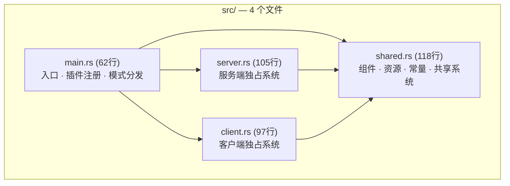

| 文件 | 行数 | 角色 |
|------|------|------|
| `shared.rs` | 118 | 全部类型定义、常量、双方共用的系统 |
| `server.rs` | 105 | 服务端系统：网络启动、玩家创建、移动处理、边界裁剪 |
| `client.rs` | 97 | 客户端系统：网络连接、键盘输入、超时检测 |
| `main.rs` | 62 | 组装入口：根据 `cargo run -- server|client` 挂载不同系统 |

---

## 第 1 级：先把游戏跑起来

```bash
# 终端 1 — 启动服务端
cargo run -- server

# 终端 2 — 启动客户端（可多开几个）
cargo run -- client
```

你会看到三角形玩家，WASD 或方向键移动，三角形尖端指向移动方向。每个新玩家颜色不同。

---

## 第 2 级：Bevy ECS 三要素

翻开 [`shared.rs`](src/shared.rs)，所有概念都能在这里找到对应。

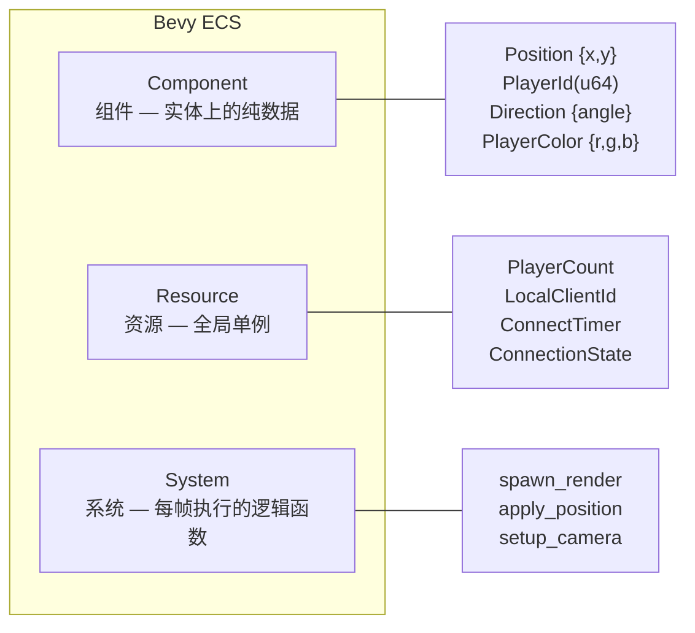

- **Component** — `#[derive(Component)]`，挂在 Entity 上的数据，用 `Query<&Component>` 读取
- **Resource** — `#[derive(Resource)]`，全局唯一，用 `Res<T>` / `ResMut<T>` 读写
- **System** — 普通 Rust 函数，参数由 Bevy 自动注入

### 在代码中辨认它们

打开 [`shared.rs`](src/shared.rs)，对照看：

| 行 | 是什么 | 如何辨认 |
|----|--------|----------|
| 8-12 | `Position` — Component | `#[derive(Component)]` + 纯数据字段 |
| 14-15 | `PlayerId` — Component | `#[derive(Component)]` + 元组结构体 |
| 24-28 | `MoveInput` — Message | `#[derive(Message)]`（类似 Component，但在网络上传输） |
| 33-34 | `LocalSprite` / `LocalPlayer` — 标记 Component | 无字段的结构体，只用于查询过滤 |
| 44-56 | `LocalClientId` 等 — Resource | `#[derive(Resource)]`，全局单例 |
| 4-9 | 常量 | 无 derive，普通 `pub const` |
| 58-73 | `hsv_to_rgb` — 工具函数 | 普通函数，不接触 ECS |
| 75-104 | `spawn_render` — System | 参数是 `Commands`, `ResMut`, `Query` |
| 106-113 | `apply_position` — System | `Query<(&Position, &Direction, &mut Transform)>` |

---

## 第 3 级：逐文件拆解

### 3.1 `shared.rs` — 共享层

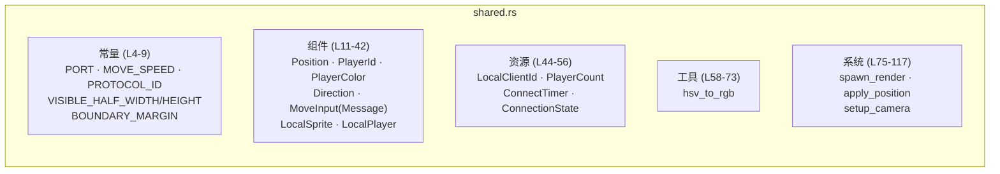

#### 组件详解

**网络同步的组件**（都 derive `Serialize, Deserialize`）：

| 组件 | 字段 | 方向 | 说明 |
|------|------|------|------|
| `Position` | `x, y: f32` | 服务端→客户端 | 玩家位置，服务端权威 |
| `Direction` | `angle: f32` | 服务端→客户端 | 朝向角度（弧度），绕 Z 轴旋转 |
| `PlayerId` | `u64` | 服务端→客户端 | 玩家唯一标识，来自 `entity.to_bits()` |
| `PlayerColor` | `r, g, b: f32` | 服务端→客户端 | 玩家颜色，金色角度算法生成 |

**客户端→服务端的消息**：

| 消息 | 字段 | 方向 | 说明 |
|------|------|------|------|
| `MoveInput` | `dx, dy: f32` | 客户端→服务端 | 归一化后的移动方向向量 |

**纯本地标记**（不参与网络）：

| 标记 | 含义 |
|------|------|
| `LocalSprite` | 已为该实体创建 Mesh2d + 材质 |
| `LocalPlayer` | 这个实体代表本地玩家（只标自己的） |

#### 三个共享系统

**`spawn_render`** (`shared.rs:75-104`) — 为新加入的玩家创建渲染网格：

```rust
// 查询条件: With<PlayerId> 且 Without<LocalSprite>
// 即：只处理还没创建渲染的玩家实体
new_players: Query<(Entity, &PlayerId, &PlayerColor),
                    (With<PlayerId>, Without<LocalSprite>)>
```

为每个新玩家创建 `Triangle2d` 三角形 mesh，注入颜色材质。如果是本地玩家（`player_id == local_client_id`），额外标记 `LocalPlayer`。

**`apply_position`** (`shared.rs:106-113`) — 把 Position + Direction 同步到 Transform：

```rust
for (pos, dir, mut transform) in players.iter_mut() {
    transform.translation = Vec3::new(pos.x, pos.y, 0.0);
    transform.rotation = Quat::from_rotation_z(dir.angle);
}
```

Transform 是 Bevy 真正用来渲染的数据，Position 是我们的逻辑数据，这个系统把两者桥接。

**`setup_camera`** (`shared.rs:115-117`) — 生成一个 2D 相机，否则什么都看不到。

### 3.2 `server.rs` — 服务端

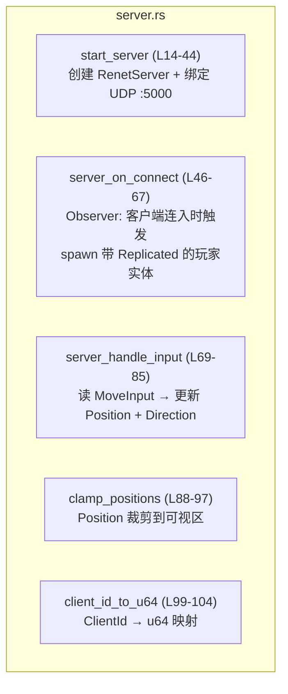

**`start_server`** — 使用 `&mut World` 而不是 `Commands`，因为在 Startup 阶段直接往 World 里插 Resource（RenetServer、NetcodeServerTransport）。

**`server_on_connect`** — 一个 Observer，不是普通的 Update 系统。`On<Add, ConnectedClient>` 表示当 `ConnectedClient` 组件被添加（即新客户端连入）时触发：

```rust
// server.rs:54 — 金色角度颜色生成
let hue = (count.0 as f32 * 137.508) % 360.0;
```

`137.508°` 是黄金角度（`360 × (1 - 1/φ)`），确保每个玩家的颜色在色相环上均匀分布。

spawn 时给实体挂上 `Replicated` 标记，bevy_replicon 会自动把这个实体及组件同步到所有客户端。

**`server_handle_input`** — 服务端核心逻辑。用 `MessageReader<FromClient<MoveInput>>` 读取客户端发来的消息，按 `client_id` 匹配玩家，更新位置和朝向。

```rust
// server.rs:80-82 — 只有移动时才更新朝向
if message.dx != 0.0 || message.dy != 0.0 {
    dir.angle = message.dy.atan2(message.dx) - std::f32::consts::FRAC_PI_2;
}
```

**`clamp_positions`** — 将 Position 裁剪到可视区边界内。详见第 7 级。

### 3.3 `client.rs` — 客户端

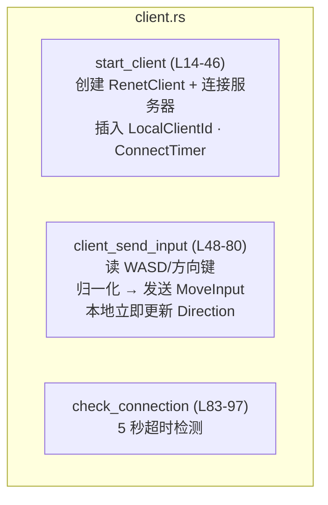

**`start_client`** — 生成一个随机的 `client_id`（基于时间戳），配置 `NetcodeClientTransport` 连接服务器。把 `client_id` 存入 `LocalClientId` 资源，供 `spawn_render` 用来标记本地玩家。

**`client_send_input`** — 每帧读取键盘：

```rust
// client.rs:56-67 — 组合键支持（W/↑ 都可以）
if keyboard.pressed(KeyCode::KeyW) || keyboard.pressed(KeyCode::ArrowUp) { dy += 1.0; }
if keyboard.pressed(KeyCode::KeyS) || keyboard.pressed(KeyCode::ArrowDown) { dy -= 1.0; }
if keyboard.pressed(KeyCode::KeyA) || keyboard.pressed(KeyCode::ArrowLeft) { dx -= 1.0; }
if keyboard.pressed(KeyCode::KeyD) || keyboard.pressed(KeyCode::ArrowRight) { dx += 1.0; }
```

归一化输入向量后，做两件事：
1. 发 `MoveInput` 消息给服务端
2. 立即更新本地 `Direction`（不等服务器回复，让操作手感更灵敏）

**`check_connection`** — 每帧 tick 一个 5 秒倒计时。连上了打印提示，超时了直接 panic。

### 3.4 `main.rs` — 组装

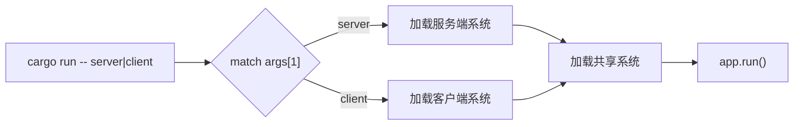

关键代码 (`main.rs:42-58`)：

```rust
match args.get(1).map(|s| s.as_str()) {
    Some("server") => {
        app.add_observer(server_on_connect);
        app.add_systems(Startup, start_server);
        app.add_systems(Update, (server_handle_input, clamp_positions).chain());
    }
    Some("client") => {
        app.add_systems(Startup, start_client);
        app.add_systems(Update, (client_send_input, check_connection));
    }
}
```

无论哪种模式，这些共享系统都会运行 (`main.rs:38-39`)：

```rust
app.add_systems(Startup, setup_camera);
app.add_systems(Update, (spawn_render, apply_position));
```

复制注册 (`main.rs:29-34`)：

```rust
app.replicate::<Position>();    // 位置 — 服务器→客户端
app.replicate::<Direction>();   // 朝向 — 服务器→客户端
app.replicate::<PlayerId>();    // 玩家 ID
app.replicate::<PlayerColor>(); // 颜色

app.add_client_message::<MoveInput>(Channel::Ordered); // 客户端→服务器
```

---

## 第 4 级：跟踪一次按键的完整数据流

按下 `W` 键，从输入到屏幕上三角形移动，经过的全部路径：

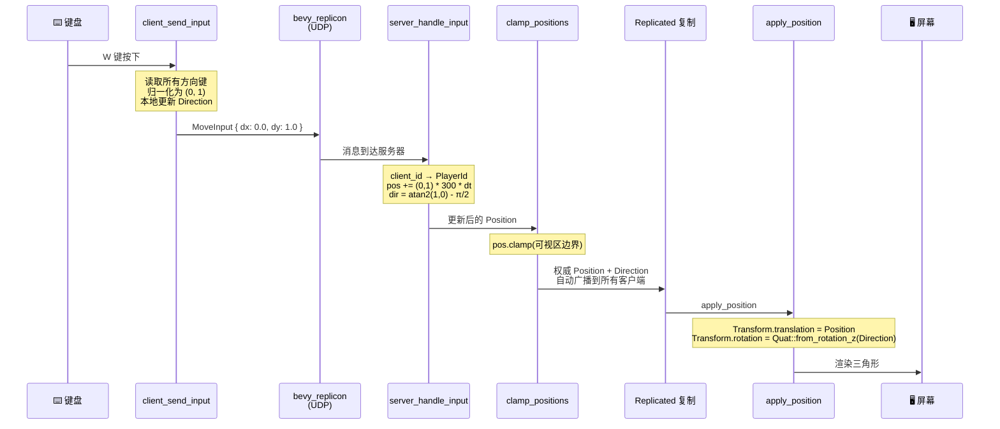

### 每一步的代码位置

| 步骤 | 文件:行号 | 发生了什么事 |
|------|-----------|-------------|
| 读键盘 | `client.rs:56-67` | 检测 WASD / 方向键，组合为 (dx, dy) |
| 归一化 | `client.rs:69-72` | 除以向量长度，防止斜向移动更快 |
| 发送 | `client.rs:79` | `writer.write(MoveInput { dx: ndx, dy: ndy })` |
| 本地朝向 | `client.rs:74-76` | 立即更新本地 Direction（不等服务器） |
| 接收 | `server.rs:74` | `move_msgs.read()` 遍历所有客户端消息 |
| 映射 | `server.rs:75` | `client_id_to_u64()` 获取发送者 ID |
| 匹配 | `server.rs:77` | 在所有玩家中查找 `player_id.0 == sender_id` |
| 移动 | `server.rs:78-79` | `pos += direction * 300 * delta_secs` |
| 朝向 | `server.rs:80-82` | 只有输入非零时才更新服务端 Direction |
| 裁剪 | `server.rs:88-97` | `pos.x.clamp(min_x, max_x)` |
| 渲染 | `shared.rs:108-109` | Position → Transform.translation + Transform.rotation |

### 为什么减 π/2

```
三角形 mesh 的顶点朝上 (Y 轴正方向)
atan2(dy, dx) 的 0° 朝右 (X 轴正方向)
两者差 90° = π/2

所以: dir.angle = atan2(dy, dx) - FRAC_PI_2
```

---

## 第 5 级：网络模型

### 服务器权威架构

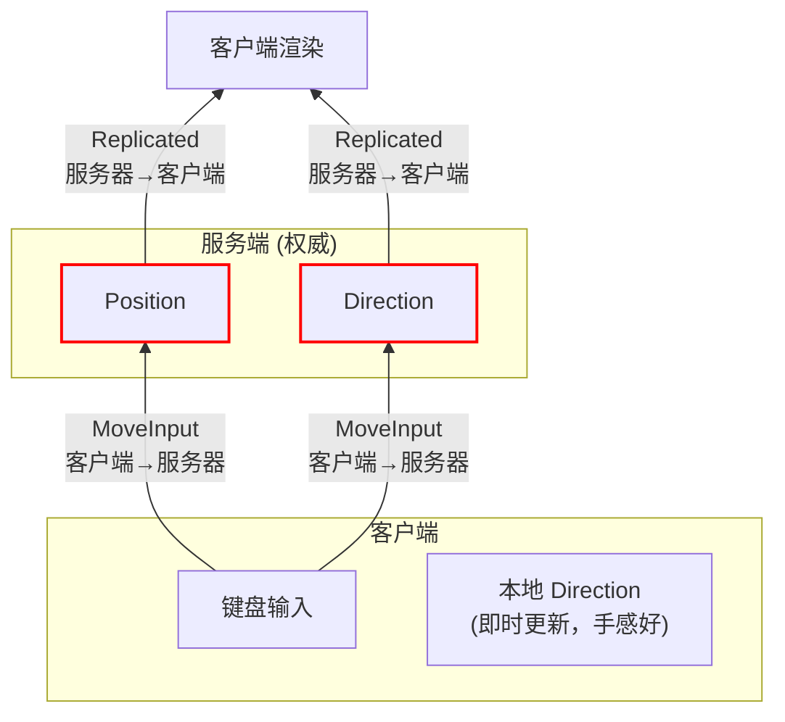

核心原则：
- 客户端**绝不直接修改**自己的 Position，只发 `MoveInput`
- 服务端是唯一权威，修改 Position 和 Direction
- `Replicated` 组件自动从服务端广播到所有客户端
- 客户端本地 Direction 可以提前更新（视觉即时反馈），但最终会被服务端权威值覆盖

### 两种数据通道

| 机制 | 方向 | 用途 | 
|------|------|------|
| `app.replicate::<T>()` | 服务端 → 客户端 | Position, Direction, PlayerId, PlayerColor |
| `app.add_client_message::<T>(channel)` | 客户端 → 服务端 | MoveInput |

### client_id → PlayerId 映射

这是理解服务端如何辨认识别玩家的关键：

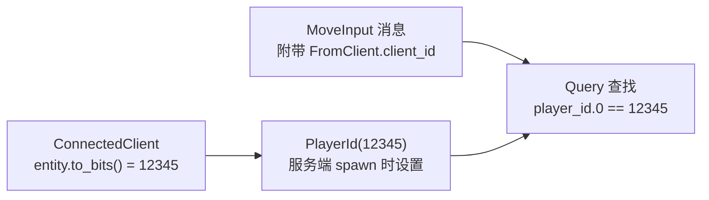

`server.rs:99-103`：

```rust
fn client_id_to_u64(id: ClientId) -> u64 {
    match id {
        ClientId::Server => 0,
        ClientId::Client(entity) => entity.to_bits(),
    }
}
```

服务端 spawn 玩家时用 `entity.to_bits()` 作为 `PlayerId`，接收消息时用同样的转换，两者就能匹配上。

---

## 第 6 级：组件与资源速查

### 完整组件图

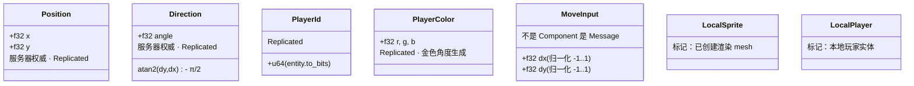

### 资源清单

| 资源 | 定义位置 | 放在哪 | 作用 |
|------|----------|--------|------|
| `PlayerCount` | `shared.rs:48` | 服务端 | 已连接玩家数，驱动颜色生成 |
| `LocalClientId` | `shared.rs:45` | 客户端 | 本地 client_id，用于 spawn_render 标记本地玩家 |
| `ConnectTimer` | `shared.rs:51` | 客户端 | 5 秒连接超时 |
| `ConnectionState` | `shared.rs:54` | 客户端 | 防止重复打印连接成功 |
| `RenetServer` | bevy_renet | 服务端 | renet 服务端实例 |
| `RenetClient` | bevy_renet | 客户端 | renet 客户端实例 |
| `NetcodeServerTransport` | bevy_replicon_renet | 服务端 | UDP 传输层 |
| `NetcodeClientTransport` | bevy_replicon_renet | 客户端 | UDP 传输层 |
| `RepliconChannels` | bevy_replicon | 双方 | 网络通道配置 |

### Query 过滤模式

`spawn_render` 的 Query 展示了常见的过滤技巧：

```rust
Query<(Entity, &PlayerId, &PlayerColor),
       (With<PlayerId>, Without<LocalSprite>)>
//      ^^^^^^^^^^^^^^^^  ^^^^^^^^^^^^^^^^^^^^^
//      "有这个"            "没有这个"
//      → 只查还没创建渲染的玩家实体
```

---

## 第 7 级：系统调度顺序

### 服务端每帧

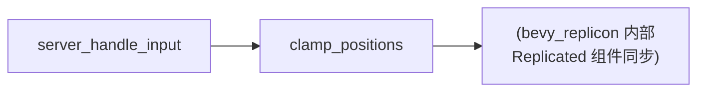

```rust
// main.rs:46 — .chain() 保证执行顺序
app.add_systems(Update, (server_handle_input, clamp_positions).chain());
```

先移动、后裁剪、再同步。如果用 `.chain()` 而不用分开的 `add_systems`，Bevy 保证前一个系统的所有变更对后一个系统可见。

### 客户端每帧

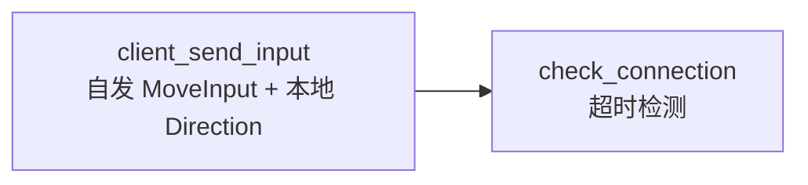

### 共享系统（双方都运行）

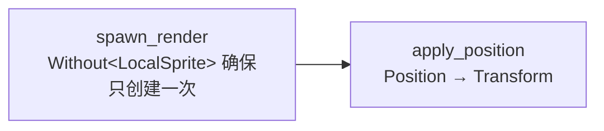

---

## 第 8 级：如何添加新功能

以游戏边界为例（已实现，代码在仓库中），完整的开发思考链：

### 思考链

```
需求：玩家不能走出屏幕
  ↓
谁说了算？ → 服务器（权威架构下，Position 归服务器管）
  ↓
在哪里改？ → Position 被 server_handle_input 更新之后
  ↓
需要什么数据？ → 屏幕尺寸常量 + 边距
  ↓
怎么改？ → 每帧更新完后把 Position clamp 到边界内
```

### 实施三步走

**第 1 步：定义常量** → [`shared.rs:7-9`](src/shared.rs#L7)

```rust
pub const VISIBLE_HALF_WIDTH: f32 = 640.0;   // 默认窗口 1280/2
pub const VISIBLE_HALF_HEIGHT: f32 = 360.0;  // 默认窗口 720/2
pub const BOUNDARY_MARGIN: f32 = 25.0;       // 三角形大小，留边距
```

**第 2 步：写系统** → [`server.rs:88-97`](src/server.rs#L88)

```rust
pub fn clamp_positions(mut players: Query<&mut Position, With<PlayerId>>) {
    let min_x = -VISIBLE_HALF_WIDTH + BOUNDARY_MARGIN;
    let max_x = VISIBLE_HALF_WIDTH - BOUNDARY_MARGIN;
    let min_y = -VISIBLE_HALF_HEIGHT + BOUNDARY_MARGIN;
    let max_y = VISIBLE_HALF_HEIGHT - BOUNDARY_MARGIN;
    for mut pos in players.iter_mut() {
        pos.x = pos.x.clamp(min_x, max_x);
        pos.y = pos.y.clamp(min_y, max_y);
    }
}
```

**第 3 步：注册系统** → [`main.rs:46`](src/main.rs#L46)

```rust
app.add_systems(Update, (server_handle_input, clamp_positions).chain());
//                                                ^^^^^^^^^^^^^^^^ 新增
```

### 改代码的通用规则

| 要做什么 | 改哪个文件 |
|----------|-----------|
| 加新组件、资源、常量、共享系统 | `shared.rs` |
| 加服务端逻辑 | `server.rs` |
| 加客户端逻辑 | `client.rs` |
| 注册系统、改变调度顺序 | `main.rs` |

---

## 依赖速查

| Crate | 在 src/ 中的用途 |
|-------|-------------------|
| `bevy` 0.18 | ECS 引擎、渲染（Triangle2d、Camera2d）、窗口 |
| `bevy_replicon` | `Replicated` 复制、`Message` 消息、`FromClient` |
| `bevy_replicon_renet` | `RenetServer`/`RenetClient`、`NetcodeServerTransport`/`NetcodeClientTransport` |
| `bevy_renet` | 底层 UDP 连接（`ConnectionConfig`, `Channel`） |
| `serde` + `bincode` | 组件和消息的序列化（网络传输必需的） |

---

## 学习检查点

学完每一级后，能回答这些问题才算掌握：

1. **第 2 级**：在 `shared.rs` 中找出一个 Component、一个 Resource、一个 System。它们各有什么特征？
2. **第 3 级**：`main.rs` 如何根据 CLI 参数加载不同的系统？为什么 `spawn_render` 和 `apply_position` 无论哪种模式都运行？
3. **第 4 级**：从按下 W 到三角形移动，数据经过了哪几个函数？每个函数在哪个文件？
4. **第 5 级**：`Replicated` 和 `Message` 的数据流向分别是什么方向？服务端如何把收到的 MoveInput 和正确的 PlayerId 对上？
5. **第 6 级**：`LocalSprite` 和 `LocalPlayer` 有什么区别？`Without<LocalSprite>` 这个过滤条件起了什么作用？
6. **第 7 级**：`.chain()` 和不 chain 的 `add_systems` 有什么区别？为什么 `clamp_positions` 要在 `server_handle_input` 之后执行？
7. **第 8 级**：如果要加"玩家按空格发射子弹"，应该在哪些文件里改什么？
